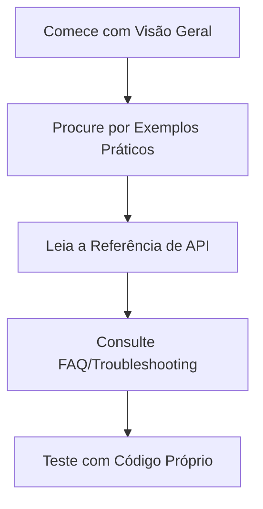

# 📘 Manual Completo: Como Ler Documentação de Programação

```
Autor: [Seu Nome]
Data: [Data Atual]
Versão: 1.0
```

## 🎯 Introdução

### Por que este manual existe?
Documentação técnica é uma das habilidades mais subestimadas e mais valiosas para pessoas desenvolvedoras. Este manual tem como objetivo transformar você em um leitor eficiente de documentação, economizando horas de frustração e acelerando seu aprendizado.

### A Mentalidade Correta
- **Documentação não é inimiga**: É uma ferramenta poderosa
- **Não precisa ler tudo**: Aprenda a encontrar o que importa
- **Contexto é rei**: Entenda quando e por que usar algo

## 📚 Capítulo 1: Tipos de Documentação

### 1.1 Documentação Oficial
```
Exemplos: MDN Web Docs, Python.org, React Docs
Características: Autoritativa, completa, mantida pelos criadores
```

### 1.2 Documentação da Comunidade
```
Exemplos: Stack Overflow, blog posts, tutorials no Medium/Dev.to
Características: Prática, baseada em casos reais, pode estar desatualizada
```

### 1.3 Documentação de Projetos
```
Exemplos: README.md, CONTRIBUTING.md, CHANGELOG.md
Características: Específica ao projeto, mostra "como contribuir"
```

### 1.4 Documentação Gerada Automaticamente
```
Exemplos: Javadoc, TypeDoc, Sphinx
Características: Técnica, foca em API, estrutura consistente
```

## 🔍 Capítulo 2: Estratégias de Leitura

### 2.1 A Abordagem em Camadas



### 2.2 A Técnica do "Escaneamento Seletivo"

**Passe 1 (30 segundos):**
- Título e introdução
- Sumário ou índice
- Exemplos de código

**Passe 2 (2 minutos):**
- Seções relevantes ao seu problema
- Parâmetros e valores de retorno
- Notas importantes (⚠️, 🚨, 💡)

**Passe 3 (profundidade):**
- Leitura detalhada apenas do necessário

## 🛠️ Capítulo 3: Estrutura Comum de Documentação

### 3.1 Componentes Típicos

```markdown
# [Nome da Tecnologia]

## Visão Geral
- O que é e por que existe

## Começando Rápido (Quick Start)
- Instalação/configuração mínima
- Exemplo "Hello World"

## Guias
- Tutorial passo a passo
- Casos de uso comuns

## Referência de API
- Métodos/funções
- Parâmetros e tipos
- Valores de retorno
- Exceções/erros

## Exemplos
- Código funcionando
- Diferentes cenários

## FAQ / Troubleshooting
- Problemas comuns
- Soluções conhecidas

## Changelog / Release Notes
- O que mudou nas versões
- Breaking changes
```

### 3.2 Como Ler Cada Seção

**Quick Start:**
- Execute mesmo sem entender tudo
- Objetivo: ver funcionando

**Exemplos:**
- Copie, cole, modifique
- Entenda a entrada e saída

**Referência de API:**
- Consulte quando necessário
- Foque em parâmetros obrigatórios

## 💡 Capítulo 4: Técnicas Avançadas

### 4.1 Leitura com Propósito

| Seu Objetivo | Onde Começar | O que Ignorar |
|-------------|-------------|---------------|
| Aprender uma nova tech | Quick Start, Tutorials | Referência detalhada de API |
| Resolver um bug específico | Troubleshooting, Exemplos | Visão geral conceitual |
| Encontrar uma função | Referência de API, Search | Guias extensos |
| Migrar de versão | Changelog, Migration Guide | Tutoriais básicos |

### 4.2 Sistema de Anotações

```markdown
# Minhas Anotações - [Tecnologia]

## Comandos Úteis
```bash
# Instalação
comando --flag valor

# Execução
outro-comando
```

## Exemplo Básico
```javascript
código de exemplo
```

## Armadilhas Comuns
1. Não faça X porque Y
2. Sempre verifique Z antes de W

## Links Importantes
- [Documentação oficial](link)
- [Exemplo avançado](link)
```

### 4.3 Busca Eficiente
```
Dica: Use operadores de busca
site:developer.mozilla.org "query específica"
filetype:pdf "nome do documento"
version:3.8 "python"
```

## 🚀 Capítulo 5: Fluxos de Trabalho Práticos

### 5.1 Fluxo: Aprendendo uma Nova Biblioteca

```yaml
passo_1:
  ação: "Visitar página inicial"
  objetivo: "Entender propósito"
  tempo: "2 minutos"

passo_2:
  ação: "Seguir Quick Start"
  objetivo: "Configurar ambiente"
  tempo: "10-15 minutos"

passo_3:
  ação: "Modificar exemplos"
  objetivo: "Testar entendimento"
  tempo: "20 minutos"

passo_4:
  ação: "Ler guia principal"
  objetivo: "Compreender conceitos"
  tempo: "30 minutos"

passo_5:
  ação: "Consultar referência"
  objetivo: "Resolver dúvidas específicas"
  tempo: "Sob demanda"
```

### 5.2 Fluxo: Resolvendo um Problema

1. **Defina o problema claramente**
   ```
   Erro: "Cannot read property 'x' of undefined"
   Contexto: Chamando API, resposta vazia
   ```

2. **Traduza para termos de busca**
   ```
   De: "Meu código não funciona"
   Para: "[Tecnologia] handle empty API response"
   ```

3. **Priorize fontes**
   - Documentação oficial > Stack Overflow > Blogs
   - Versão atual > Versões antigas

4. **Teste isoladamente**
   ```javascript
   // Crie um exemplo mínimo
   testarFunção(entradaSimples);
   ```

## 🧩 Capítulo 6: Casos Especiais

### 6.1 Documentação Péssima (Ou Inexistente)

**Estratégias:**
1. Leia o código fonte
2. Procure testes unitários
3. Verifique exemplos de uso no repositório
4. Consulte issues/pull requests

### 6.2 Documentação em Outro Idioma

**Ferramentas úteis:**
- Google Translate (para páginas)
- DeepL (mais preciso para técnico)
- Dicionário técnico específico

**Dica:** Aprenda termos técnicos no idioma original

### 6.3 Documentação Desatualizada

**Sinais de alerta:**
- Datas antigas
- Referências a versões obsoletas
- Exemplos que não funcionam

**Verificação:**
1. Compare com changelog
2. Teste exemplos
3. Consulte a versão atual

## 📖 Capítulo 7: Prática Guiada

### 7.1 Exercício: Analisando uma Página de Documentação

**URL:** `https://axios-http.com/docs/intro`

**Tarefas:**
1. Identifique em 1 minuto:
   - Propósito da biblioteca
   - Como instalar
   - Exemplo mais simples

2. Em 3 minutos:
   - Encontre como fazer POST request
   - Identifique parâmetros obrigatórios
   - Localize exemplo de tratamento de erro

3. Em 5 minutos:
   - Crie um exemplo funcional
   - Modifique para seu caso de uso
   - Encontre configurações avançadas

### 7.2 Exercício: Comparação de Fontes

**Problema:** "Como validar email em JavaScript"

**Compare:**
1. MDN Web Docs (documentação oficial)
2. Stack Overflow (comunidade)
3. Blog técnico (artigo)

**Avalie:**
- Qualidade da informação
- Atualização
- Abordagem (teórica vs prática)
- Exemplos fornecidos

## 🔧 Capítulo 8: Ferramentas e Recursos

### 8.1 Extensões de Navegador
```
- Dark Reader: modo escuro para docs
- Markdown Viewer: visualizar .md
- Octotree: navegar repositórios GitHub
```

### 8.2 Ferramentas Locais
```bash
# Servir documentação local
python -m http.server  # Para docs HTML
docsify serve ./docs   # Para Markdown

# Gerar documentação
jsdoc arquivo.js       # JavaScript
pdoc3 modulo.py        # Python
```

### 8.3 Bookmarks Úteis
```markdown
## Documentações Oficiais
- [MDN Web Docs](https://developer.mozilla.org)
- [DevDocs](https://devdocs.io) (agregador)
- [Python Docs](https://docs.python.org)
- [React Docs](https://reactjs.org/docs)

## Comunidade
- [Stack Overflow](https://stackoverflow.com)
- [DigitalOcean Community](https://www.digitalocean.com/community)
```

## 🎓 Capítulo 9: Desenvolvendo Habilidade

### 9.1 Método de Melhoria Contínua

**Semana 1-2: Consciência**
- Identifique como você lê docs atualmente
- Cronometre seu tempo
- Note frustrações

**Semana 3-4: Técnicas Básicas**
- Pratique escaneamento seletivo
- Use o sistema de camadas
- Crie anotações

**Semana 5-8: Fluência**
- Reduza tempo de consulta em 50%
- Antecipe estrutura das docs
- Ensine outros

### 9.2 Métricas de Progresso
```yaml
iniciante:
  tempo_resolucao: "> 1 hora"
  fontes: "Stack Overflow apenas"
  confiança: "Baixa"

intermediario:
  tempo_resolucao: "15-30 minutos"
  fontes: "Docs oficiais + comunidade"
  confiança: "Média"

avancado:
  tempo_resolucao: "< 10 minutos"
  fontes: "Docs oficiais prioritariamente"
  confiança: "Alta, com verificação"
```

## 📝 Capítulo 10: Checklist e Templates

### 10.1 Checklist Antes de Pedir Ajuda

- [ ] Li a documentação oficial
- [ ] Executei os exemplos básicos
- [ ] Consultei a seção de troubleshooting
- [ ] Verifiquei se não é um erro conhecido
- [ ] Procurei em issues do GitHub
- [ ] Tentei isolar o problema
- [ ] Testei em ambiente limpo

### 10.2 Template de Anotações Pessoais

```markdown
# [Nome da Tecnologia]

## Data do Estudo: [DATA]
## Versão: [X.Y.Z]

## Propósito
[2-3 frases sobre o que faz]

## Instalação
```bash
[comandos de instalação]
```

## Exemplo Mínimo Viável
```[linguagem]
[código mínimo]
```

## Conceitos Chave
- [ ] Conceito 1: [explicação]
- [ ] Conceito 2: [explicação]

## Armadilhas Comuns
1. [Problema comum e solução]

## Recursos Avançados
- [Recurso 1]: [uso]
- [Recurso 2]: [uso]

## Links
- [Documentação oficial](link)
- [Exemplos avançados](link)
- [Artigo explicativo](link)
```

## 🏁 Conclusão

### Resumo dos Princípios Essenciais

1. **Comece pelo começo**: Quick Start > Teoria
2. **Aprenda navegando**: Não leia sequencialmente
3. **Pratique imediatamente**: Código > Leitura
4. **Documente seu aprendizado**: Anote para futuro você
5. **Ensine para solidificar**: Explique para aprender melhor

### Próximos Passos

1. **Escolha uma tecnologia** que você usa regularmente
2. **Aplique as técnicas** deste manual por uma semana
3. **Meça seu progresso** em tempo e confiança
4. **Compartilhe** com colegas
5. **Adapte** as técnicas ao seu estilo

---

## 📄 Licença e Contribuições

Este manual é aberto e pode ser compartilhado livremente. Encontrou um erro? Tem uma sugestão?

**Contribua:**
1. Fork do repositório
2. Faça suas modificações
3. Envie um pull request

**Mantenha o espírito:**
- Foco em praticidade
- Exemplos claros
- Linguagem acessível

---

*"A documentação é uma conversa com desenvolvedores futuros, incluindo você mesmo daqui a seis meses."* - Desconhecido sábio

**Boa leitura e bons códigos!** 🚀

---
*Última atualização: [Data]*  
*Próxima revisão programada: [Data + 6 meses]*
