# 🎓 Manual Completo de Ciência da Computação
## Aprendizado Autodidata - Guia Definitivo


## 📋 Sumário

- [📌 Introdução](#-introdução)
- [🎯 Por que Aprender Ciência da Computação?](#-por-que-aprender-ciência-da-computação)
- [📊 Mapa do Currículo](#-mapa-do-currículo)
- [⏰ Plano de Estudos de 2 Anos](#-plano-de-estudos-de-2-anos)
- [🧮 Parte 1: Fundamentos Matemáticos](#-parte-1-fundamentos-matemáticos)
- [💻 Parte 2: Programação e Algoritmos](#-parte-2-programação-e-algoritmos)
- [🖥️ Parte 3: Sistemas de Computação](#️-parte-3-sistemas-de-computação)
- [🚀 Parte 4: Desenvolvimento de Software](#-parte-4-desenvolvimento-de-software)
- [🎯 Parte 5: Especializações](#-parte-5-especializações)
- [📁 Parte 6: Projetos e Portfólio](#-parte-6-projetos-e-portfólio)
- [📈 Parte 7: Carreira e Mercado](#-parte-7-carreira-e-mercado)
- [🎉 Conclusão](#-conclusão)
- [📚 Recursos Adicionais](#-recursos-adicionais)

---

## 📌 Introdução

### O que é Ciência da Computação?
Ciência da Computação é o estudo sistemático dos processos algorítmicos que descrevem e transformam informação. **Não é apenas programação** - é a base teórica e prática por trás de todo o software, hardware e sistemas computacionais.

### Este Manual Inclui:
✅ Todo o currículo de um bacharelado em Ciência da Computação  
✅ Caminho de aprendizado estruturado em 24 meses  
✅ Projetos práticos em cada etapa  
✅ Recursos gratuitos e de qualidade  
✅ Guia de carreira e portfólio  

---

## 🎯 Por que Aprender Ciência da Computação?

### Vantagens do Aprendizado Autodidata:
- **Flexibilidade**: Estude no seu ritmo
- **Custo zero**: Todos os recursos são gratuitos
- **Foco prático**: Aprenda o que o mercado realmente precisa
- **Portfólio sólido**: Construa projetos reais desde o início

### Mercado de Trabalho no Brasil:
- **Salário inicial**: R$ 3.000 - R$ 6.000
- **Demanda**: Crescimento de 20% ao ano
- **Áreas quentes**: DevOps, Data Science, IA, Segurança
- **Remoto**: 60% das vagas permitem trabalho remoto

---

## 📊 Mapa do Currículo

```mermaid
graph TD
    A[Fundamentos] --> B[Lógica + Matemática]
    A --> C[Primeira Linguagem]
    
    B --> D[Algoritmos]
    C --> D
    
    D --> E[Estruturas de Dados]
    E --> F[Sistemas Operacionais]
    
    F --> G[Redes]
    G --> H[Bancos de Dados]
    
    H --> I[Engenharia de Software]
    I --> J[Especialização]
    
    J --> K[Projetos + Portfólio]
    K --> L[Carreira]
```



---

## ⏰ Plano de Estudos de 2 Anos

### 🟢 Ano 1: Fundamentos (0-12 meses)

| Mês | Foco Principal | Carga Horária Semanal | Tópicos |
|-----|---------------|----------------------|---------|
| 1-3 | Lógica + Python | 15-20h | Lógica booleana, Python básico, Git |
| 4-6 | Algoritmos | 15-20h | Complexidade, ordenação, busca |
| 7-9 | Estruturas de Dados | 15-20h | Listas, pilhas, filas, árvores |
| 10-12 | POO + Web Básico | 15-20h | Classes, HTML, CSS, JavaScript |

### 🟡 Ano 2: Especialização (13-24 meses)

| Mês | Foco Principal | Carga Horária | Especialização |
|-----|---------------|--------------|----------------|
| 13-15 | Sistemas | 15-20h | SO, Redes, Arquitetura |
| 16-18 | Backend | 15-20h | APIs, Bancos de Dados |
| 19-21 | Especialização | 20-25h | Escolha uma área |
| 22-24 | Projetos | 20-25h | Portfólio + Open Source |

---

## 🧮 Parte 1: Fundamentos Matemáticos

### 1.1 Lógica Computacional (Mês 1)

#### 📚 Conteúdo Essencial:
- **Lógica Proposicional**: AND, OR, NOT, XOR
- **Tabelas Verdade**: Construção e interpretação
- **Leis de De Morgan**: ¬(P ∧ Q) ≡ ¬P ∨ ¬Q
- **Lógica de Predicados**: ∀ (para todo), ∃ (existe)

#### 🛠️ Exercícios Práticos:
```python
# Implementação das portas lógicas
def porta_and(a, b):
    return a and b

def porta_or(a, b):
    return a or b

def porta_not(a):
    return not a

# Tabela verdade para AND
print("Tabela Verdade AND:")
print("A | B | A AND B")
print("0 | 0 |", porta_and(False, False))
print("0 | 1 |", porta_and(False, True))
print("1 | 0 |", porta_and(True, False))
print("1 | 1 |", porta_and(True, True))
```

#### 📖 Recursos Recomendados:
- **Livro**: "Matemática Discreta e suas Aplicações" (Kenneth Rosen)
- **Curso**: [Matemática para Computação - USP](https://www.coursera.org/learn/matematica-computacao)
- **Site**: [Brilliant.org - Logic](https://brilliant.org/courses/logic-deduction/)

### 1.2 Matemática Discreta (Mês 2-3)

#### 📚 Conteúdo Essencial:
- **Teoria dos Conjuntos**: União, interseção, diferença
- **Combinatória**: Permutações, arranjos, combinações
- **Grafos**: Vértices, arestas, caminhos, árvores
- **Relações**: Reflexiva, simétrica, transitiva

#### 🛠️ Exercícios Práticos:
```python
import math
from itertools import permutations, combinations

# Combinações C(n, p) = n! / (p! * (n-p)!)
def combinacoes(n, p):
    return math.comb(n, p)

# Permutações de um conjunto
def permutacoes(lista):
    return list(permutations(lista))

# Exemplo: Quantos times de 5 pessoas com 10 disponíveis?
print("Combinações de times:", combinacoes(10, 5))

# Exemplo: Anagramas de "ABC"
print("Anagramas:", permutacoes(['A', 'B', 'C']))
```

#### 🎯 Projeto 1: Sistema de Recomendação Simples
Crie um sistema que sugere amigos baseado em interesses comuns usando teoria dos conjuntos.

### 1.3 Álgebra Linear (Mês 4)

#### 📚 Conteúdo Essencial:
- **Vetores**: Soma, produto escalar, norma
- **Matrizes**: Multiplicação, transposta, determinante
- **Sistemas Lineares**: Resolução, dependência linear
- **Transformações**: Rotação, escala, translação

#### 🛠️ Exercícios Práticos:
```python
import numpy as np

# Operações com vetores
v1 = np.array([1, 2, 3])
v2 = np.array([4, 5, 6])

print("Soma:", v1 + v2)
print("Produto escalar:", np.dot(v1, v2))
print("Norma de v1:", np.linalg.norm(v1))

# Operações com matrizes
A = np.array([[1, 2], [3, 4]])
B = np.array([[5, 6], [7, 8]])

print("Multiplicação AB:")
print(np.dot(A, B))

print("Determinante de A:", np.linalg.det(A))
print("Inversa de A:")
print(np.linalg.inv(A))
```

#### 📖 Recursos Recomendados:
- **Livro**: "Álgebra Linear com Aplicações" (Steven J. Leon)
- **Curso**: [Linear Algebra - MIT OpenCourseWare](https://ocw.mit.edu/courses/mathematics/18-06-linear-algebra-spring-2010/)
- **Visualização**: [3Blue1Brown - Essence of Linear Algebra](https://www.3blue1brown.com/topics/linear-algebra)

### 1.4 Cálculo (Mês 5-6)

#### 📚 Conteúdo Essencial:
- **Limites e Continuidade**: Conceito de limite
- **Derivadas**: Taxa de variação, regras de derivação
- **Integrais**: Área sob curva, teorema fundamental
- **Séries**: Convergência, séries de Taylor

#### 🛠️ Aplicações em CC:
- **Otimização**: Encontrar máximos e mínimos (derivadas)
- **Machine Learning**: Gradiente descendente
- **Processamento de Imagens**: Transformadas integrais
- **Análise de Algoritmos**: Notação assintótica

#### 📖 Recursos Recomendados:
- **Livro**: "Cálculo" (James Stewart)
- **Curso**: [Calculus 1 - Khan Academy](https://pt.khanacademy.org/math/calculus-1)
- **Site**: [Paul's Online Math Notes](https://tutorial.math.lamar.edu/)

---

## 💻 Parte 2: Programação e Algoritmos

### 2.1 Primeira Linguagem: Python (Mês 1-3)

#### 🎯 Por que Python?
- **Sintaxe simples**: Fácil para iniciantes
- **Versátil**: Web, dados, IA, automação
- **Comunidade grande**: Muitos recursos e ajuda
- **Demanda no mercado**: Uma das mais requisitadas

#### 📚 Roadmap Python (12 semanas):

**Semana 1-2: Fundamentos**
```python
# Tipos básicos
nome = "João"          # String
idade = 25             # Inteiro
altura = 1.75          # Float
estudante = True       # Booleano

# Estruturas de controle
if idade >= 18:
    print("Maior de idade")
elif idade >= 12:
    print("Adolescente")
else:
    print("Criança")

# Loops
for i in range(5):
    print(f"Número: {i}")

contador = 0
while contador < 5:
    print(contador)
    contador += 1
```

**Semana 3-4: Estruturas de Dados**
```python
# Listas (mutáveis)
frutas = ["maçã", "banana", "laranja"]
frutas.append("uva")
frutas.remove("banana")

# Tuplas (imutáveis)
coordenadas = (10.5, 20.3)

# Dicionários (chave-valor)
pessoa = {
    "nome": "Maria",
    "idade": 30,
    "cidade": "São Paulo"
}

# Conjuntos (únicos)
numeros = {1, 2, 3, 4, 5}
```

**Semana 5-6: Funções e Módulos**
```python
# Função básica
def calcular_imc(peso, altura):
    """Calcula o Índice de Massa Corporal"""
    return peso / (altura ** 2)

# Função com parâmetros padrão
def saudacao(nome, mensagem="Olá"):
    return f"{mensagem}, {nome}!"

# Módulos padrão
import math
import random
from datetime import datetime

# Criando módulos
# salvar como calculadora.py
def soma(a, b):
    return a + b

# em outro arquivo:
# from calculadora import soma
```

**Semana 7-8: Programação Orientada a Objetos**
```python
class Pessoa:
    def __init__(self, nome, idade):
        self.nome = nome
        self.idade = idade
    
    def apresentar(self):
        return f"Olá, sou {self.nome}"
    
    def aniversario(self):
        self.idade += 1

class Estudante(Pessoa):
    def __init__(self, nome, idade, curso):
        super().__init__(nome, idade)
        self.curso = curso
        self.notas = []
    
    def adicionar_nota(self, nota):
        self.notas.append(nota)
    
    def media(self):
        return sum(self.notas) / len(self.notas) if self.notas else 0
```

**Semana 9-10: Tratamento de Erros e Arquivos**
```python
# Try/Except
try:
    numero = int(input("Digite um número: "))
    resultado = 10 / numero
except ValueError:
    print("Isso não é um número válido!")
except ZeroDivisionError:
    print("Não pode dividir por zero!")
except Exception as e:
    print(f"Erro inesperado: {e}")
else:
    print(f"Resultado: {resultado}")
finally:
    print("Fim da operação")

# Trabalhando com arquivos
with open('dados.txt', 'w') as arquivo:
    arquivo.write("Primeira linha\n")
    arquivo.write("Segunda linha\n")

with open('dados.txt', 'r') as arquivo:
    conteudo = arquivo.read()
    print(conteudo)
```

**Semana 11-12: Tópicos Avançados**
```python
# List comprehensions
quadrados = [x**2 for x in range(10)]
pares = [x for x in range(20) if x % 2 == 0]

# Geradores
def fibonacci(limite):
    a, b = 0, 1
    while a < limite:
        yield a
        a, b = b, a + b

# Decoradores
def log_decorator(func):
    def wrapper(*args, **kwargs):
        print(f"Chamando {func.__name__}")
        resultado = func(*args, **kwargs)
        print(f"{func.__name__} retornou {resultado}")
        return resultado
    return wrapper

@log_decorator
def soma(a, b):
    return a + b
```

#### 🎯 Projeto 2: Jogo da Forca
Implemente o clássico jogo da forca com interface no terminal.

### 2.2 Estruturas de Dados (Mês 4-6)

#### 📚 Estruturas Lineares:

**Array/Lista:**
```python
class Array:
    def __init__(self, capacidade):
        self.capacidade = capacidade
        self.tamanho = 0
        self.dados = [None] * capacidade
    
    def __getitem__(self, indice):
        if 0 <= indice < self.tamanho:
            return self.dados[indice]
        raise IndexError("Índice fora do intervalo")
    
    def adicionar(self, elemento):
        if self.tamanho >= self.capacidade:
            self._redimensionar()
        self.dados[self.tamanho] = elemento
        self.tamanho += 1
    
    def _redimensionar(self):
        nova_capacidade = self.capacidade * 2
        novos_dados = [None] * nova_capacidade
        for i in range(self.tamanho):
            novos_dados[i] = self.dados[i]
        self.dados = novos_dados
        self.capacidade = nova_capacidade
```

**Lista Encadeada:**
```python
class No:
    def __init__(self, valor):
        self.valor = valor
        self.proximo = None

class ListaEncadeada:
    def __init__(self):
        self.cabeca = None
        self.tamanho = 0
    
    def inserir_inicio(self, valor):
        novo_no = No(valor)
        novo_no.proximo = self.cabeca
        self.cabeca = novo_no
        self.tamanho += 1
    
    def buscar(self, valor):
        atual = self.cabeca
        while atual:
            if atual.valor == valor:
                return atual
            atual = atual.proximo
        return None
    
    def remover(self, valor):
        atual = self.cabeca
        anterior = None
        
        while atual and atual.valor != valor:
            anterior = atual
            atual = atual.proximo
        
        if not atual:  # Valor não encontrado
            return False
        
        if not anterior:  # Remover cabeça
            self.cabeca = atual.proximo
        else:
            anterior.proximo = atual.proximo
        
        self.tamanho -= 1
        return True
```

**Pilha (LIFO):**
```python
class Pilha:
    def __init__(self):
        self.itens = []
    
    def empilhar(self, item):
        self.itens.append(item)
    
    def desempilhar(self):
        if not self.esta_vazia():
            return self.itens.pop()
        return None
    
    def topo(self):
        if not self.esta_vazia():
            return self.itens[-1]
        return None
    
    def esta_vazia(self):
        return len(self.itens) == 0
    
    def tamanho(self):
        return len(self.itens)
```

**Fila (FIFO):**
```python
class Fila:
    def __init__(self):
        self.itens = []
    
    def enfileirar(self, item):
        self.itens.insert(0, item)
    
    def desenfileirar(self):
        if not self.esta_vazia():
            return self.itens.pop()
        return None
    
    def frente(self):
        if not self.esta_vazia():
            return self.itens[-1]
        return None
    
    def esta_vazia(self):
        return len(self.itens) == 0
    
    def tamanho(self):
        return len(self.itens)
```

#### 📚 Estruturas Não-Lineares:

**Árvore Binária:**
```python
class NoArvore:
    def __init__(self, valor):
        self.valor = valor
        self.esquerda = None
        self.direita = None

class ArvoreBinaria:
    def __init__(self):
        self.raiz = None
    
    def inserir(self, valor):
        if self.raiz is None:
            self.raiz = NoArvore(valor)
        else:
            self._inserir_recursivo(self.raiz, valor)
    
    def _inserir_recursivo(self, no_atual, valor):
        if valor < no_atual.valor:
            if no_atual.esquerda is None:
                no_atual.esquerda = NoArvore(valor)
            else:
                self._inserir_recursivo(no_atual.esquerda, valor)
        else:
            if no_atual.direita is None:
                no_atual.direita = NoArvore(valor)
            else:
                self._inserir_recursivo(no_atual.direita, valor)
    
    def buscar(self, valor):
        return self._buscar_recursivo(self.raiz, valor)
    
    def _buscar_recursivo(self, no_atual, valor):
        if no_atual is None:
            return False
        if valor == no_atual.valor:
            return True
        elif valor < no_atual.valor:
            return self._buscar_recursivo(no_atual.esquerda, valor)
        else:
            return self._buscar_recursivo(no_atual.direita, valor)
```

**Tabela Hash:**
```python
class TabelaHash:
    def __init__(self, tamanho=10):
        self.tamanho = tamanho
        self.tabela = [[] for _ in range(tamanho)]
    
    def _hash(self, chave):
        return hash(chave) % self.tamanho
    
    def inserir(self, chave, valor):
        indice = self._hash(chave)
        for i, (k, v) in enumerate(self.tabela[indice]):
            if k == chave:
                self.tabela[indice][i] = (chave, valor)
                return
        self.tabela[indice].append((chave, valor))
    
    def buscar(self, chave):
        indice = self._hash(chave)
        for k, v in self.tabela[indice]:
            if k == chave:
                return v
        return None
    
    def remover(self, chave):
        indice = self._hash(chave)
        for i, (k, v) in enumerate(self.tabela[indice]):
            if k == chave:
                del self.tabela[indice][i]
                return True
        return False
```

#### 🎯 Projeto 3: Sistema de Biblioteca
Implemente um sistema de gerenciamento de biblioteca usando várias estruturas de dados.

### 2.3 Análise de Algoritmos (Mês 7-8)

#### 📚 Complexidade Assintótica (Big O):

**Notação Big O:**
```python
# O(1) - Tempo constante
def acesso_elemento(arr, indice):
    return arr[indice] if 0 <= indice < len(arr) else None

# O(n) - Tempo linear
def busca_linear(arr, alvo):
    for elemento in arr:
        if elemento == alvo:
            return True
    return False

# O(n²) - Tempo quadrático
def pares_duplicados(arr):
    pares = []
    for i in range(len(arr)):
        for j in range(i + 1, len(arr)):
            if arr[i] == arr[j]:
                pares.append((i, j))
    return pares

# O(log n) - Tempo logarítmico
def busca_binaria(arr, alvo):
    esquerda, direita = 0, len(arr) - 1
    while esquerda <= direita:
        meio = (esquerda + direita) // 2
        if arr[meio] == alvo:
            return meio
        elif arr[meio] < alvo:
            esquerda = meio + 1
        else:
            direita = meio - 1
    return -1

# O(2^n) - Tempo exponencial (Fibonacci recursivo)
def fibonacci_exponencial(n):
    if n <= 1:
        return n
    return fibonacci_exponencial(n-1) + fibonacci_exponencial(n-2)

# O(n!) - Tempo fatorial (problema do caixeiro viajante)
```

**Complexidade de Espaço:**
```python
# O(1) - Espaço constante
def soma_lista(arr):
    total = 0  # 1 variável
    for num in arr:
        total += num
    return total

# O(n) - Espaço linear
def copiar_lista(arr):
    copia = []  # n elementos
    for elemento in arr:
        copia.append(elemento)
    return copia

# O(n²) - Espaço quadrático
def matriz_quadrada(n):
    matriz = [[0] * n for _ in range(n)]  # n² elementos
    return matriz
```

#### 📚 Algoritmos de Ordenação:

**Bubble Sort (O(n²)):**
```python
def bubble_sort(arr):
    n = len(arr)
    for i in range(n):
        # Últimos i elementos já estão ordenados
        for j in range(0, n-i-1):
            if arr[j] > arr[j+1]:
                arr[j], arr[j+1] = arr[j+1], arr[j]
    return arr
```

**Merge Sort (O(n log n)):**
```python
def merge_sort(arr):
    if len(arr) <= 1:
        return arr
    
    meio = len(arr) // 2
    esquerda = merge_sort(arr[:meio])
    direita = merge_sort(arr[meio:])
    
    return merge(esquerda, direita)

def merge(esquerda, direita):
    resultado = []
    i = j = 0
    
    while i < len(esquerda) and j < len(direita):
        if esquerda[i] < direita[j]:
            resultado.append(esquerda[i])
            i += 1
        else:
            resultado.append(direita[j])
            j += 1
    
    resultado.extend(esquerda[i:])
    resultado.extend(direita[j:])
    return resultado
```

**Quick Sort (O(n log n) médio, O(n²) pior caso):**
```python
def quicksort(arr):
    if len(arr) <= 1:
        return arr
    
    pivo = arr[len(arr) // 2]
    menores = [x for x in arr if x < pivo]
    iguais = [x for x in arr if x == pivo]
    maiores = [x for x in arr if x > pivo]
    
    return quicksort(menores) + iguais + quicksort(maiores)
```

**Heap Sort (O(n log n)):**
```python
def heap_sort(arr):
    n = len(arr)
    
    # Construir heap máximo
    for i in range(n//2 - 1, -1, -1):
        heapify(arr, n, i)
    
    # Extrair elementos do heap
    for i in range(n-1, 0, -1):
        arr[i], arr[0] = arr[0], arr[i]  # Trocar
        heapify(arr, i, 0)
    
    return arr

def heapify(arr, n, i):
    maior = i
    esquerda = 2 * i + 1
    direita = 2 * i + 2
    
    if esquerda < n and arr[esquerda] > arr[maior]:
        maior = esquerda
    
    if direita < n and arr[direita] > arr[maior]:
        maior = direita
    
    if maior != i:
        arr[i], arr[maior] = arr[maior], arr[i]
        heapify(arr, n, maior)
```

### 2.4 Algoritmos Clássicos (Mês 9-10)

#### 📚 Algoritmos de Busca:

**Busca em Largura (BFS):**
```python
from collections import deque

def bfs(grafo, inicio):
    visitados = set()
    fila = deque([inicio])
    resultado = []
    
    while fila:
        vertice = fila.popleft()
        if vertice not in visitados:
            visitados.add(vertice)
            resultado.append(vertice)
            fila.extend(grafo[vertice])
    
    return resultado
```

**Busca em Profundidade (DFS):**
```python
def dfs(grafo, inicio, visitados=None):
    if visitados is None:
        visitados = set()
    
    visitados.add(inicio)
    resultado = [inicio]
    
    for vizinho in grafo[inicio]:
        if vizinho not in visitados:
            resultado.extend(dfs(grafo, vizinho, visitados))
    
    return resultado
```

**Dijkstra (Caminhos Mínimos):**
```python
import heapq

def dijkstra(grafo, inicio):
    distancias = {vertice: float('inf') for vertice in grafo}
    distancias[inicio] = 0
    fila_prioridade = [(0, inicio)]
    
    while fila_prioridade:
        distancia_atual, vertice_atual = heapq.heappop(fila_prioridade)
        
        if distancia_atual > distancias[vertice_atual]:
            continue
        
        for vizinho, peso in grafo[vertice_atual].items():
            distancia = distancia_atual + peso
            
            if distancia < distancias[vizinho]:
                distancias[vizinho] = distancia
                heapq.heappush(fila_prioridade, (distancia, vizinho))
    
    return distancias
```

#### 📚 Algoritmos Gulosos:

**Troco Mínimo:**
```python
def troco_minimo(valor, moedas):
    moedas.sort(reverse=True)
    resultado = []
    
    for moeda in moedas:
        while valor >= moeda:
            valor -= moeda
            resultado.append(moeda)
    
    return resultado
```

**Agendamento de Tarefas:**
```python
def agendamento_tarefas(tarefas):
    # Ordena por tempo de término
    tarefas.sort(key=lambda x: x[1])
    
    selecionadas = []
    ultimo_termino = 0
    
    for inicio, termino in tarefas:
        if inicio >= ultimo_termino:
            selecionadas.append((inicio, termino))
            ultimo_termino = termino
    
    return selecionadas
```

#### 📚 Programação Dinâmica:

**Fibonacci com PD:**
```python
def fibonacci_pd(n):
    if n <= 1:
        return n
    
    dp = [0] * (n + 1)
    dp[1] = 1
    
    for i in range(2, n + 1):
        dp[i] = dp[i-1] + dp[i-2]
    
    return dp[n]
```

**Problema da Mochila:**
```python
def mochila(pesos, valores, capacidade):
    n = len(pesos)
    dp = [[0] * (capacidade + 1) for _ in range(n + 1)]
    
    for i in range(1, n + 1):
        for w in range(1, capacidade + 1):
            if pesos[i-1] <= w:
                dp[i][w] = max(valores[i-1] + dp[i-1][w - pesos[i-1]], dp[i-1][w])
            else:
                dp[i][w] = dp[i-1][w]
    
    return dp[n][capacidade]
```

#### 🎯 Projeto 4: Sistema de Navegação
Implemente um sistema de rotas usando algoritmos de grafos.

---

## 🖥️ Parte 3: Sistemas de Computação

### 3.1 Arquitetura de Computadores (Mês 13)

#### 📚 Componentes Básicos:

**Hierarquia de Memória:**
```
Registradores → Cache L1 → Cache L2 → Cache L3 → RAM → SSD/HDD
```

**CPU - Simulação Simplificada:**
```python
class CPU:
    def __init__(self):
        self.registradores = {
            'AX': 0,  # Acumulador
            'BX': 0,  # Base
            'CX': 0,  # Contador
            'DX': 0,  # Dados
            'PC': 0,  # Contador de Programa
            'SP': 0   # Ponteiro de Pilha
        }
        self.memoria = [0] * 1024  # 1KB de memória
    
    def executar_instrucao(self, opcode, operando1=None, operando2=None):
        if opcode == 'MOV':
            self.registradores[operando1] = operando2
        elif opcode == 'ADD':
            self.registradores[operando1] += operando2
        elif opcode == 'SUB':
            self.registradores[operando1] -= operando2
        elif opcode == 'JMP':
            self.registradores['PC'] = operando1
    
    def ciclo_busca_execucao(self):
        # Busca instrução da memória
        endereco = self.registradores['PC']
        instrucao = self.memoria[endereco]
        
        # Decodifica e executa
        self.executar_instrucao(**instrucao)
        
        # Incrementa contador de programa
        self.registradores['PC'] += 1
```

#### 📚 Sistema Binário e Lógica Digital:

**Conversão de Bases:**
```python
def decimal_para_binario(n):
    return bin(n)[2:]

def binario_para_decimal(b):
    return int(b, 2)

def decimal_para_hexadecimal(n):
    return hex(n)[2:].upper()

# Portas lógicas em hardware
class PortaAND:
    def __init__(self):
        self.input_a = 0
        self.input_b = 0
    
    def output(self):
        return self.input_a and self.input_b

class FlipFlopD:
    def __init__(self):
        self.q = 0
        self.q_bar = 1
    
    def clock(self, d):
        self.q = d
        self.q_bar = not d
```

### 3.2 Sistemas Operacionais (Mês 14)

#### 📚 Processos e Threads:

**Simulação de Escalonamento:**
```python
from collections import deque
import time

class Processo:
    def __init__(self, pid, tempo_execucao, prioridade=0):
        self.pid = pid
        self.tempo_execucao = tempo_execucao
        self.tempo_restante = tempo_execucao
        self.prioridade = prioridade
        self.estado = "pronto"  # pronto, executando, bloqueado, finalizado

class Escalonador:
    def __init__(self, algoritmo="FCFS"):
        self.processos = deque()
        self.algoritmo = algoritmo
        self.tempo_atual = 0
    
    def adicionar_processo(self, processo):
        self.processos.append(processo)
    
    def fcfs(self):
        """First-Come, First-Served"""
        tempo_retorno_total = 0
        tempo_espera_total = 0
        
        for processo in self.processos:
            tempo_espera_total += self.tempo_atual
            self.tempo_atual += processo.tempo_execucao
            tempo_retorno_total += self.tempo_atual
        
        n = len(self.processos)
        return tempo_retorno_total / n, tempo_espera_total / n
    
    def round_robin(self, quantum=2):
        """Round Robin"""
        fila = deque(self.processos.copy())
        tempo_retorno = {}
        tempo_espera = {}
        
        for processo in self.processos:
            tempo_retorno[processo.pid] = 0
            tempo_espera[processo.pid] = 0
        
        while fila:
            processo = fila.popleft()
            
            tempo_executado = min(quantum, processo.tempo_restante)
            processo.tempo_restante -= tempo_executado
            self.tempo_atual += tempo_executado
            
            for p in fila:
                if p.pid != processo.pid:
                    tempo_espera[p.pid] += tempo_executado
            
            if processo.tempo_restante > 0:
                fila.append(processo)
            else:
                tempo_retorno[processo.pid] = self.tempo_atual
        
        tempo_medio_retorno = sum(tempo_retorno.values()) / len(tempo_retorno)
        tempo_medio_espera = sum(tempo_espera.values()) / len(tempo_espera)
        
        return tempo_medio_retorno, tempo_medio_espera
```

#### 📚 Gerenciamento de Memória:

**Simulação de Alocação:**
```python
class GerenciadorMemoria:
    def __init__(self, tamanho_total):
        self.tamanho_total = tamanho_total
        self.memoria = [None] * tamanho_total
        self.lacunas = [(0, tamanho_total)]  # Lista de lacunas livres
    
    def primeira_lacuna(self, tamanho):
        """First Fit"""
        for inicio, tamanho_lacuna in self.lacunas:
            if tamanho_lacuna >= tamanho:
                return inicio
        return -1
    
    def melhor_lacuna(self, tamanho):
        """Best Fit"""
        melhor = -1
        melhor_tamanho = float('inf')
        
        for inicio, tamanho_lacuna in self.lacunas:
            if tamanho_lacuna >= tamanho and tamanho_lacuna < melhor_tamanho:
                melhor = inicio
                melhor_tamanho = tamanho_lacuna
        
        return melhor
    
    def alocar(self, processo_id, tamanho, estrategia="primeira"):
        if estrategia == "primeira":
            inicio = self.primeira_lacuna(tamanho)
        else:
            inicio = self.melhor_lacuna(tamanho)
        
        if inicio == -1:
            return False
        
        # Atualiza lacunas
        for i, (inicio_lacuna, tamanho_lacuna) in enumerate(self.lacunas):
            if inicio_lacuna == inicio:
                if tamanho_lacuna == tamanho:
                    self.lacunas.pop(i)
                else:
                    self.lacunas[i] = (inicio + tamanho, tamanho_lacuna - tamanho)
                break
        
        # Aloca memória
        for i in range(inicio, inicio + tamanho):
            self.memoria[i] = processo_id
        
        return True
```

### 3.3 Redes de Computadores (Mês 15)

#### 📚 Modelo TCP/IP:

**Cliente-Servidor em Python:**
```python
# Servidor TCP
import socket

def servidor_tcp():
    HOST = '127.0.0.1'
    PORT = 5000
    
    with socket.socket(socket.AF_INET, socket.SOCK_STREAM) as s:
        s.bind((HOST, PORT))
        s.listen()
        print(f"Servidor ouvindo em {HOST}:{PORT}")
        
        conn, addr = s.accept()
        with conn:
            print(f"Conectado por {addr}")
            while True:
                data = conn.recv(1024)
                if not data:
                    break
                conn.sendall(data)

# Cliente TCP
def cliente_tcp():
    HOST = '127.0.0.1'
    PORT = 5000
    
    with socket.socket(socket.AF_INET, socket.SOCK_STREAM) as s:
        s.connect((HOST, PORT))
        s.sendall(b'Hello, server!')
        data = s.recv(1024)
    
    print(f"Recebido: {data.decode()}")
```

#### 📚 Protocolos Importantes:

**HTTP Client Simples:**
```python
import http.client

def requisicao_http(url, metodo="GET"):
    conn = http.client.HTTPSConnection(url)
    conn.request(metodo, "/")
    resposta = conn.getresponse()
    
    print(f"Status: {resposta.status}")
    print(f"Headers: {resposta.getheaders()}")
    print(f"Body: {resposta.read().decode()}")
    
    conn.close()
```

**DNS Resolver Simples:**
```python
import socket

def resolver_dns(dominio):
    try:
        endereco_ip = socket.gethostbyname(dominio)
        return endereco_ip
    except socket.gaierror:
        return None

# Exemplo
print("IP do Google:", resolver_dns("google.com"))
```

### 3.4 Bancos de Dados (Mês 16)

#### 📚 SQL Básico:

**Operações CRUD:**
```sql
-- Criar tabela
CREATE TABLE usuarios (
    id INTEGER PRIMARY KEY AUTOINCREMENT,
    nome VARCHAR(100) NOT NULL,
    email VARCHAR(100) UNIQUE NOT NULL,
    idade INTEGER,
    criado_em TIMESTAMP DEFAULT CURRENT_TIMESTAMP
);

-- Inserir dados
INSERT INTO usuarios (nome, email, idade)
VALUES ('João Silva', 'joao@email.com', 25);

-- Consultar dados
SELECT * FROM usuarios WHERE idade > 18;
SELECT nome, email FROM usuarios ORDER BY nome ASC;
SELECT COUNT(*) as total FROM usuarios;

-- Atualizar dados
UPDATE usuarios SET idade = 26 WHERE id = 1;

-- Deletar dados
DELETE FROM usuarios WHERE id = 1;

-- Junções (JOIN)
SELECT usuarios.nome, pedidos.valor
FROM usuarios
JOIN pedidos ON usuarios.id = pedidos.usuario_id;
```

**Python + SQLite:**
```python
import sqlite3

class GerenciadorBancoDados:
    def __init__(self, nome_banco="meu_banco.db"):
        self.conexao = sqlite3.connect(nome_banco)
        self.criar_tabelas()
    
    def criar_tabelas(self):
        cursor = self.conexao.cursor()
        cursor.execute('''
            CREATE TABLE IF NOT EXISTS produtos (
                id INTEGER PRIMARY KEY AUTOINCREMENT,
                nome TEXT NOT NULL,
                preco REAL NOT NULL,
                estoque INTEGER DEFAULT 0
            )
        ''')
        self.conexao.commit()
    
    def inserir_produto(self, nome, preco, estoque=0):
        cursor = self.conexao.cursor()
        cursor.execute(
            "INSERT INTO produtos (nome, preco, estoque) VALUES (?, ?, ?)",
            (nome, preco, estoque)
        )
        self.conexao.commit()
        return cursor.lastrowid
    
    def buscar_produtos(self, filtro=None):
        cursor = self.conexao.cursor()
        if filtro:
            cursor.execute("SELECT * FROM produtos WHERE nome LIKE ?", (f'%{filtro}%',))
        else:
            cursor.execute("SELECT * FROM produtos")
        return cursor.fetchall()
    
    def fechar(self):
        self.conexao.close()
```

#### 📚 NoSQL - MongoDB:

**Operações Básicas:**
```python
from pymongo import MongoClient

class BancoMongoDB:
    def __init__(self, uri="mongodb://localhost:27017/"):
        self.cliente = MongoClient(uri)
        self.db = self.cliente["meubanco"]
    
    def inserir_usuario(self, usuario):
        return self.db.usuarios.insert_one(usuario)
    
    def buscar_usuarios(self, filtro=None):
        if filtro:
            return list(self.db.usuarios.find(filtro))
        return list(self.db.usuarios.find())
    
    def atualizar_usuario(self, usuario_id, atualizacao):
        return self.db.usuarios.update_one(
            {"_id": usuario_id},
            {"$set": atualizacao}
        )
    
    def deletar_usuario(self, usuario_id):
        return self.db.usuarios.delete_one({"_id": usuario_id})
```

#### 🎯 Projeto 5: Sistema de E-commerce
Implemente um sistema completo de e-commerce com banco de dados.

---

## 🚀 Parte 4: Desenvolvimento de Software

### 4.1 Engenharia de Software (Mês 17)

#### 📚 Padrões de Projeto (Design Patterns):

**Singleton:**
```python
class Configuracao:
    _instancia = None
    
    def __new__(cls):
        if cls._instancia is None:
            cls._instancia = super().__new__(cls)
            cls._instancia.configuracoes = {}
        return cls._instancia
    
    def set(self, chave, valor):
        self.configuracoes[chave] = valor
    
    def get(self, chave):
        return self.configuracoes.get(chave)

# Uso
config1 = Configuracao()
config1.set("debug", True)

config2 = Configuracao()
print(config2.get("debug"))  # True - mesma instância
```

**Observer:**
```python
class Observador:
    def atualizar(self, mensagem):
        pass

class Sujeito:
    def __init__(self):
        self.observadores = []
    
    def adicionar_observador(self, observador):
        self.observadores.append(observador)
    
    def remover_observador(self, observador):
        self.observadores.remove(observador)
    
    def notificar(self, mensagem):
        for observador in self.observadores:
            observador.atualizar(mensagem)

class Logger(Observador):
    def atualizar(self, mensagem):
        print(f"[LOG] {mensagem}")

class SistemaEmail(Observador):
    def atualizar(self, mensagem):
        print(f"[EMAIL] Enviando: {mensagem}")
```

**Factory Method:**
```python
from abc import ABC, abstractmethod

class Documento(ABC):
    @abstractmethod
    def abrir(self):
        pass

class PDFDocument(Documento):
    def abrir(self):
        return "Abrindo PDF..."

class WordDocument(Documento):
    def abrir(self):
        return "Abrindo Word..."

class DocumentoFactory:
    @staticmethod
    def criar_documento(tipo):
        if tipo == "pdf":
            return PDFDocument()
        elif tipo == "docx":
            return WordDocument()
        else:
            raise ValueError("Tipo não suportado")
```

#### 📚 Princípios SOLID:

```python
# S - Single Responsibility
class Usuario:
    def __init__(self, nome, email):
        self.nome = nome
        self.email = email

class ValidadorUsuario:
    @staticmethod
    def validar(usuario):
        # Lógica de validação
        pass

class RepositorioUsuario:
    def salvar(self, usuario):
        # Lógica de persistência
        pass

# O - Open/Closed
class Desconto:
    def calcular(self, valor):
        pass

class DescontoClienteVIP(Desconto):
    def calcular(self, valor):
        return valor * 0.8

class DescontoBlackFriday(Desconto):
    def calcular(self, valor):
        return valor * 0.5

# L - Liskov Substitution
class Pato:
    def voar(self):
        return "Voando"

class PatoBorracha(Pato):
    def voar(self):
        raise Exception("Pato de borracha não voa")

# I - Interface Segregation
class Trabalhador:
    def trabalhar(self):
        pass

class Comedor:
    def comer(self):
        pass

class Humano(Trabalhador, Comedor):
    def trabalhar(self):
        return "Trabalhando"
    
    def comer(self):
        return "Comendo"

# D - Dependency Inversion
class Database(ABC):
    @abstractmethod
    def conectar(self):
        pass

class MySQLDatabase(Database):
    def conectar(self):
        return "Conectando ao MySQL"

class Aplicacao:
    def __init__(self, database: Database):
        self.database = database
    
    def iniciar(self):
        return self.database.conectar()
```

### 4.2 Controle de Versão - Git (Mês 18)

#### 📚 Comandos Essenciais:

**Configuração Inicial:**
```bash
# Configurar usuário
git config --global user.name "Seu Nome"
git config --global user.email "seu@email.com"

# Configurar editor padrão
git config --global core.editor "code --wait"

# Ver configurações
git config --list
```

**Repositório Local:**
```bash
# Inicializar repositório
git init

# Ver status
git status

# Adicionar arquivos
git add .                     # Todos os arquivos
git add arquivo.py           # Arquivo específico
git add pasta/               # Pasta específica

# Commitar
git commit -m "Mensagem descritiva"
git commit -am "Mensagem"    # Add + commit (apenas para arquivos rastreados)

# Ver histórico
git log
git log --oneline
git log --graph
git log --stat
```

**Branches:**
```bash
# Listar branches
git branch
git branch -a                # Todas as branches (incluindo remotas)

# Criar branch
git branch nova-feature
git checkout -b nova-feature # Cria e muda para a branch

# Mudar de branch
git checkout main
git checkout nova-feature

# Mesclar branches
git checkout main
git merge nova-feature

# Rebase
git checkout nova-feature
git rebase main

# Deletar branch
git branch -d nova-feature   # Deleta local
git push origin --delete nova-feature # Deleta remota
```

**Repositório Remoto:**
```bash
# Adicionar remoto
git remote add origin https://github.com/usuario/repositorio.git
git remote -v                # Ver remotos

# Enviar para remoto
git push origin main
git push origin nova-feature

# Buscar do remoto
git pull origin main
git fetch origin             # Busca mas não mescla

# Clonar repositório
git clone https://github.com/usuario/repositorio.git
git clone url pasta-destino  # Clonar para pasta específica
```

**Resolução de Conflitos:**
```bash
# Quando ocorre conflito:
# 1. Git avisa sobre conflito
# 2. Abra os arquivos conflitantes
# 3. Resolva os conflitos (remova <<<<<<<, =======, >>>>>>>)
# 4. Adicione os arquivos resolvidos
git add arquivo-resolvido.py

# 5. Continue o merge/rebase
git merge --continue
# ou
git rebase --continue
```

**Desfazendo Coisas:**
```bash
# Desfazer último commit (mantém mudanças)
git reset --soft HEAD~1

# Desfazer último commit (remove mudanças do stage)
git reset --mixed HEAD~1

# Desfazer último commit (remove tudo)
git reset --hard HEAD~1

# Reverter commit específico (cria novo commit)
git revert HASH_DO_COMMIT

# Descartar mudanças não commitadas
git checkout -- arquivo.py
git checkout -- .

# Mover commit entre branches
git cherry-pick HASH_DO_COMMIT
```

#### 📚 Fluxo de Trabalho (Workflow):

**Git Flow:**
```bash
# Branches principais:
# - main: produção
# - develop: desenvolvimento
# - feature/*: novas funcionalidades
# - release/*: preparação para produção
# - hotfix/*: correções de produção

# Criar feature branch
git checkout develop
git checkout -b feature/nova-funcionalidade

# Finalizar feature
git checkout develop
git merge --no-ff feature/nova-funcionalidade
git branch -d feature/nova-funcionalidade
```

**GitHub Flow (simples):**
```bash
# 1. Crie branch da main
git checkout -b minha-feature

# 2. Faça commits
git add .
git commit -m "Implementa feature X"

# 3. Envie para GitHub
git push origin minha-feature

# 4. Crie Pull Request no GitHub
# 5. Espere review e aprovação
# 6. Merge no GitHub
# 7. Delete a branch
```

### 4.3 Testes de Software (Mês 19)

#### 📚 Testes Unitários com unittest:

```python
import unittest

def soma(a, b):
    return a + b

def dividir(a, b):
    if b == 0:
        raise ValueError("Divisão por zero")
    return a / b

class TestCalculadora(unittest.TestCase):
    def setUp(self):
        """Executa antes de cada teste"""
        self.calc = Calculadora()
    
    def tearDown(self):
        """Executa após cada teste"""
        pass
    
    def test_soma_positivos(self):
        self.assertEqual(soma(2, 3), 5)
    
    def test_soma_negativos(self):
        self.assertEqual(soma(-2, -3), -5)
    
    def test_soma_mista(self):
        self.assertEqual(soma(-2, 3), 1)
    
    def test_dividir_normal(self):
        self.assertEqual(dividir(10, 2), 5)
    
    def test_dividir_por_zero(self):
        with self.assertRaises(ValueError):
            dividir(10, 0)
    
    def test_soma_tipo_retorno(self):
        self.assertIsInstance(soma(1, 2), int)
    
    def test_soma_nao_igual(self):
        self.assertNotEqual(soma(2, 2), 5)
    
    def test_soma_aproximada(self):
        self.assertAlmostEqual(0.1 + 0.2, 0.3, places=7)
    
    def test_lista_contem(self):
        lista = [1, 2, 3, 4, 5]
        self.assertIn(3, lista)
    
    def test_dicionario_chave(self):
        dicionario = {'a': 1, 'b': 2}
        self.assertIn('a', dicionario)

if __name__ == '__main__':
    unittest.main()
```

#### 📚 Testes com pytest:

```python
# Instalação: pip install pytest

# test_calculadora.py
import pytest

def soma(a, b):
    return a + b

def test_soma_positivos():
    assert soma(2, 3) == 5

def test_soma_negativos():
    assert soma(-2, -3) == -5

def test_soma_zero():
    assert soma(0, 0) == 0

# Testes com parâmetros
@pytest.mark.parametrize("a,b,esperado", [
    (2, 3, 5),
    (-2, -3, -5),
    (0, 0, 0),
    (100, 200, 300)
])
def test_soma_parametrizada(a, b, esperado):
    assert soma(a, b) == esperado

# Fixtures
@pytest.fixture
def dados_teste():
    return {
        'numeros': [1, 2, 3, 4, 5],
        'soma_total': 15
    }

def test_soma_lista(dados_teste):
    assert sum(dados_teste['numeros']) == dados_teste['soma_total']
```

#### 📚 Test Driven Development (TDD):

```python
# Ciclo TDD: Red → Green → Refactor

# 1. RED: Escreva um teste que falha
def test_calculadora_soma():
    calc = Calculadora()
    assert calc.soma(2, 3) == 5  # Calculadora não existe ainda

# 2. GREEN: Implemente o mínimo para passar
class Calculadora:
    def soma(self, a, b):
        return 5  # Implementação mínima

# 3. REFACTOR: Melhore o código
class Calculadora:
    def soma(self, a, b):
        return a + b  # Implementação correta

# Adicione mais testes
def test_calculadora_subtracao():
    calc = Calculadora()
    assert calc.subtrai(5, 3) == 2  # Teste falha

# Implemente subtração
class Calculadora:
    def soma(self, a, b):
        return a + b
    
    def subtrai(self, a, b):
        return a - b  # Nova implementação
```

#### 📚 Testes de Integração:

```python
import unittest
from minha_aplicacao import app, db

class TestIntegracao(unittest.TestCase):
    def setUp(self):
        self.app = app.test_client()
        self.app.testing = True
        db.create_all()
    
    def tearDown(self):
        db.session.remove()
        db.drop_all()
    
    def test_criar_usuario(self):
        resposta = self.app.post('/usuarios', json={
            'nome': 'Teste',
            'email': 'teste@email.com'
        })
        self.assertEqual(resposta.status_code, 201)
        
        dados = resposta.get_json()
        self.assertIn('id', dados)
        self.assertEqual(dados['nome'], 'Teste')
    
    def test_listar_usuarios(self):
        # Primeiro cria um usuário
        self.app.post('/usuarios', json={
            'nome': 'Teste',
            'email': 'teste@email.com'
        })
        
        # Depois lista
        resposta = self.app.get('/usuarios')
        self.assertEqual(resposta.status_code, 200)
        
        dados = resposta.get_json()
        self.assertEqual(len(dados), 1)
        self.assertEqual(dados[0]['nome'], 'Teste')
```

#### 📚 Mocks e Stubs:

```python
from unittest.mock import Mock, patch
import requests

class APICliente:
    def __init__(self):
        self.session = requests.Session()
    
    def buscar_usuario(self, user_id):
        resposta = self.session.get(f'https://api.exemplo.com/users/{user_id}')
        return resposta.json()

def test_buscar_usuario_com_mock():
    # Cria um mock da resposta
    mock_resposta = Mock()
    mock_resposta.json.return_value = {'id': 1, 'nome': 'João'}
    
    # Mock da sessão
    mock_session = Mock()
    mock_session.get.return_value = mock_resposta
    
    # Testa o cliente
    cliente = APICliente()
    cliente.session = mock_session
    
    resultado = cliente.buscar_usuario(1)
    
    assert resultado == {'id': 1, 'nome': 'João'}
    mock_session.get.assert_called_once_with('https://api.exemplo.com/users/1')

# Usando patch
@patch('meu_modulo.requests.get')
def test_buscar_dados(mock_get):
    mock_get.return_value.json.return_value = {'dados': 'teste'}
    
    resultado = buscar_dados()
    
    assert resultado == {'dados': 'teste'}
    mock_get.assert_called_once_with('https://api.exemplo.com/dados')
```

### 4.4 DevOps e CI/CD (Mês 20)

#### 📚 Docker:

**Dockerfile Básico:**
```dockerfile
# Dockerfile para aplicação Python
FROM python:3.9-slim

# Definir diretório de trabalho
WORKDIR /app

# Copiar requirements primeiro (cache eficiente)
COPY requirements.txt .
RUN pip install --no-cache-dir -r requirements.txt

# Copiar o restante da aplicação
COPY . .

# Expor porta
EXPOSE 8000

# Comando para executar
CMD ["python", "app.py"]
```

**docker-compose.yml:**
```yaml
version: '3.8'
services:
  web:
    build: .
    ports:
      - "8000:8000"
    environment:
      - DATABASE_URL=postgresql://user:pass@db:5432/db
    depends_on:
      - db
    volumes:
      - .:/app
      - /app/node_modules
  
  db:
    image: postgres:13
    environment:
      - POSTGRES_USER=user
      - POSTGRES_PASSWORD=pass
      - POSTGRES_DB=db
    volumes:
      - postgres_data:/var/lib/postgresql/data
  
  redis:
    image: redis:alpine
    ports:
      - "6379:6379"
  
  nginx:
    image: nginx:alpine
    ports:
      - "80:80"
    volumes:
      - ./nginx.conf:/etc/nginx/nginx.conf
    depends_on:
      - web

volumes:
  postgres_data:
```

**Comandos Docker Essenciais:**
```bash
# Build da imagem
docker build -t minha-app:latest .

# Listar imagens
docker images

# Executar container
docker run -d -p 8000:8000 --name meu-app minha-app:latest

# Listar containers
docker ps
docker ps -a  # Todos os containers

# Parar container
docker stop meu-app

# Iniciar container
docker start meu-app

# Remover container
docker rm meu-app

# Remover imagem
docker rmi minha-app:latest

# Ver logs
docker logs meu-app
docker logs -f meu-app  # Segue logs

# Executar comando no container
docker exec -it meu-app bash

# Limpar recursos não utilizados
docker system prune -a
```

#### 📚 CI/CD com GitHub Actions:

**.github/workflows/ci.yml:**
```yaml
name: CI Pipeline

on:
  push:
    branches: [ main, develop ]
  pull_request:
    branches: [ main ]

jobs:
  test:
    runs-on: ubuntu-latest
    
    strategy:
      matrix:
        python-version: [3.8, 3.9]
    
    steps:
    - uses: actions/checkout@v2
    
    - name: Set up Python ${{ matrix.python-version }}
      uses: actions/setup-python@v2
      with:
        python-version: ${{ matrix.python-version }}
    
    - name: Install dependencies
      run: |
        python -m pip install --upgrade pip
        pip install -r requirements.txt
        pip install pytest pytest-cov
    
    - name: Run tests
      run: |
        pytest --cov=./ --cov-report=xml
    
    - name: Upload coverage to Codecov
      uses: codecov/codecov-action@v2
      with:
        file: ./coverage.xml
  
  build:
    needs: test
    runs-on: ubuntu-latest
    
    steps:
    - uses: actions/checkout@v2
    
    - name: Build Docker image
      run: |
        docker build -t minha-app:${{ github.sha }} .
    
    - name: Push to Docker Hub
      run: |
        echo "${{ secrets.DOCKER_PASSWORD }}" | docker login -u "${{ secrets.DOCKER_USERNAME }}" --password-stdin
        docker tag minha-app:${{ github.sha }} ${{ secrets.DOCKER_USERNAME }}/minha-app:${{ github.sha }}
        docker push ${{ secrets.DOCKER_USERNAME }}/minha-app:${{ github.sha }}
  
  deploy:
    needs: build
    runs-on: ubuntu-latest
    if: github.ref == 'refs/heads/main'
    
    steps:
    - name: Deploy to production
      run: |
        echo "Deploying to production..."
        # Comandos de deploy
```

#### 📚 Kubernetes Básico:

**deployment.yaml:**
```yaml
apiVersion: apps/v1
kind: Deployment
metadata:
  name: minha-app
spec:
  replicas: 3
  selector:
    matchLabels:
      app: minha-app
  template:
    metadata:
      labels:
        app: minha-app
    spec:
      containers:
      - name: minha-app
        image: minha-app:latest
        ports:
        - containerPort: 8000
        env:
        - name: DATABASE_URL
          valueFrom:
            secretKeyRef:
              name: db-secret
              key: url
        resources:
          requests:
            memory: "128Mi"
            cpu: "250m"
          limits:
            memory: "256Mi"
            cpu: "500m"
```

**service.yaml:**
```yaml
apiVersion: v1
kind: Service
metadata:
  name: minha-app-service
spec:
  selector:
    app: minha-app
  ports:
  - port: 80
    targetPort: 8000
  type: LoadBalancer
```

**Comandos Kubernetes:**
```bash
# Aplicar configurações
kubectl apply -f deployment.yaml
kubectl apply -f service.yaml

# Ver pods
kubectl get pods
kubectl get pods -o wide

# Ver serviços
kubectl get services
kubectl get svc

# Ver logs
kubectl logs nome-do-pod
kubectl logs -f nome-do-pod  # Segue logs

# Executar comando no pod
kubectl exec -it nome-do-pod -- bash

# Escalar deployment
kubectl scale deployment minha-app --replicas=5

# Atualizar imagem
kubectl set image deployment/minha-app minha-app=minha-app:v2

# Rollback
kubectl rollout undo deployment/minha-app

# Ver status do rollout
kubectl rollout status deployment/minha-app

# Remover recursos
kubectl delete -f deployment.yaml
kubectl delete -f service.yaml
```

#### 🎯 Projeto 6: Pipeline CI/CD Completo
Implemente um pipeline automatizado para uma aplicação web.

---

## 🎯 Parte 5: Especializações

### 5.1 Inteligência Artificial e Machine Learning (Mês 21)

#### 📚 Fundamentos de ML:

**Pré-processamento de Dados:**
```python
import pandas as pd
import numpy as np
from sklearn.model_selection import train_test_split
from sklearn.preprocessing import StandardScaler, LabelEncoder

class PreProcessador:
    def __init__(self):
        self.scaler = StandardScaler()
        self.encoder = LabelEncoder()
    
    def preparar_dados(self, dados):
        # Lidar com valores ausentes
        dados = dados.fillna(dados.mean())
        
        # Remover duplicatas
        dados = dados.drop_duplicates()
        
        # Codificar variáveis categóricas
        colunas_categoricas = dados.select_dtypes(include=['object']).columns
        for col in colunas_categoricas:
            dados[col] = self.encoder.fit_transform(dados[col])
        
        return dados
    
    def normalizar(self, X):
        return self.scaler.fit_transform(X)
```

**Modelos Básicos:**
```python
from sklearn.linear_model import LinearRegression, LogisticRegression
from sklearn.tree import DecisionTreeClassifier
from sklearn.ensemble import RandomForestClassifier
from sklearn.svm import SVC
from sklearn.cluster import KMeans

class ModelosML:
    def __init__(self):
        self.modelos = {
            'regressao_linear': LinearRegression(),
            'regressao_logistica': LogisticRegression(),
            'arvore_decisao': DecisionTreeClassifier(),
            'random_forest': RandomForestClassifier(),
            'svm': SVC(),
            'kmeans': KMeans(n_clusters=3)
        }
    
    def treinar(self, nome_modelo, X_treino, y_treino):
        modelo = self.modelos[nome_modelo]
        modelo.fit(X_treino, y_treino)
        return modelo
    
    def prever(self, modelo, X_teste):
        return modelo.predict(X_teste)
```

**Rede Neural Simples:**
```python
import numpy as np

class RedeNeural:
    def __init__(self, tamanhos):
        self.tamanhos = tamanhos
        self.pesos = []
        self.vieses = []
        
        # Inicializar pesos e vieses
        for i in range(len(tamanhos) - 1):
            peso = np.random.randn(tamanhos[i], tamanhos[i+1]) * 0.1
            vies = np.zeros((1, tamanhos[i+1]))
            self.pesos.append(peso)
            self.vieses.append(vies)
    
    def sigmoid(self, x):
        return 1 / (1 + np.exp(-x))
    
    def sigmoid_derivada(self, x):
        return x * (1 - x)
    
    def forward(self, X):
        ativacoes = [X]
        entrada = X
        
        for peso, vies in zip(self.pesos, self.vieses):
            z = np.dot(entrada, peso) + vies
            saida = self.sigmoid(z)
            ativacoes.append(saida)
            entrada = saida
        
        return ativacoes
    
    def backward(self, X, y, ativacoes, taxa_aprendizado=0.01):
        m = X.shape[0]
        gradientes_peso = []
        gradientes_vies = []
        
        # Gradiente do erro
        erro = ativacoes[-1] - y
        delta = erro * self.sigmoid_derivada(ativacoes[-1])
        
        # Backpropagation
        for i in reversed(range(len(self.pesos))):
            grad_peso = np.dot(ativacoes[i].T, delta) / m
            grad_vies = np.sum(delta, axis=0, keepdims=True) / m
            
            gradientes_peso.insert(0, grad_peso)
            gradientes_vies.insert(0, grad_vies)
            
            if i > 0:
                delta = np.dot(delta, self.pesos[i].T) * self.sigmoid_derivada(ativacoes[i])
        
        # Atualizar pesos e vieses
        for i in range(len(self.pesos)):
            self.pesos[i] -= taxa_aprendizado * gradientes_peso[i]
            self.vieses[i] -= taxa_aprendizado * gradientes_vies[i]
    
    def treinar(self, X, y, epochs=1000):
        for epoch in range(epochs):
            ativacoes = self.forward(X)
            self.backward(X, y, ativacoes)
            
            if epoch % 100 == 0:
                perda = np.mean((ativacoes[-1] - y) ** 2)
                print(f"Epoch {epoch}, Perda: {perda:.4f}")
```

### 5.2 Desenvolvimento Web Full Stack (Mês 22)

#### 📚 Frontend Moderno:

**HTML5 Estrutura:**
```html
<!DOCTYPE html>
<html lang="pt-BR">
<head>
    <meta charset="UTF-8">
    <meta name="viewport" content="width=device-width, initial-scale=1.0">
    <title>Minha Aplicação</title>
    <link rel="stylesheet" href="styles.css">
    <link href="https://cdn.jsdelivr.net/npm/bootstrap@5.1.3/dist/css/bootstrap.min.css" rel="stylesheet">
</head>
<body>
    <header>
        <nav class="navbar navbar-expand-lg navbar-light bg-light">
            <div class="container">
                <a class="navbar-brand" href="#">Meu Site</a>
                <button class="navbar-toggler" type="button" data-bs-toggle="collapse" data-bs-target="#navbarNav">
                    <span class="navbar-toggler-icon"></span>
                </button>
                <div class="collapse navbar-collapse" id="navbarNav">
                    <ul class="navbar-nav">
                        <li class="nav-item">
                            <a class="nav-link active" href="#">Home</a>
                        </li>
                        <li class="nav-item">
                            <a class="nav-link" href="#">Sobre</a>
                        </li>
                        <li class="nav-item">
                            <a class="nav-link" href="#">Contato</a>
                        </li>
                    </ul>
                </div>
            </div>
        </nav>
    </header>
    
    <main class="container my-5">
        <section id="hero">
            <h1>Bem-vindo ao Meu Site</h1>
            <p class="lead">Uma aplicação moderna com HTML5, CSS3 e JavaScript.</p>
        </section>
        
        <section id="conteudo" class="row">
            <article class="col-md-6">
                <h2>Artigo 1</h2>
                <p>Conteúdo do artigo...</p>
            </article>
            <article class="col-md-6">
                <h2>Artigo 2</h2>
                <p>Conteúdo do artigo...</p>
            </article>
        </section>
    </main>
    
    <footer class="bg-dark text-white py-4">
        <div class="container text-center">
            <p>&copy; 2024 Meu Site. Todos os direitos reservados.</p>
        </div>
    </footer>
    
    <script src="https://cdn.jsdelivr.net/npm/bootstrap@5.1.3/dist/js/bootstrap.bundle.min.js"></script>
    <script src="script.js"></script>
</body>
</html>
```

**CSS3 Moderno:**
```css
/* styles.css */
:root {
    --cor-primaria: #007bff;
    --cor-secundaria: #6c757d;
    --cor-sucesso: #28a745;
    --espacamento: 1rem;
}

* {
    margin: 0;
    padding: 0;
    box-sizing: border-box;
}

body {
    font-family: 'Segoe UI', system-ui, -apple-system, sans-serif;
    line-height: 1.6;
    color: #333;
}

/* Layout com Grid */
.container {
    display: grid;
    grid-template-columns: repeat(auto-fit, minmax(300px, 1fr));
    gap: var(--espacamento);
    padding: var(--espacamento);
}

/* Cards modernos */
.card {
    background: white;
    border-radius: 10px;
    box-shadow: 0 4px 6px rgba(0, 0, 0, 0.1);
    padding: 1.5rem;
    transition: transform 0.3s ease;
}

.card:hover {
    transform: translateY(-5px);
}

/* Animações */
@keyframes fadeIn {
    from {
        opacity: 0;
        transform: translateY(20px);
    }
    to {
        opacity: 1;
        transform: translateY(0);
    }
}

.fade-in {
    animation: fadeIn 0.5s ease-out;
}

/* Responsividade */
@media (max-width: 768px) {
    .container {
        grid-template-columns: 1fr;
    }
    
    .navbar-nav {
        text-align: center;
    }
}

/* Dark mode */
@media (prefers-color-scheme: dark) {
    body {
        background-color: #121212;
        color: #ffffff;
    }
    
    .card {
        background-color: #1e1e1e;
    }
}
```

**JavaScript Moderno:**
```javascript
// script.js - ES6+
class GerenciadorApp {
    constructor() {
        this.apiUrl = 'https://api.exemplo.com';
        this.dados = [];
        this.inicializar();
    }
    
    async inicializar() {
        await this.carregarDados();
        this.configurarEventos();
        this.renderizar();
    }
    
    async carregarDados() {
        try {
            const resposta = await fetch(`${this.apiUrl}/dados`);
            this.dados = await resposta.json();
        } catch (erro) {
            console.error('Erro ao carregar dados:', erro);
            this.mostrarErro('Não foi possível carregar os dados.');
        }
    }
    
    configurarEventos() {
        document.querySelector('#buscar').addEventListener('click', () => {
            this.buscar();
        });
        
        document.querySelector('#formulario').addEventListener('submit', (evento) => {
            evento.preventDefault();
            this.enviarFormulario();
        });
    }
    
    renderizar() {
        const container = document.querySelector('#dados-container');
        container.innerHTML = this.dados.map(item => `
            <div class="card">
                <h3>${item.titulo}</h3>
                <p>${item.descricao}</p>
                <button class="btn-detalhes" data-id="${item.id}">
                    Ver detalhes
                </button>
            </div>
        `).join('');
        
        // Adicionar eventos aos botões
        document.querySelectorAll('.btn-detalhes').forEach(botao => {
            botao.addEventListener('click', (evento) => {
                const id = evento.target.dataset.id;
                this.mostrarDetalhes(id);
            });
        });
    }
    
    mostrarErro(mensagem) {
        const erroDiv = document.createElement('div');
        erroDiv.className = 'alert alert-danger';
        erroDiv.textContent = mensagem;
        document.querySelector('#app').prepend(erroDiv);
        
        setTimeout(() => {
            erroDiv.remove();
        }, 5000);
    }
}

// Quando o DOM estiver carregado
document.addEventListener('DOMContentLoaded', () => {
    const app = new GerenciadorApp();
    
    // Service Worker para PWA
    if ('serviceWorker' in navigator) {
        navigator.serviceWorker.register('/sw.js')
            .then(() => console.log('Service Worker registrado'))
            .catch(erro => console.log('Erro no Service Worker:', erro));
    }
});
```

#### 📚 Backend com Flask:

```python
# app.py
from flask import Flask, request, jsonify, render_template
from flask_sqlalchemy import SQLAlchemy
from flask_cors import CORS
from flask_jwt_extended import JWTManager, create_access_token, jwt_required
from datetime import datetime, timedelta
import os

app = Flask(__name__)
CORS(app)

# Configurações
app.config['SQLALCHEMY_DATABASE_URI'] = os.getenv('DATABASE_URL', 'sqlite:///app.db')
app.config['SQLALCHEMY_TRACK_MODIFICATIONS'] = False
app.config['JWT_SECRET_KEY'] = os.getenv('JWT_SECRET', 'chave-secreta')
app.config['JWT_ACCESS_TOKEN_EXPIRES'] = timedelta(hours=1)

# Inicializar extensões
db = SQLAlchemy(app)
jwt = JWTManager(app)

# Modelos
class Usuario(db.Model):
    id = db.Column(db.Integer, primary_key=True)
    nome = db.Column(db.String(100), nullable=False)
    email = db.Column(db.String(100), unique=True, nullable=False)
    senha_hash = db.Column(db.String(200), nullable=False)
    criado_em = db.Column(db.DateTime, default=datetime.utcnow)
    
    def to_dict(self):
        return {
            'id': self.id,
            'nome': self.nome,
            'email': self.email,
            'criado_em': self.criado_em.isoformat()
        }

class Produto(db.Model):
    id = db.Column(db.Integer, primary_key=True)
    nome = db.Column(db.String(100), nullable=False)
    descricao = db.Column(db.Text)
    preco = db.Column(db.Float, nullable=False)
    estoque = db.Column(db.Integer, default=0)
    criado_em = db.Column(db.DateTime, default=datetime.utcnow)
    
    def to_dict(self):
        return {
            'id': self.id,
            'nome': self.nome,
            'descricao': self.descricao,
            'preco': self.preco,
            'estoque': self.estoque,
            'criado_em': self.criado_em.isoformat()
        }

# Rotas
@app.route('/')
def index():
    return render_template('index.html')

@app.route('/api/registrar', methods=['POST'])
def registrar():
    dados = request.get_json()
    
    if not dados or not dados.get('email') or not dados.get('senha'):
        return jsonify({'erro': 'Dados incompletos'}), 400
    
    if Usuario.query.filter_by(email=dados['email']).first():
        return jsonify({'erro': 'Email já cadastrado'}), 400
    
    novo_usuario = Usuario(
        nome=dados.get('nome', ''),
        email=dados['email'],
        senha_hash=dados['senha']  # Na prática, usar bcrypt
    )
    
    db.session.add(novo_usuario)
    db.session.commit()
    
    return jsonify({'mensagem': 'Usuário criado com sucesso'}), 201

@app.route('/api/login', methods=['POST'])
def login():
    dados = request.get_json()
    
    usuario = Usuario.query.filter_by(email=dados['email']).first()
    
    if not usuario or usuario.senha_hash != dados['senha']:  # Verificar com bcrypt
        return jsonify({'erro': 'Credenciais inválidas'}), 401
    
    access_token = create_access_token(identity=usuario.id)
    return jsonify({'access_token': access_token}), 200

@app.route('/api/produtos', methods=['GET'])
def listar_produtos():
    produtos = Produto.query.all()
    return jsonify([produto.to_dict() for produto in produtos]), 200

@app.route('/api/produtos/<int:id>', methods=['GET'])
def obter_produto(id):
    produto = Produto.query.get_or_404(id)
    return jsonify(produto.to_dict()), 200

@app.route('/api/produtos', methods=['POST'])
@jwt_required()
def criar_produto():
    dados = request.get_json()
    
    novo_produto = Produto(
        nome=dados['nome'],
        descricao=dados.get('descricao', ''),
        preco=dados['preco'],
        estoque=dados.get('estoque', 0)
    )
    
    db.session.add(novo_produto)
    db.session.commit()
    
    return jsonify(novo_produto.to_dict()), 201

@app.route('/api/produtos/<int:id>', methods=['PUT'])
@jwt_required()
def atualizar_produto(id):
    produto = Produto.query.get_or_404(id)
    dados = request.get_json()
    
    produto.nome = dados.get('nome', produto.nome)
    produto.descricao = dados.get('descricao', produto.descricao)
    produto.preco = dados.get('preco', produto.preco)
    produto.estoque = dados.get('estoque', produto.estoque)
    
    db.session.commit()
    return jsonify(produto.to_dict()), 200

@app.route('/api/produtos/<int:id>', methods=['DELETE'])
@jwt_required()
def deletar_produto(id):
    produto = Produto.query.get_or_404(id)
    
    db.session.delete(produto)
    db.session.commit()
    
    return jsonify({'mensagem': 'Produto deletado'}), 200

# Error handlers
@app.errorhandler(404)
def nao_encontrado(erro):
    return jsonify({'erro': 'Recurso não encontrado'}), 404

@app.errorhandler(500)
def erro_servidor(erro):
    return jsonify({'erro': 'Erro interno do servidor'}), 500

if __name__ == '__main__':
    with app.app_context():
        db.create_all()
    app.run(debug=True, port=5000)
```

#### 📚 API RESTful - Boas Práticas:

```python
# api/__init__.py
from flask import Blueprint
from .usuarios import usuarios_bp
from .produtos import produtos_bp
from .pedidos import pedidos_bp

api_bp = Blueprint('api', __name__, url_prefix='/api/v1')

# Registrar blueprints
api_bp.register_blueprint(usuarios_bp, url_prefix='/usuarios')
api_bp.register_blueprint(produtos_bp, url_prefix='/produtos')
api_bp.register_blueprint(pedidos_bp, url_prefix='/pedidos')

# api/usuarios.py
from flask import Blueprint, request, jsonify
from flask_jwt_extended import jwt_required, get_jwt_identity

usuarios_bp = Blueprint('usuarios', __name__)

@usuarios_bp.route('/', methods=['GET'])
@jwt_required()
def listar_usuarios():
    """Lista todos os usuários (apenas admin)"""
    pagina = request.args.get('pagina', 1, type=int)
    limite = request.args.get('limite', 10, type=int)
    
    usuarios = Usuario.query.paginate(page=pagina, per_page=limite)
    
    return jsonify({
        'usuarios': [u.to_dict() for u in usuarios.items],
        'pagina': pagina,
        'total_paginas': usuarios.pages,
        'total_usuarios': usuarios.total
    }), 200

@usuarios_bp.route('/<int:id>', methods=['GET'])
@jwt_required()
def obter_usuario(id):
    """Obtém um usuário específico"""
    usuario = Usuario.query.get_or_404(id)
    
    # Verificar permissões
    usuario_atual_id = get_jwt_identity()
    if usuario.id != usuario_atual_id and not usuario.eh_admin:
        return jsonify({'erro': 'Permissão negada'}), 403
    
    return jsonify(usuario.to_dict()), 200

@usuarios_bp.route('/me', methods=['GET'])
@jwt_required()
def meu_perfil():
    """Obtém o perfil do usuário atual"""
    usuario_id = get_jwt_identity()
    usuario = Usuario.query.get_or_404(usuario_id)
    
    return jsonify(usuario.to_dict()), 200

@usuarios_bp.route('/me', methods=['PUT'])
@jwt_required()
def atualizar_perfil():
    """Atualiza o perfil do usuário atual"""
    usuario_id = get_jwt_identity()
    usuario = Usuario.query.get_or_404(usuario_id)
    
    dados = request.get_json()
    
    # Campos permitidos para atualização
    campos_permitidos = ['nome', 'email']
    for campo in campos_permitidos:
        if campo in dados:
            setattr(usuario, campo, dados[campo])
    
    db.session.commit()
    return jsonify(usuario.to_dict()), 200
```

### 5.3 Segurança da Informação (Mês 23)

#### 📚 Criptografia:

**Hash e Salt:**
```python
import hashlib
import os
import base64

class SegurancaSenha:
    def __init__(self):
        self.tamanho_salt = 32
        self.iteracoes = 100000
    
    def gerar_salt(self):
        """Gera um salt aleatório"""
        return os.urandom(self.tamanho_salt)
    
    def hash_senha(self, senha, salt=None):
        """Gera hash da senha com salt"""
        if salt is None:
            salt = self.gerar_salt()
        
        # Usando PBKDF2
        chave = hashlib.pbkdf2_hmac(
            'sha256',
            senha.encode('utf-8'),
            salt,
            self.iteracoes
        )
        
        # Combinar salt e hash
        return salt + chave
    
    def verificar_senha(self, senha, hash_armazenado):
        """Verifica senha contra hash armazenado"""
        # Extrair salt do hash armazenado
        salt = hash_armazenado[:self.tamanho_salt]
        hash_correto = hash_armazenado[self.tamanho_salt:]
        
        # Gerar hash da senha fornecida
        hash_teste = hashlib.pbkdf2_hmac(
            'sha256',
            senha.encode('utf-8'),
            salt,
            self.iteracoes
        )
        
        # Comparar hashes
        return hash_teste == hash_correto
    
    def forca_senha(self, senha):
        """Avalia força da senha"""
        pontuacao = 0
        
        # Comprimento
        if len(senha) >= 8:
            pontuacao += 1
        if len(senha) >= 12:
            pontuacao += 1
        
        # Complexidade
        if any(c.isupper() for c in senha):
            pontuacao += 1
        if any(c.islower() for c in senha):
            pontuacao += 1
        if any(c.isdigit() for c in senha):
            pontuacao += 1
        if any(c in "!@#$%^&*()_+-=[]{}|;:,.<>?" for c in senha):
            pontuacao += 1
        
        # Classificação
        if pontuacao <= 2:
            return "Fraca"
        elif pontuacao <= 4:
            return "Média"
        else:
            return "Forte"
```

**Criptografia Simétrica:**
```python
from cryptography.fernet import Fernet

class CriptografiaSimetrica:
    def __init__(self, chave=None):
        if chave:
            self.chave = chave
        else:
            self.chave = Fernet.generate_key()
        self.fernet = Fernet(self.chave)
    
    def criptografar(self, texto):
        """Criptografa texto"""
        texto_bytes = texto.encode()
        texto_criptografado = self.fernet.encrypt(texto_bytes)
        return texto_criptografado
    
    def descriptografar(self, texto_criptografado):
        """Descriptografa texto"""
        texto_bytes = self.fernet.decrypt(texto_criptografado)
        return texto_bytes.decode()
    
    def salvar_chave(self, caminho):
        """Salva chave em arquivo"""
        with open(caminho, 'wb') as arquivo:
            arquivo.write(self.chave)
    
    def carregar_chave(self, caminho):
        """Carrega chave de arquivo"""
        with open(caminho, 'rb') as arquivo:
            self.chave = arquivo.read()
        self.fernet = Fernet(self.chave)
```

**Criptografia Assimétrica:**
```python
from cryptography.hazmat.primitives import hashes
from cryptography.hazmat.primitives.asymmetric import rsa, padding
from cryptography.hazmat.primitives import serialization

class CriptografiaAssimetrica:
    def __init__(self):
        self.chave_privada = None
        self.chave_publica = None
    
    def gerar_par_chaves(self):
        """Gera par de chaves RSA"""
        self.chave_privada = rsa.generate_private_key(
            public_exponent=65537,
            key_size=2048
        )
        self.chave_publica = self.chave_privada.public_key()
    
    def criptografar(self, texto, chave_publica=None):
        """Criptografa com chave pública"""
        if chave_publica is None:
            chave_publica = self.chave_publica
        
        texto_bytes = texto.encode()
        texto_criptografado = chave_publica.encrypt(
            texto_bytes,
            padding.OAEP(
                mgf=padding.MGF1(algorithm=hashes.SHA256()),
                algorithm=hashes.SHA256(),
                label=None
            )
        )
        return texto_criptografado
    
    def descriptografar(self, texto_criptografado):
        """Descriptografa com chave privada"""
        texto_bytes = self.chave_privada.decrypt(
            texto_criptografado,
            padding.OAEP(
                mgf=padding.MGF1(algorithm=hashes.SHA256()),
                algorithm=hashes.SHA256(),
                label=None
            )
        )
        return texto_bytes.decode()
    
    def salvar_chaves(self, caminho_privada, caminho_publica):
        """Salva chaves em arquivos"""
        # Salvar chave privada
        with open(caminho_privada, 'wb') as arquivo:
            arquivo.write(
                self.chave_privada.private_bytes(
                    encoding=serialization.Encoding.PEM,
                    format=serialization.PrivateFormat.PKCS8,
                    encryption_algorithm=serialization.NoEncryption()
                )
            )
        
        # Salvar chave pública
        with open(caminho_publica, 'wb') as arquivo:
            arquivo.write(
                self.chave_publica.public_bytes(
                    encoding=serialization.Encoding.PEM,
                    format=serialization.PublicFormat.SubjectPublicKeyInfo
                )
            )
```

#### 📚 Segurança Web:

**Validação de Entrada:**
```python
import re
from urllib.parse import urlparse

class ValidadorSeguranca:
    @staticmethod
    def validar_email(email):
        """Valida formato de email"""
        padrao = r'^[a-zA-Z0-9._%+-]+@[a-zA-Z0-9.-]+\.[a-zA-Z]{2,}$'
        return re.match(padrao, email) is not None
    
    @staticmethod
    def sanitizar_sql(entrada):
        """Remove caracteres perigosos para SQL"""
        caracteres_perigosos = ["'", '"', ";", "--", "/*", "*/", "#", "\\"]
        for char in caracteres_perigosos:
            entrada = entrada.replace(char, "")
        return entrada
    
    @staticmethod
    def validar_url(url):
        """Valida URL segura"""
        try:
            resultado = urlparse(url)
            return all([resultado.scheme, resultado.netloc])
        except:
            return False
    
    @staticmethod
    def prevenir_xss(texto):
        """Escapa caracteres perigosos para XSS"""
        substituicoes = {
            '<': '&lt;',
            '>': '&gt;',
            '"': '&quot;',
            "'": '&#x27;',
            '&': '&amp;'
        }
        
        for char, escape in substituicoes.items():
            texto = texto.replace(char, escape)
        
        return texto
    
    @staticmethod
    def validar_senha(senha):
        """Valida força da senha"""
        if len(senha) < 8:
            return False, "Senha muito curta"
        
        if not any(c.isupper() for c in senha):
            return False, "Precisa de letra maiúscula"
        
        if not any(c.islower() for c in senha):
            return False, "Precisa de letra minúscula"
        
        if not any(c.isdigit() for c in senha):
            return False, "Precisa de número"
        
        if not any(c in "!@#$%^&*()_+-=[]{}|;:,.<>?" for c in senha):
            return False, "Precisa de caractere especial"
        
        return True, "Senha forte"
```

**Proteção contra CSRF:**
```python
import secrets
from datetime import datetime, timedelta

class ProtecaoCSRF:
    def __init__(self):
        self.tokens = {}
    
    def gerar_token(self, usuario_id):
        """Gera token CSRF"""
        token = secrets.token_hex(32)
        expiracao = datetime.now() + timedelta(hours=1)
        
        self.tokens[usuario_id] = {
            'token': token,
            'expiracao': expiracao
        }
        
        return token
    
    def validar_token(self, usuario_id, token):
        """Valida token CSRF"""
        if usuario_id not in self.tokens:
            return False
        
        dados_token = self.tokens[usuario_id]
        
        if datetime.now() > dados_token['expiracao']:
            del self.tokens[usuario_id]
            return False
        
        if dados_token['token'] != token:
            return False
        
        return True
    
    def limpar_tokens_expirados(self):
        """Remove tokens expirados"""
        agora = datetime.now()
        usuarios_remover = []
        
        for usuario_id, dados in self.tokens.items():
            if agora > dados['expiracao']:
                usuarios_remover.append(usuario_id)
        
        for usuario_id in usuarios_remover:
            del self.tokens[usuario_id]
```

#### 📚 Hardening de Servidores:

**Configuração Segura Nginx:**
```nginx
# nginx.conf
server {
    listen 443 ssl http2;
    server_name exemplo.com;
    
    # SSL/TLS
    ssl_certificate /etc/ssl/certs/exemplo.crt;
    ssl_certificate_key /etc/ssl/private/exemplo.key;
    ssl_protocols TLSv1.2 TLSv1.3;
    ssl_ciphers HIGH:!aNULL:!MD5;
    
    # Headers de segurança
    add_header X-Frame-Options "SAMEORIGIN" always;
    add_header X-Content-Type-Options "nosniff" always;
    add_header X-XSS-Protection "1; mode=block" always;
    add_header Referrer-Policy "strict-origin-when-cross-origin" always;
    add_header Content-Security-Policy "default-src 'self';" always;
    
    # Rate limiting
    limit_req_zone $binary_remote_addr zone=um:10m rate=10r/s;
    
    location / {
        limit_req zone=um burst=20 nodelay;
        proxy_pass http://app:8000;
        proxy_set_header Host $host;
        proxy_set_header X-Real-IP $remote_addr;
        proxy_set_header X-Forwarded-For $proxy_add_x_forwarded_for;
        proxy_set_header X-Forwarded-Proto $scheme;
    }
    
    # Bloquear acesso a arquivos sensíveis
    location ~ /\. {
        deny all;
    }
    
    location ~ /(config|env|\.git) {
        deny all;
    }
}
```

**Configuração Segura Docker:**
```dockerfile
# Dockerfile seguro
FROM python:3.9-slim

# Usar usuário não-root
RUN groupadd -r appuser && useradd -r -g appuser appuser

# Criar diretório de trabalho
WORKDIR /app

# Copiar requirements primeiro
COPY requirements.txt .

# Instalar dependências
RUN pip install --no-cache-dir -r requirements.txt

# Copiar aplicação
COPY . .

# Mudar proprietário
RUN chown -R appuser:appuser /app

# Mudar para usuário não-root
USER appuser

# Porta não-privilegiada
EXPOSE 8000

# Health check
HEALTHCHECK --interval=30s --timeout=3s --start-period=5s --retries=3 \
    CMD curl -f http://localhost:8000/health || exit 1

# Comando de execução
CMD ["python", "app.py"]
```

### 5.4 Ciência de Dados (Mês 24)

#### 📚 Análise Exploratória:

```python
import pandas as pd
import numpy as np
import matplotlib.pyplot as plt
import seaborn as sns
from sklearn.preprocessing import StandardScaler
from sklearn.decomposition import PCA

class AnaliseExploratoria:
    def __init__(self, dados):
        self.dados = dados
        self.relatorio = {}
    
    def analise_inicial(self):
        """Análise inicial dos dados"""
        print("=== PRIMEIRAS LINHAS ===")
        print(self.dados.head())
        
        print("\n=== INFORMAÇÕES ===")
        print(self.dados.info())
        
        print("\n=== ESTATÍSTICAS DESCRITIVAS ===")
        print(self.dados.describe())
        
        print("\n=== VALORES AUSENTES ===")
        print(self.dados.isnull().sum())
        
        print("\n=== DUPLICATAS ===")
        print(f"Total de duplicatas: {self.dados.duplicated().sum()}")
    
    def visualizar_distribuicao(self):
        """Visualiza distribuição das variáveis"""
        fig, axes = plt.subplots(2, 3, figsize=(15, 10))
        axes = axes.flatten()
        
        colunas_numericas = self.dados.select_dtypes(include=[np.number]).columns
        
        for i, coluna in enumerate(colunas_numericas[:6]):
            self.dados[coluna].hist(ax=axes[i], bins=30)
            axes[i].set_title(f'Distribuição de {coluna}')
            axes[i].set_xlabel(coluna)
            axes[i].set_ylabel('Frequência')
        
        plt.tight_layout()
        plt.show()
    
    def analise_correlacao(self):
        """Analisa correlação entre variáveis"""
        correlacao = self.dados.corr()
        
        plt.figure(figsize=(12, 10))
        sns.heatmap(correlacao, annot=True, cmap='coolwarm', center=0)
        plt.title('Matriz de Correlação')
        plt.show()
        
        return correlacao
    
    def identificar_outliers(self, coluna):
        """Identifica outliers usando IQR"""
        Q1 = self.dados[coluna].quantile(0.25)
        Q3 = self.dados[coluna].quantile(0.75)
        IQR = Q3 - Q1
        
        limite_inferior = Q1 - 1.5 * IQR
        limite_superior = Q3 + 1.5 * IQR
        
        outliers = self.dados[
            (self.dados[coluna] < limite_inferior) | 
            (self.dados[coluna] > limite_superior)
        ]
        
        return outliers
    
    def analise_temporal(self, coluna_data, coluna_valor):
        """Análise de séries temporais"""
        self.dados[coluna_data] = pd.to_datetime(self.dados[coluna_data])
        dados_agrupados = self.dados.set_index(coluna_data)[coluna_valor].resample('D').mean()
        
        plt.figure(figsize=(15, 6))
        dados_agrupados.plot()
        plt.title(f'Série Temporal de {coluna_valor}')
        plt.xlabel('Data')
        plt.ylabel(coluna_valor)
        plt.grid(True)
        plt.show()
```

#### 📚 Machine Learning:

```python
from sklearn.model_selection import train_test_split, cross_val_score, GridSearchCV
from sklearn.metrics import accuracy_score, precision_score, recall_score, f1_score
from sklearn.metrics import confusion_matrix, classification_report, roc_curve, auc
from sklearn.ensemble import RandomForestClassifier, GradientBoostingClassifier
from sklearn.svm import SVC
from xgboost import XGBClassifier
import joblib

class ModeloMachineLearning:
    def __init__(self):
        self.modelos = {}
        self.metricas = {}
    
    def preparar_dados(self, X, y, test_size=0.2, random_state=42):
        """Prepara dados para treinamento"""
        X_treino, X_teste, y_treino, y_teste = train_test_split(
            X, y, test_size=test_size, random_state=random_state
        )
        
        return X_treino, X_teste, y_treino, y_teste
    
    def treinar_modelos(self, X_treino, y_treino):
        """Treina múltiplos modelos"""
        modelos_config = {
            'random_forest': RandomForestClassifier(n_estimators=100, random_state=42),
            'gradient_boosting': GradientBoostingClassifier(n_estimators=100, random_state=42),
            'svm': SVC(probability=True, random_state=42),
            'xgboost': XGBClassifier(n_estimators=100, random_state=42)
        }
        
        for nome, modelo in modelos_config.items():
            print(f"Treinando {nome}...")
            modelo.fit(X_treino, y_treino)
            self.modelos[nome] = modelo
        
        return self.modelos
    
    def avaliar_modelos(self, X_teste, y_teste):
        """Avalia todos os modelos"""
        resultados = {}
        
        for nome, modelo in self.modelos.items():
            y_pred = modelo.predict(X_teste)
            y_pred_proba = modelo.predict_proba(X_teste)[:, 1] if hasattr(modelo, 'predict_proba') else None
            
            metricas = {
                'acuracia': accuracy_score(y_teste, y_pred),
                'precisao': precision_score(y_teste, y_pred, average='weighted'),
                'recall': recall_score(y_teste, y_pred, average='weighted'),
                'f1': f1_score(y_teste, y_pred, average='weighted')
            }
            
            resultados[nome] = metricas
            
            print(f"\n=== {nome.upper()} ===")
            print(f"Acurácia: {metricas['acuracia']:.4f}")
            print(f"Precisão: {metricas['precisao']:.4f}")
            print(f"Recall: {metricas['recall']:.4f}")
            print(f"F1-Score: {metricas['f1']:.4f}")
            
            # Matriz de confusão
            cm = confusion_matrix(y_teste, y_pred)
            self.plotar_matriz_confusao(cm, nome)
            
            # ROC Curve
            if y_pred_proba is not None:
                self.plotar_curva_roc(y_teste, y_pred_proba, nome)
        
        self.metricas = resultados
        return resultados
    
    def plotar_matriz_confusao(self, cm, nome_modelo):
        """Plota matriz de confusão"""
        plt.figure(figsize=(8, 6))
        sns.heatmap(cm, annot=True, fmt='d', cmap='Blues')
        plt.title(f'Matriz de Confusão - {nome_modelo}')
        plt.ylabel('Verdadeiro')
        plt.xlabel('Previsto')
        plt.show()
    
    def plotar_curva_roc(self, y_teste, y_pred_proba, nome_modelo):
        """Plota curva ROC"""
        fpr, tpr, _ = roc_curve(y_teste, y_pred_proba)
        roc_auc = auc(fpr, tpr)
        
        plt.figure(figsize=(8, 6))
        plt.plot(fpr, tpr, color='darkorange', lw=2, label=f'ROC curve (area = {roc_auc:.2f})')
        plt.plot([0, 1], [0, 1], color='navy', lw=2, linestyle='--')
        plt.xlim([0.0, 1.0])
        plt.ylim([0.0, 1.05])
        plt.xlabel('False Positive Rate')
        plt.ylabel('True Positive Rate')
        plt.title(f'Curva ROC - {nome_modelo}')
        plt.legend(loc="lower right")
        plt.grid(True)
        plt.show()
    
    def otimizar_hiperparametros(self, X_treino, y_treino, nome_modelo):
        """Otimiza hiperparâmetros do modelo"""
        if nome_modelo == 'random_forest':
            param_grid = {
                'n_estimators': [100, 200],
                'max_depth': [None, 10, 20],
                'min_samples_split': [2, 5],
                'min_samples_leaf': [1, 2]
            }
            modelo = RandomForestClassifier(random_state=42)
        elif nome_modelo == 'xgboost':
            param_grid = {
                'n_estimators': [100, 200],
                'max_depth': [3, 6, 9],
                'learning_rate': [0.01, 0.1, 0.3]
            }
            modelo = XGBClassifier(random_state=42)
        else:
            print(f"Otimização não disponível para {nome_modelo}")
            return
        
        grid_search = GridSearchCV(
            estimator=modelo,
            param_grid=param_grid,
            cv=5,
            scoring='accuracy',
            n_jobs=-1
        )
        
        grid_search.fit(X_treino, y_treino)
        
        print(f"Melhores parâmetros para {nome_modelo}:")
        print(grid_search.best_params_)
        print(f"Melhor score: {grid_search.best_score_:.4f}")
        
        return grid_search.best_estimator_
    
    def salvar_modelo(self, nome_modelo, caminho):
        """Salva modelo em arquivo"""
        if nome_modelo in self.modelos:
            joblib.dump(self.modelos[nome_modelo], caminho)
            print(f"Modelo {nome_modelo} salvo em {caminho}")
    
    def carregar_modelo(self, caminho):
        """Carrega modelo de arquivo"""
        modelo = joblib.load(caminho)
        return modelo
```

#### 📚 Big Data:

**Processamento com Dask:**
```python
import dask.dataframe as dd
import dask.array as da
from dask.distributed import Client

class ProcessamentoBigData:
    def __init__(self, n_workers=4):
        self.client = Client(n_workers=n_workers)
        self.dados = None
    
    def carregar_dados_paralelo(self, caminho, formato='csv'):
        """Carrega dados em paralelo"""
        if formato == 'csv':
            self.dados = dd.read_csv(caminho)
        elif formato == 'parquet':
            self.dados = dd.read_parquet(caminho)
        elif formato == 'json':
            self.dados = dd.read_json(caminho)
        else:
            raise ValueError(f"Formato {formato} não suportado")
        
        return self.dados
    
    def processar_em_lotes(self, funcao_processamento, tamanho_lote=10000):
        """Processa dados em lotes"""
        if self.dados is None:
            raise ValueError("Dados não carregados")
        
        resultados = []
        n_particoes = len(self.dados.partitions)
        
        for i in range(n_particoes):
            lote = self.dados.get_partition(i).compute()
            resultado = funcao_processamento(lote)
            resultados.append(resultado)
        
        return resultados
    
    def agregacao_distribuida(self):
        """Agregações distribuídas"""
        if self.dados is None:
            raise ValueError("Dados não carregados")
        
        agregacoes = {
            'contagem': self.dados.count().compute(),
            'media': self.dados.mean().compute(),
            'desvio_padrao': self.dados.std().compute(),
            'minimo': self.dados.min().compute(),
            'maximo': self.dados.max().compute()
        }
        
        return agregacoes
    
    def join_distribuido(self, outros_dados, on):
        """Join distribuído entre datasets"""
        return self.dados.merge(outros_dados, on=on).compute()
```

**Streaming com Apache Kafka (simulado):**
```python
import time
import json
from collections import deque
from threading import Thread

class SimuladorStreaming:
    def __init__(self, taxa=100):
        self.taxa = taxa  # Eventos por segundo
        self.buffer = deque(maxlen=10000)
        self.executando = False
    
    def gerar_evento(self):
        """Gera um evento simulado"""
        evento = {
            'timestamp': time.time(),
            'usuario_id': f'user_{int(time.time() % 1000)}',
            'acao': 'click',  # ou 'view', 'purchase', etc.
            'produto_id': f'prod_{int(time.time() % 100)}',
            'valor': round(time.time() % 100, 2)
        }
        return evento
    
    def produtor(self):
        """Simula produtor Kafka"""
        while self.executando:
            evento = self.gerar_evento()
            self.buffer.append(evento)
            time.sleep(1 / self.taxa)
    
    def consumidor(self, funcao_processamento):
        """Simula consumidor Kafka"""
        while self.executando:
            if self.buffer:
                evento = self.buffer.popleft()
                funcao_processamento(evento)
            time.sleep(0.001)
    
    def iniciar(self, funcao_processamento):
        """Inicia simulação de streaming"""
        self.executando = True
        
        # Threads para produtor e consumidor
        produtor_thread = Thread(target=self.produtor)
        consumidor_thread = Thread(target=self.consumidor, args=(funcao_processamento,))
        
        produtor_thread.start()
        consumidor_thread.start()
        
        return produtor_thread, consumidor_thread
    
    def parar(self):
        """Para simulação de streaming"""
        self.executando = False

class ProcessadorStreaming:
    def __init__(self, janela_tempo=60):
        self.janela_tempo = janela_tempo
        self.eventos_janela = deque()
        self.estatisticas = {
            'total_eventos': 0,
            'eventos_por_segundo': 0,
            'soma_valores': 0
        }
    
    def processar_evento(self, evento):
        """Processa um evento de streaming"""
        self.estatisticas['total_eventos'] += 1
        self.estatisticas['soma_valores'] += evento.get('valor', 0)
        
        # Adiciona evento à janela
        self.eventos_janela.append(evento)
        
        # Remove eventos antigos
        agora = time.time()
        while self.eventos_janela and agora - self.eventos_janela[0]['timestamp'] > self.janela_tempo:
            self.eventos_janela.popleft()
        
        # Atualiza estatísticas
        self.estatisticas['eventos_por_segundo'] = len(self.eventos_janela) / self.janela_tempo
        
        # Processamento adicional
        self.processamento_adicional(evento)
    
    def processamento_adicional(self, evento):
        """Processamento personalizado"""
        # Detecta anomalias
        if evento.get('valor', 0) > 100:
            print(f"ALERTA: Valor alto detectado: {evento}")
        
        # Agregações em tempo real
        if len(self.eventos_janela) % 100 == 0:
            self.calcular_agregacoes()
    
    def calcular_agregacoes(self):
        """Calcula agregações em tempo real"""
        valores = [e.get('valor', 0) for e in self.eventos_janela]
        
        if valores:
            agregacoes = {
                'media': sum(valores) / len(valores),
                'maximo': max(valores),
                'minimo': min(valores),
                'contagem': len(valores)
            }
            
            print(f"Agregações da última {self.janela_tempo}s: {agregacoes}")
```

#### 🎯 Projeto 7: Sistema de Recomendação em Produção
Implemente um sistema completo de recomendação com ML e APIs.

---

## 📁 Parte 6: Projetos e Portfólio

### 6.1 Estrutura de Portfólio

```
portfolio/
├── README.md
├── projetos/
│   ├── 01-sistema-biblioteca/
│   ├── 02-ecommerce-completo/
│   ├── 03-api-recomendacao/
│   ├── 04-dashboard-analytics/
│   └── 05-app-mobile/
├── certificacoes/
│   ├── python-avancado.pdf
│   ├── aws-certified.pdf
│   └── docker-kubernetes.pdf
├── habilidades.md
├── experiencia.md
└── contato.md
```

### 6.2 Projetos Recomendados

#### Projeto 1: Sistema de Biblioteca (Iniciante)
**Stack:** Python, SQLite, Tkinter (GUI)
**Funcionalidades:**
- CRUD de livros e usuários
- Empréstimo e devolução
- Relatórios e estatísticas
- Interface gráfica

#### Projeto 2: E-commerce Completo (Intermediário)
**Stack:** Django/Flask, PostgreSQL, React, Docker
**Funcionalidades:**
- Catálogo de produtos
- Carrinho de compras
- Checkout com pagamento
- Sistema de avaliações
- Painel administrativo

#### Projeto 3: API de Recomendação (Avançado)
**Stack:** FastAPI, Scikit-learn, MongoDB, Redis, Docker
**Funcionalidades:**
- Sistema de recomendação colaborativa
- Cache com Redis
- Documentação automática (Swagger)
- Testes automatizados
- Deploy em cloud

#### Projeto 4: Dashboard de Analytics (Data Science)
**Stack:** Python, Pandas, Plotly, Dash, PostgreSQL
**Funcionalidades:**
- Análise exploratória de dados
- Visualizações interativas
- Previsões com ML
- Exportação de relatórios
- Deploy web

### 6.3 GitHub para Portfólio

**README.md do Portfólio:**
```markdown
# 👨‍💻 Portfólio - [Seu Nome]

## 🚀 Sobre Mim
Desenvolvedor Full Stack com foco em [sua especialização]. 
2 anos de experiência em projetos práticos de Ciência da Computação.

## 🛠️ Tecnologias

### Linguagens


### Frontend


### Backend


### DevOps


## 📂 Projetos Destacados

### [E-commerce Completo](https://github.com/seuusuario/ecommerce)
Sistema completo de e-commerce com Django e React.
- **Stack:** Django, React, PostgreSQL, Docker
- **Funcionalidades:** Catálogo, carrinho, pagamento, admin
- **Status:** ✅ Em produção

### [Sistema de Recomendação](https://github.com/seuusuario/recommendation-system)
API de recomendação baseada em Machine Learning.
- **Stack:** FastAPI, Scikit-learn, MongoDB, Redis
- **Algoritmos:** Filtragem colaborativa, baseada em conteúdo
- **Performance:** 95% de precisão

### [Dashboard Analytics](https://github.com/seuusuario/analytics-dashboard)
Dashboard interativo para análise de dados.
- **Stack:** Python, Plotly, Dash, PostgreSQL
- **Visualizações:** Gráficos interativos, filtros dinâmicos
- **Deploy:** Heroku

## 📜 Certificações
- AWS Certified Solutions Architect
- Python for Data Science (IBM)
- Docker and Kubernetes (Coursera)

## 📞 Contato
- **Email:** seu@email.com
- **LinkedIn:** [linkedin.com/in/seuperfil](https://linkedin.com/in/seuperfil)
- **GitHub:** [github.com/seuusuario](https://github.com/seuusuario)
- **Portfólio:** [seusite.com](https://seusite.com)

## 📈 Estatísticas GitHub


```

### 6.4 Contribuições Open Source

**Como Começar:**
1. Encontre projetos com tag "good first issue"
2. Leia o código de conduta
3. Siga as guidelines de contribuição
4. Faça fork e pull request

**Projetos Recomendados para Iniciantes:**
- [freeCodeCamp](https://github.com/freeCodeCamp/freeCodeCamp)
- [First Contributions](https://github.com/firstcontributions/first-contributions)
- [Awesome Python](https://github.com/vinta/awesome-python)
- [Brazilian Projects](https://github.com/brazil-js/awesome-brazilian-dev)

---

## 📈 Parte 7: Carreira e Mercado

### 7.1 Preparação para Entrevistas

#### 📚 Estrutura de Estudo:

**1. Revisão de Fundamentos (2 semanas)**
- Estruturas de dados e algoritmos
- Complexidade computacional
- SQL e bancos de dados
- Redes e sistemas operacionais

**2. Prática de Código (4 semanas)**
- LeetCode (50 problemas fáceis, 30 médios, 20 difíceis)
- HackerRank (algoritmos e SQL)
- Projetos rápidos (1-2 dias cada)

**3. System Design (2 semanas)**
- Arquitetura de sistemas populares
- Escalabilidade e performance
- Trade-offs e decisões de design

**4. Mock Interviews (2 semanas)**
- Pratique com outros desenvolvedores
- Use plataformas como Pramp
- Grave e analise suas entrevistas

#### 📚 Perguntas Técnicas Comuns:

**Algoritmos:**
```python
# Exemplo: Inverter lista encadeada
def inverter_lista(cabeca):
    anterior = None
    atual = cabeca
    
    while atual:
        proximo = atual.proximo
        atual.proximo = anterior
        anterior = atual
        atual = proximo
    
    return anterior

# Exemplo: Validador de parênteses
def validar_parenteses(s):
    pilha = []
    mapeamento = {')': '(', '}': '{', ']': '['}
    
    for char in s:
        if char in mapeamento.values():
            pilha.append(char)
        elif char in mapeamento.keys():
            if not pilha or pilha.pop() != mapeamento[char]:
                return False
    
    return not pilha
```

**SQL:**
```sql
-- Exemplo: Ranking de vendas
SELECT 
    vendedor_id,
    nome,
    SUM(valor) as total_vendas,
    RANK() OVER (ORDER BY SUM(valor) DESC) as ranking
FROM vendas
JOIN vendedores ON vendas.vendedor_id = vendedores.id
WHERE data BETWEEN '2024-01-01' AND '2024-12-31'
GROUP BY vendedor_id, nome
ORDER BY total_vendas DESC
LIMIT 10;

-- Exemplo: Encontrar duplicatas
SELECT email, COUNT(*)
FROM usuarios
GROUP BY email
HAVING COUNT(*) > 1;
```

**System Design:**
```
Pergunta: Como você projetaria o Twitter?

Resposta Estruturada:
1. Requisitos Funcionais:
   - Postar tweets (280 caracteres)
   - Timeline personalizada
   - Seguir/Deixar de seguir
   - Likes e retweets

2. Requisitos Não-Funcionais:
   - Baixa latência (< 200ms)
   - Alta disponibilidade (99.99%)
   - Consistência eventual
   - Escalabilidade

3. Estimativas:
   - 500M usuários ativos
   - 500M tweets/dia
   - 15GB novos dados/dia
   - 1M solicitações/segundo

4. Componentes:
   - API Gateway
   - Serviço de Tweets
   - Serviço de Timeline
   - Serviço de Usuários
   - Cache (Redis)
   - Banco de Dados (Cassandra para tweets, MySQL para usuários)
   - Message Queue (Kafka)
   - CDN para mídia

5. Considerações:
   - Sharding por ID de usuário
   - Cache de timeline pré-computado
   - Fan-out on write para celebridades
   - Fan-out on read para usuários normais
   - Rate limiting
   - Monitoramento e logs
```

### 7.2 LinkedIn Otimizado

**Headline:**
```
Desenvolvedor Full Stack | Python | React | AWS | Ciência da Computação Autodidata
```

**Resumo:**
```markdown
Desenvolvedor com 2 anos de experiência em projetos práticos de Ciência da Computação, 
especializado em desenvolvimento web full stack e sistemas escaláveis.

🎯 Especializações:
- Desenvolvimento Backend com Python (Django, FastAPI)
- Frontend moderno com React e TypeScript
- Arquitetura de Microsserviços
- DevOps e Cloud (AWS, Docker, Kubernetes)
- Machine Learning e Ciência de Dados

🚀 Projetos Destacados:
1. Sistema de E-commerce Completo - Django + React + PostgreSQL
2. API de Recomendação - FastAPI + Machine Learning
3. Dashboard Analytics - Python + Plotly + Dash

📚 Aprendizado Contínuo:
- Bacharelado equivalente em Ciência da Computação (autodidata)
- Certificações AWS e Docker
- Contribuidor Open Source

💼 Buscando oportunidades desafiadoras para aplicar habilidades técnicas 
e contribuir para projetos inovadores.

#DesenvolvimentoDeSoftware #Python #React #AWS #DevOps #OpenToWork
```

**Experiência:**
```markdown
### Desenvolvedor Full Stack - Projetos Pessoais
Janeiro 2023 - Presente

- Desenvolvimento e manutenção de 5 projetos completos de software
- Implementação de APIs RESTful com Django e FastAPI
- Criação de interfaces modernas com React e TypeScript
- Configuração de pipelines CI/CD com GitHub Actions
- Deploy em cloud (AWS, Heroku, DigitalOcean)
- Otimização de performance e escalabilidade

Principais Projetos:
1. **Sistema de E-commerce** (Django, React, PostgreSQL)
   - Arquitetura microservices
   - Sistema de pagamento integrado
   - Dashboard administrativo
   - 1000+ usuários ativos

2. **API de Recomendação** (FastAPI, Scikit-learn, Redis)
   - Filtragem colaborativa e baseada em conteúdo
   - Cache Redis para performance
   - Documentação automática com Swagger
   - 95% de precisão nas recomendações

Tecnologias: Python, JavaScript, React, Django, FastAPI, PostgreSQL, 
MongoDB, Redis, Docker, AWS, Git, CI/CD
```

### 7.3 Estratégia de Busca de Emprego

**1. Preparação (1-2 semanas)**
- [ ] Portfólio atualizado
- [ ] LinkedIn otimizado
- [ ] Currículo em PDF
- [ ] Carta de apresentação genérica
- [ ] Lista de empresas-alvo

**2. Aplicação (2-4 semanas)**
- 5-10 aplicações por dia
- Personalize cada aplicação
- Use network para referências
- Participe de eventos da área

**3. Processo Seletivo**
- Testes técnicos
- Entrevistas técnicas
- Entrevistas comportamentais
- Prova de conceito/take-home

**4. Oferta e Negociação**
- Compare ofertas
- Negocie salário e benefícios
- Considere crescimento profissional
- Analise cultura da empresa

---

## 🎉 Conclusão

### Resumo do Caminho Percorrido:

✅ **Fundamentos Matemáticos** - Lógica, matemática discreta, álgebra linear  
✅ **Programação** - Python, algoritmos, estruturas de dados  
✅ **Sistemas** - Arquitetura, SO, redes, bancos de dados  
✅ **Engenharia de Software** - Design patterns, testes, Git  
✅ **Especialização** - Web, dados, IA, segurança (escolha uma)  
✅ **Projetos** - Portfólio com 5+ projetos completos  
✅ **Carreira** - LinkedIn, entrevistas, network  

### Próximos Passos:

1. **Continue Aprendendo**: Tecnologia evolui rápido
2. **Contribua Open Source**: Ganhe experiência real
3. **Networking**: Participe de comunidades
4. **Mentoria**: Ajude outros, aprenda ensinando
5. **Especialize-se**: Aprofunde em uma área específica

### Lembretes Importantes:

📌 **Consistência > Intensidade**  
📌 **Projetos > Certificados**  
📌 **Rede > Currículo**  
📌 **Prática > Teoria**  
📌 **Saúde > Trabalho**  

### Frase Final:
> "A jornada de mil milhas começa com um único passo.  
> Você já deu o primeiro - continue caminhando!"

---

## 📚 Recursos Adicionais

### Cursos Gratuitos em Português:
1. **Curso em Vídeo** (Gustavo Guanabara) - Python, Git, HTML/CSS
2. **USP Coursera** - Introdução à Ciência da Computação
3. **FGV Online** - Lógica de Programação
4. **Fundação Bradesco** - Cursos de TI
5. **Sebrae** - Empreendedorismo Digital

### Comunidades Brasileiras:
- **DevBR** (Slack/Discord)
- **Python Brasil**
- **React Brasil**
- **Data Science Brasil**
- **Women Who Code (Brasil)**

### Livros Gratuitos:
1. "Python para Zumbis" (Fernando Masanori)
2. "Entendendo Algoritmos" (Aditya Bhargava)
3. "Eloquent JavaScript" (Marijn Haverbeke)
4. "Pro Git" (Scott Chacon)
5. "Think Python" (Allen Downey)

### Ferramentas Essenciais:
1. **VS Code** - Editor de código
2. **Git** - Controle de versão
3. **Docker** - Containers
4. **Postman** - Teste de APIs
5. **Figma** - Design de interfaces

### Newsletters Úteis:
1. **Brewing Bytes** (tecnologia em português)
2. **Python Weekly** (inglês)
3. **JavaScript Weekly** (inglês)
4. **Data Elixir** (ciência de dados)
5. **Dev.to Digest** (inglês)

---

## 🔄 Atualizações

**Próxima Revisão do Manual:** Julho 2024  
**Versão Atual:** 1.0 (Janeiro 2024)  

### Changelog:
- v1.0 (Jan/2024): Versão inicial completa
- Planejado: Adicionar mais projetos práticos
- Planejado: Expandir seção de IA/ML
- Planejado: Guia de freelancing

### Contribuições:
Este manual é vivo e em constante evolução.  
Sugestões e contribuições são bem-vindas!

---

**🎓 Parabéns por chegar até aqui!**  
Você agora tem um caminho claro para se tornar um profissional de Ciência da Computação sem faculdade.  

**Lembre-se:** Cada grande desenvolvedor já foi um iniciante.  
O que os diferencia é a **persistência** e a **paixão por aprender**.

**Boa jornada! 🚀**

---

*Dedicado a todos os autodidatas que acreditam que o conhecimento não tem fronteiras.*
