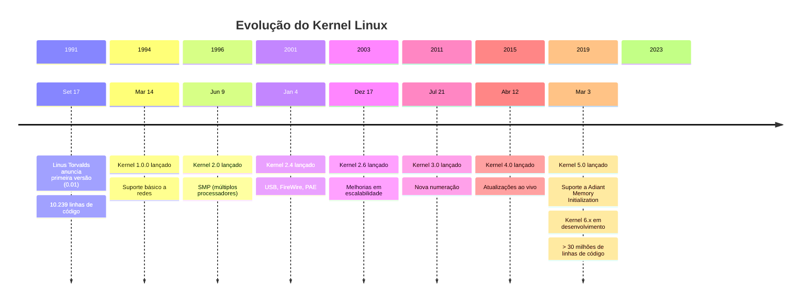

# 📖 Manual Completo: Kernel Linux

```
Autor: [Seu Nome]
Data: [Data Atual]
Versão: 1.0
Foco: Kernel Linux - Conceitos, Arquitetura e Operação
```

## 🎯 Introdução ao Kernel Linux

### O que é o Kernel Linux?
O kernel Linux é o **coração** do sistema operacional Linux. É um software de baixo nível que atua como intermediário entre o hardware e os processos de software.

**Analogia:** Se o computador fosse um carro:
- **Hardware** = Motor, rodas, volante
- **Kernel** = Sistema de controle do carro
- **Processos/Aplicativos** = Motorista e passageiros
- **Shell/Interface** = Volante e pedais

## 📚 Capítulo 1: História e Evolução

### 1.1 Linha do Tempo



### 1.2 Filosofia do Linux
- **Monolítico, mas modular**: Kernel único com módulos carregáveis
- **Open Source**: Código aberto, desenvolvimento colaborativo
- **POSIX compliant**: Compatível com padrões Unix
- **Copy-on-write**: Otimização de memória
- **Everything is a file**: Abstração unificada

## 🏗️ Capítulo 2: Arquitetura do Kernel

### 2.1 Visão Geral da Arquitetura

```
┌─────────────────────────────────────────────────┐
│             APLICAÇÕES DO USUÁRIO               │
│  (bash, chrome, gcc, Apache, MySQL, etc.)       │
└─────────────────────────────────────────────────┘
┌─────────────────────────────────────────────────┐
│            CHAMADAS DE SISTEMA (syscalls)       │
│  (read, write, open, close, fork, exec, etc.)   │
└─────────────────────────────────────────────────┘
┌─────────────────────────────────────────────────┐
│                    KERNEL SPACE                  │
├─────────────────────────────────────────────────┤
│  SUBSISTEMA DE ARQUIVOS  │   GERENCIADOR DE     │
│  (VFS, ext4, procfs,     │   PROCESSOS          │
│   sysfs, devtmpfs)       │   (scheduler, tasks) │
├─────────────────────────────────────────────────┤
│  SUBSISTEMA DE REDE      │   GERENCIADOR DE     │
│  (TCP/IP, sockets,       │   MEMÓRIA            │
│   firewall, protocolos)  │   (pages, slab, vm)  │
├─────────────────────────────────────────────────┤
│  SUBSISTEMA DE DISPOSITIVOS                     │
│  (drivers: block, char, network, USB, PCI)      │
└─────────────────────────────────────────────────┘
┌─────────────────────────────────────────────────┐
│                    HARDWARE                      │
│  (CPU, RAM, disco, rede, periféricos)           │
└─────────────────────────────────────────────────┘
```

### 2.2 Espaços de Memória

#### Espaço do Kernel (Kernel Space)
- **Privilégio máximo**: Ring 0 (x86) ou EL1 (ARM)
- **Acesso direto ao hardware**
- **Memória dedicada**: 1GB em sistemas 32-bit (configurável)
- **Funções críticas**: Manipulação de hardware, gerenciamento de memória

#### Espaço do Usuário (User Space)
- **Privilégio restrito**: Ring 3 (x86) ou EL0 (ARM)
- **Isolamento entre processos**
- **Acesso via syscalls**
- **Segurança**: Um processo não pode acessar memória de outro

### 2.3 Modos de Operação da CPU

```c
// Transição User → Kernel (exemplo)
int main() {
    int fd = open("arquivo.txt", O_RDONLY);  // Syscall
    // CPU muda para modo kernel
    // Kernel executa operação
    // CPU retorna para modo usuário
    return 0;
}
```

**Context Switch:**
1. Salva estado do processo atual
2. Muda para modo kernel
3. Executa syscall
4. Restaura estado
5. Retorna para modo usuário

## 🔧 Capítulo 3: Subsistemas do Kernel

### 3.1 Gerenciador de Processos

#### Estruturas de Dados Principais
```c
// task_struct (include/linux/sched.h)
struct task_struct {
    volatile long state;            // Estado do processo
    void *stack;                    // Ponteiro para pilha
    unsigned int flags;             // Flags do processo
    int prio;                       // Prioridade estática
    int static_prio;                // Prioridade dinâmica
    struct mm_struct *mm;           // Informações de memória
    struct files_struct *files;     // Arquivos abertos
    // ... mais de 100 campos
};
```

#### Estados do Processo
```
┌─────────┐      ┌─────────┐      ┌─────────┐
│  NOVO   │───▶  │ PRONTO  │◀──┐  │ EXECUT. │
└─────────┘      └─────────┘   │  └─────────┘
                               │         │
┌─────────┐      ┌─────────┐   │  ┌─────────┐
│ ZUMBÍ   │      │ ESPERA  │◀──┘  │   IO    │
└─────────┘      └─────────┘      └─────────┘
```

#### Escalonadores (Schedulers)
- **CFS (Completely Fair Scheduler)**: Padrão desde 2.6.23
- **SCHED_FIFO**: Tempo real, primeiro a entrar, primeiro a sair
- **SCHED_RR**: Tempo real, round-robin
- **SCHED_DEADLINE**: Baseado em deadlines

### 3.2 Gerenciador de Memória

#### Hierarquia de Memória
```bash
# Visualizando informações de memória
$ cat /proc/meminfo
$ free -h
$ vmstat 1
```

#### Componentes do Gerenciador de Memória
1. **Gerenciador de Páginas (Page Frame Allocator)**
2. **Alocador de Memória Virtual (VM Allocator)**
3. **Alocador Slab/Slub/Slob**
4. **Gerenciador de Swap**

#### Tabelas de Páginas
```
Virtual Address → Page Table → Physical Address
┌─────────────┐     ┌──────┐     ┌─────────────┐
│ 0x4000_1000 │────▶│ PTE  │────▶│ 0x1000_0000 │
└─────────────┘     └──────┘     └─────────────┘
```

### 3.3 Sistema de Arquivos

#### Virtual File System (VFS)
```c
// Estruturas principais
struct inode {          // Representa um arquivo/diretório
    umode_t i_mode;     // Permissões
    uid_t i_uid;        // Dono
    gid_t i_gid;        // Grupo
    loff_t i_size;      // Tamanho
    struct timespec64 i_atime;  // Último acesso
    struct timespec64 i_mtime;  // Última modificação
    const struct inode_operations *i_op;  // Operações
};

struct file {           // Arquivo aberto
    struct path f_path; // Caminho
    const struct file_operations *f_op;  // Operações
    loff_t f_pos;       // Posição atual
    // ...
};
```

#### Sistemas de Arquivos Suportados
- **Ext4**: Padrão atual do Linux
- **XFS**: Para grandes arquivos
- **Btrfs**: Com recursos avançados (snapshots, RAID)
- **FAT32/NTFS**: Compatibilidade com Windows
- **ZFS**: Via módulo (OpenZFS)
- **procfs/sysfs/debugfs**: Sistemas de arquivos virtuais

### 3.4 Subsistema de Rede

#### Pilha de Rede (Network Stack)
```
┌─────────────────────────────────────────┐
│          APLICAÇÃO (socket API)         │
├─────────────────────────────────────────┤
│        TCP / UDP / ICMP / etc.          │
├─────────────────────────────────────────┤
│                 IP                      │
├─────────────────────────────────────────┤
│         Netfilter / iptables            │
├─────────────────────────────────────────┤
│          Device Drivers                 │
└─────────────────────────────────────────┘
```

#### Estruturas de Dados
```c
// Socket (include/linux/net.h)
struct socket {
    socket_state state;           // Estado do socket
    struct sock *sk;              // Dados do socket
    const struct proto_ops *ops;  // Operações
};

// sk_buff - pacote de rede (include/linux/skbuff.h)
struct sk_buff {
    struct sk_buff *next, *prev;  // Lista encadeada
    struct sock *sk;              // Socket associado
    unsigned int len;             // Tamanho total
    __u8 *head, *data, *tail, *end;  // Ponteiros do buffer
    // ...
};
```

### 3.5 Drivers de Dispositivo

#### Tipos de Drivers
1. **Char Devices** (tty, /dev/null, /dev/random)
2. **Block Devices** (HDD, SSD, USB)
3. **Network Devices** (ethernet, wifi)
4. **USB Devices**
5. **PCI/PCIe Devices**

#### Exemplo de Driver Simples
```c
#include <linux/init.h>
#include <linux/module.h>
#include <linux/fs.h>

#define DEVICE_NAME "meu_driver"
#define CLASS_NAME  "meu"

static int major_num;
static struct class* meu_class = NULL;

static int dev_open(struct inode *inodep, struct file *filep) {
    printk(KERN_INFO "Dispositivo aberto\n");
    return 0;
}

static ssize_t dev_read(struct file *filep, char *buffer,
                       size_t len, loff_t *offset) {
    // Implementação da leitura
    return 0;
}

static struct file_operations fops = {
    .open = dev_open,
    .read = dev_read,
};

static int __init meu_init(void) {
    major_num = register_chrdev(0, DEVICE_NAME, &fops);
    meu_class = class_create(THIS_MODULE, CLASS_NAME);
    device_create(meu_class, NULL, MKDEV(major_num, 0),
                  NULL, DEVICE_NAME);
    return 0;
}

static void __exit meu_exit(void) {
    device_destroy(meu_class, MKDEV(major_num, 0));
    class_unregister(meu_class);
    class_destroy(meu_class);
    unregister_chrdev(major_num, DEVICE_NAME);
}

module_init(meu_init);
module_exit(meu_exit);
MODULE_LICENSE("GPL");
```

## 🛠️ Capítulo 4: Módulos do Kernel

### 4.1 O que são Módulos?
- **Código kernel carregável dinamicamente**
- **Extensão das funcionalidades do kernel**
- **Compilados separadamente (.ko files)**
- **Pode ser carregado/descarregado sem reiniciar**

### 4.2 Comandos Básicos
```bash
# Listar módulos carregados
$ lsmod

# Carregar módulo
$ sudo insmod modulo.ko
$ sudo modprobe modulo  # Com dependências

# Descarregar módulo
$ sudo rmmod modulo
$ sudo modprobe -r modulo

# Informações do módulo
$ modinfo modulo.ko

# Dependências
$ depmod -a
```

### 4.3 Estrutura de um Módulo
```makefile
# Makefile simples
obj-m += meu_modulo.o
meu_modulo-objs := main.o funcoes.o

KDIR := /lib/modules/$(shell uname -r)/build
PWD := $(shell pwd)

all:
    $(MAKE) -C $(KDIR) M=$(PWD) modules

clean:
    $(MAKE) -C $(KDIR) M=$(PWD) clean
```

## 📊 Capítulo 5: Interfaces do Kernel

### 5.1 Syscalls (Chamadas de Sistema)
```c
// Exemplo: implementação simplificada de sys_open
SYSCALL_DEFINE3(open, const char __user *, filename,
                int, flags, umode_t, mode)
{
    if (force_o_largefile())
        flags |= O_LARGEFILE;
    return do_sys_open(AT_FDCWD, filename, flags, mode);
}
```

#### Números de Syscall
```bash
# Ver syscalls disponíveis
$ cat /usr/include/asm/unistd_64.h | grep __NR
$ ausyscall --dump  # Arch Linux

# Chamar syscall diretamente
$ strace ls  # Trace de syscalls
```

### 5.2 /proc - Sistema de Arquivos de Processos
```bash
# Informações do sistema
$ cat /proc/cpuinfo      # Informações da CPU
$ cat /proc/meminfo      # Informações de memória
$ cat /proc/version      # Versão do kernel
$ cat /proc/cmdline      # Parâmetros de boot

# Informações de processos
$ ls /proc/[PID]/        # Diretório de cada processo
$ cat /proc/[PID]/status # Status do processo
$ cat /proc/[PID]/maps   # Mapa de memória
$ cat /proc/[PID]/fd     # File descriptors abertos
```

### 5.3 /sys - Sistema de Arquivos do Kernel
```bash
# Dispositivos
$ ls /sys/class/         # Classes de dispositivos
$ ls /sys/bus/           # Barramentos
$ ls /sys/devices/       # Dispositivos físicos

# Kernel
$ ls /sys/kernel/        # Configurações do kernel
$ cat /sys/kernel/osrelease  # Versão do kernel

# Ajustes em tempo real
$ echo 1 > /sys/kernel/debug/tracing/tracing_on
```

### 5.4 ioctl() - Operações de Controle
```c
// Exemplo: ioctl para dispositivo
int fd = open("/dev/meu_device", O_RDWR);
ioctl(fd, COMANDO_PERSONALIZADO, &argumento);
close(fd);
```

## 🔍 Capítulo 6: Debugging e Tracing

### 6.1 Ferramentas de Debugging

#### printk() - Logging do Kernel
```c
// Níveis de log (include/linux/kern_levels.h)
printk(KERN_EMERG   "Sistema está inutilizável\n");
printk(KERN_ALERT   "Ação imediata necessária\n");
printk(KERN_CRIT    "Condição crítica\n");
printk(KERN_ERR     "Condição de erro\n");
printk(KERN_WARNING "Condição de aviso\n");
printk(KERN_NOTICE  "Condição normal, porém significante\n");
printk(KERN_INFO    "Informacional\n");
printk(KERN_DEBUG   "Mensagens de debug\n");

// Ver logs
$ dmesg
$ journalctl -k  # systemd
```

#### Magic SysRq
```bash
# Ativar (temporariamente)
$ echo 1 > /proc/sys/kernel/sysrq

# Comandos úteis (Alt+SysRq+letra)
# Alt+SysRq+h - Ajuda
# Alt+SysRq+t - Listar tasks
# Alt+SysRq+m - Info memória
# Alt+SysRq+s - Sincronizar filesystems
# Alt+SysRq+u - Remount como read-only
# Alt+SysRq+b - Reboot
```

### 6.2 Tracing e Profiling

#### ftrace
```bash
# Habilitar ftrace
$ cd /sys/kernel/debug/tracing

# Listar tracers disponíveis
$ cat available_tracers

# Configurar
$ echo function > current_tracer
$ echo 1 > tracing_on
# Executar comando a ser traceado
$ echo 0 > tracing_on
$ cat trace | head -50
```

#### perf
```bash
# Instalar
$ sudo apt install linux-tools-$(uname -r)

# Comandos básicos
$ perf list                    # Listar eventos
$ perf stat ls                 # Estatísticas
$ perf record -g ./programa    # Gravar
$ perf report                  # Analisar
$ perf top                     # Tempo real
```

#### SystemTap
```systemtap
# Script exemplo
probe kernel.function("sys_open") {
    printf("%s -> %s\n", execname(), user_string($filename))
}
```

### 6.3 Kprobes e Uprobes
```bash
# Kprobe dinâmico
$ echo 'p:meu_probe vfs_read' > /sys/kernel/debug/tracing/kprobe_events
$ echo 1 > /sys/kernel/debug/tracing/events/kprobes/meu_probe/enable
$ cat /sys/kernel/debug/tracing/trace_pipe
```

## ⚙️ Capítulo 7: Compilação e Configuração

### 7.1 Obtendo o Código Fonte
```bash
# Clone do kernel
$ git clone https://git.kernel.org/pub/scm/linux/kernel/git/torvalds/linux.git
$ cd linux

# Alternativa: kernel.org
$ wget https://cdn.kernel.org/pub/linux/kernel/v6.x/linux-6.6.tar.xz
$ tar -xf linux-6.6.tar.xz
$ cd linux-6.6
```

### 7.2 Configuração do Kernel
```bash
# Ferramentas de configuração
$ make menuconfig    # Interface ncurses
$ make xconfig       # Interface gráfica (Qt)
$ make gconfig       # Interface gráfica (GTK)
$ make oldconfig     # Usar configuração antiga
$ make defconfig     # Configuração padrão
$ make localmodconfig # Módulos atualmente carregados
```

### 7.3 Processo de Compilação
```bash
# 1. Preparar
$ make clean
$ make mrproper  # Limpeza completa

# 2. Configurar
$ cp /boot/config-$(uname -r) .config
$ make olddefconfig

# 3. Compilar
$ make -j$(nproc)           # Kernel
$ make -j$(nproc) modules   # Módulos

# 4. Instalar
$ sudo make modules_install
$ sudo make install

# 5. Atualizar bootloader (grub)
$ sudo update-grub  # Ubuntu/Debian
$ sudo grub2-mkconfig -o /boot/grub2/grub.cfg  # RHEL/Fedora
```

### 7.4 Opções Importantes de Configuração
```bash
# Buscar opções específicas
$ make menuconfig
# Pressionar / para buscar
# Exemplo: CONFIG_DEBUG_INFO

# Opções recomendadas para desenvolvimento
CONFIG_DEBUG_INFO=y           # Informações de debug
CONFIG_DEBUG_KERNEL=y         # Debug do kernel
CONFIG_KPROBES=y              # Kprobes
CONFIG_FTRACE=y               # Ftracing
CONFIG_DYNAMIC_DEBUG=y        # Debug dinâmico
CONFIG_KGDB=y                 # Debugger do kernel
```

## 🚀 Capítulo 8: Desenvolvimento para o Kernel

### 8.1 Convenções de Código
```c
// Estilo de código (Documentation/process/coding-style.rst)
// Tabulação: TAB (8 espaços)
// Chaves: K&R style
if (condicao) {
    funcao();
} else {
    outra_funcao();
}

// Comentários
/*
 * Comentários multi-linha
 * devem ter asterisco alinhado
 */

// Nomenclatura
static void minha_funcao_local(void)  // static para locais
void minha_funcao_global(void)        // não-static para globais
#define MINHA_MACRO_CONSTANTE         // MACROS em maiúsculo

// Tipos específicos do kernel
u8, u16, u32, u64          // Unsigned
s8, s16, s32, s64          // Signed
__u8, __u16, __u32, __u64  // Arquitetura-independent
size_t                     // Tamanho
ssize_t                    // Tamanho com sinal
loff_t                     // Offset longo
```

### 8.2 APIs Comuns do Kernel

#### Listas Encadeadas
```c
#include <linux/list.h>

struct meu_item {
    int valor;
    struct list_head lista;  // Deve ser membro
};

// Inicialização
LIST_HEAD(minha_lista);

// Adicionar
struct meu_item *item = kmalloc(sizeof(*item), GFP_KERNEL);
item->valor = 42;
INIT_LIST_HEAD(&item->lista);
list_add(&item->lista, &minha_lista);

// Iterar
struct meu_item *iterador;
list_for_each_entry(iterador, &minha_lista, lista) {
    printk(KERN_INFO "Valor: %d\n", iterador->valor);
}

// Remover e liberar
list_del(&item->lista);
kfree(item);
```

#### Mutexes e Spinlocks
```c
#include <linux/mutex.h>
#include <linux/spinlock.h>

// Mutex (para seções longas)
static DEFINE_MUTEX(meu_mutex);
mutex_lock(&meu_mutex);
// Seção crítica
mutex_unlock(&meu_mutex);

// Spinlock (para seções curtas)
static DEFINE_SPINLOCK(meu_spinlock);
unsigned long flags;
spin_lock_irqsave(&meu_spinlock, flags);
// Seção crítica (não pode dormir!)
spin_unlock_irqrestore(&meu_spinlock, flags);
```

#### Workqueues
```c
#include <linux/workqueue.h>

// Declaração
static void meu_trabalho(struct work_struct *work);
static DECLARE_WORK(meu_work, meu_trabalho);

// Agendar
schedule_work(&meu_work);

// Implementação
static void meu_trabalho(struct work_struct *work)
{
    // Executado em contexto de processo
    printk(KERN_INFO "Trabalho executado\n");
}
```

### 8.3 Gerenciamento de Memória no Kernel

#### Alocação de Memória
```c
#include <linux/slab.h>

// Alocação comum (pode dormir)
void *ptr = kmalloc(size, GFP_KERNEL);

// Alocação atômica (não pode dormir)
void *ptr = kmalloc(size, GFP_ATOMIC);

// Alocação para DMA
void *ptr = kmalloc(size, GFP_DMA);

// Alocação zero-initialized
void *ptr = kzalloc(size, GFP_KERNEL);

// Liberação
kfree(ptr);
```

#### vmalloc vs kmalloc
```c
// vmalloc: memória virtualmente contígua
// Útil para grandes alocações (> página)
void *ptr = vmalloc(size);
vfree(ptr);

// kmalloc: memória fisicamente contígua
// Útil para DMA, pequenas alocações
void *ptr = kmalloc(size, GFP_KERNEL);
kfree(ptr);
```

### 8.4 Manipulação de Arquivos no Kernel
```c
#include <linux/fs.h>

// Abrir arquivo
struct file *filp = filp_open("/caminho/arquivo", O_RDONLY, 0);
if (IS_ERR(filp)) {
    return PTR_ERR(filp);
}

// Ler arquivo
char buffer[100];
loff_t pos = 0;
ssize_t ret = kernel_read(filp, buffer, sizeof(buffer), &pos);

// Escrever arquivo
ssize_t ret = kernel_write(filp, buffer, sizeof(buffer), &pos);

// Fechar arquivo
filp_close(filp, NULL);
```

## 🔧 Capítulo 9: Troubleshooting Comum

### 9.1 Kernel Panic
#### Sintomas:
- Sistema congela
- Mensagem no console
- Possível reinicialização automática

#### Causas Comuns:
1. **NULL pointer dereference**
2. **Double free**
3. **Stack overflow**
4. **Hardware failure**
5. **Driver buggy**

#### Debugging:
```bash
# Configurar para não reiniciar
# Adicionar no cmdline do kernel: panic=10

# Obter backtrace
$ dmesg | tail -50

# Informações do panic
$ cat /proc/vmcore  # Se kdump configurado
```

### 9.2 OOM Killer (Out Of Memory)
#### Sintomas:
- Processos sendo mortos misteriosamente
- Mensagens no dmesg sobre OOM

#### Diagnóstico:
```bash
# Ver logs
$ dmesg | grep -i "killed process"

# Configurar OOM score
$ cat /proc/[PID]/oom_score
$ echo -100 > /proc/[PID]/oom_score_adj

# Estatísticas de memória
$ cat /proc/meminfo
$ ps aux --sort=-%mem
```

### 9.3 Deadlocks
#### Detecção:
```bash
# Lockdep (lock dependency validator)
# Adicionar no cmdline: lockdep=1

# Ver deadlocks suspeitos
$ dmesg | grep -i "possible deadlock"

# Informações de locks
$ cat /proc/locks
```

### 9.4 Performance Issues
#### Ferramentas:
```bash
# Perf para análise geral
$ perf record -a -g sleep 10
$ perf report

# Tracepoints específicos
$ perf stat -e 'sched:*' ls

# Análise de I/O
$ iostat -x 1
$ iotop

# Análise de rede
$ tcptrace
$ netstat -s
```

## 📈 Capítulo 10: Tuning e Otimização

### 10.1 Parâmetros do Kernel
```bash
# Sysctl - ajustes em tempo de execução
$ sysctl -a | grep vm  # Parâmetros de memória
$ sysctl -a | grep net # Parâmetros de rede

# Ajustes comuns
# Memória
$ echo 1 > /proc/sys/vm/drop_caches
$ sysctl -w vm.swappiness=10

# Rede
$ sysctl -w net.core.rmem_max=16777216
$ sysctl -w net.core.wmem_max=16777216

# IO
$ echo deadline > /sys/block/sda/queue/scheduler
```

### 10.2 Kernel Samepage Merging (KSM)
```bash
# Habilitar KSM para VM consolidation
$ echo 1 > /sys/kernel/mm/ksm/run

# Monitorar
$ cat /sys/kernel/mm/ksm/pages_shared
$ cat /sys/kernel/mm/ksm/pages_sharing
```

### 10.3 Transparent Huge Pages (THP)
```bash
# Status
$ cat /sys/kernel/mm/transparent_hugepage/enabled

# Configurar
$ echo always > /sys/kernel/mm/transparent_hugepage/enabled
$ echo madvise > /sys/kernel/mm/transparent_hugepage/enabled
$ echo never > /sys/kernel/mm/transparent_hugepage/enabled
```

### 10.4 CPU Frequency Scaling
```bash
# Governors disponíveis
$ cat /sys/devices/system/cpu/cpu0/cpufreq/scaling_available_governors

# Governor atual
$ cat /sys/devices/system/cpu/cpu0/cpufreq/scaling_governor

# Alterar
$ echo performance > /sys/devices/system/cpu/cpu0/cpufreq/scaling_governor
```

## 🔮 Capítulo 11: Tópicos Avançados

### 11.1 Kernel Hardening
```bash
# Grsecurity/PaX features
# Adicionar no cmdline: lockdown=confidentiality

# ASLR (Address Space Layout Randomization)
$ cat /proc/sys/kernel/randomize_va_space

# SELinux/AppArmor
$ sestatus
$ aa-status

# Kernel module signing
$ uname -r | grep "CONFIG_MODULE_SIG=y"
```

### 11.2 Containers e Namespaces
```c
// Criar namespace de rede
unshare(CLONE_NEWNET);

// Namespaces suportados
CLONE_NEWPID  // PID namespace
CLONE_NEWNET  // Network namespace
CLONE_NEWNS   // Mount namespace
CLONE_NEWUTS  // UTS namespace (hostname)
CLONE_NEWIPC  // IPC namespace
CLONE_NEWUSER // User namespace
CLONE_NEWCGROUP // Cgroup namespace
```

### 11.3 eBPF (Extended Berkeley Packet Filter)
```bash
# Verificar suporte
$ grep BPF /boot/config-$(uname -r)

# Ferramentas
$ sudo apt install bpfcc-tools

# Exemplo: trace opens
$ opensnoop-bpfcc

# Exemplo: profile CPU
$ profile-bpfcc 5
```

### 11.4 Live Patching
```bash
# Suporte
$ uname -r | grep "CONFIG_LIVEPATCH=y"

# Ferramentas
# kpatch (Red Hat)
# livepatch (SUSE)
# kgraft
```

## 📚 Capítulo 12: Recursos e Referências

### 12.1 Documentação Oficial
```
Kernel Source: /Documentation/
Site: https://www.kernel.org/doc/html/latest/
Livros:
  - "Linux Device Drivers" (lwn.net)
  - "Professional Linux Kernel Architecture"
  - "Understanding the Linux Kernel"
```

### 12.2 Comunidades
- **Kernel Mailing Lists** (lkml.org)
- **Stack Overflow** (tag: linux-kernel)
- **Kernel Newbies** (kernelnewbies.org)
- **LWN.net** (Linux Weekly News)

### 12.3 Ferramentas Essenciais
```bash
# Desenvolvimento
$ sudo apt install build-essential libncurses-dev bison flex \
  libssl-dev libelf-dev

# Debugging
$ sudo apt install gdb crash kgdb

# Tracing
$ sudo apt install trace-cmd perf-tools-unstable
```

### 12.4 Práticas Recomendadas
1. **Sempre use versionamento** (git)
2. **Teste em VM primeiro**
3. **Mantenha backups do kernel funcionando**
4. **Use CONFIG_DEBUG_INFO para debugging**
5. **Participe das mailing lists**
6. **Leia Documentation/process/submitting-patches.rst**

---

## 🎓 Glossário

| Termo | Definição |
|-------|-----------|
| **Syscall** | Interface entre user-space e kernel |
| **IRQ** | Interrupt Request - sinal de hardware |
| **Tasklet** | Bottom half de interrupção |
| **RCU** | Read-Copy-Update - mecanismo de sincronização |
| **DMA** | Direct Memory Access |
| **MMU** | Memory Management Unit |
| **TLB** | Translation Lookaside Buffer |
| **CPI** | Cycles Per Instruction |
| **NUMA** | Non-Uniform Memory Access |
| **SMP** | Symmetric Multi-Processing |

---

## 🔄 Ciclo de Vida do Desenvolvimento


---

## 📊 Estatísticas do Kernel (2023)

- **Linhas de código**: ~30+ milhões
- **Contribuidores**: 5,000+ por release
- **Empresas envolvidas**: 1,500+
- **Commits por release**: 10,000-15,000
- **Frequência de release**: 2-3 meses
- **Arquiteturas suportadas**: 30+

---

**📌 Dica Final:** O desenvolvimento do kernel é uma maratona, não uma corrida. Comece com pequenos patches, aprenda o processo, e gradualmente aumente a complexidade.

*"O kernel Linux é a maior colaboração de software da história da humanidade."* - Jim Zemlin

**Boa jornada no mundo do kernel!** 🐧

---
*Última atualização: [Data]*  
*Baseado no kernel: 6.6+*  
*Próxima revisão: [Data + 6 meses]*
