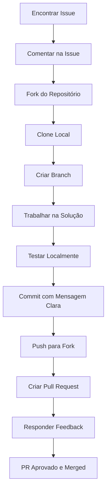

# Manual Completo de Contribuição Open Source

## Índice

1. [Introdução ao Open Source](#introdução-ao-open-source)
2. [Por que Contribuir?](#por-que-contribuir)
3. [Encontrando Projetos](#encontrando-projetos)
4. [Primeiros Passos](#primeiros-passos)
5. [Entendendo o Projeto](#entendendo-o-projeto)
6. [Encontrando Issues](#encontrando-issues)
7. [Processo de Contribuição](#processo-de-contribuição)
8. [Criando Pull Requests](#criando-pull-requests)
9. [Código de Conduta](#código-de-conduta)
10. [Documentação](#documentação)
11. [Testes](#testes)
12. [Comunicação Efetiva](#comunicação-efetiva)
13. [Tornando-se Mantenedor](#tornando-se-mantenedor)
14. [Criando Seu Próprio Projeto](#criando-seu-próprio-projeto)
15. [Ferramentas e Recursos](#ferramentas-e-recursos)

## Introdução ao Open Source

### O que é Open Source?
Open Source (Código Aberto) refere-se a software cujo código-fonte é disponibilizado publicamente, permitindo que qualquer pessoa visualize, use, modifique e distribua o software.

**Os 4 Liberdades do Software Livre (FSF):**
1. Liberdade de executar o programa como quiser
2. Liberdade de estudar o código-fonte
3. Liberdade de redistribuir cópias
4. Liberdade de distribuir versões modificadas

### Licenças Open Source
```markdown
Principais Licenças:

Permissivas:
- MIT: Muito permissiva, apenas requer atribuição
- Apache 2.0: Similar ao MIT, com cláusula de patentes
- BSD: Variações com diferentes restrições

Copyleft (Restritivas):
- GPL: Requer que trabalhos derivados sejam open source
- LGPL: Versão menos restritiva da GPL
- AGPL: Foca em software como serviço

Outras:
- Mozilla Public License (MPL): Híbrida
- Eclipse Public License (EPL): Para projetos empresariais
```

### Ecossistema Open Source
- **GitHub**: Plataforma mais popular (100M+ desenvolvedores)
- **GitLab**: Alternativa open source ao GitHub
- **Bitbucket**: Foco em empresas
- **SourceForge**: Uma das primeiras plataformas
- **Git**: Sistema de controle de versão fundamental

## Por que Contribuir?

### Benefícios Pessoais
```markdown
🎯 Desenvolvimento Técnico
- Aprenda com código de produção
- Pratique novas tecnologias
- Melhore habilidades de código limpo

🚀 Crescimento Profissional
- Construa portfólio público
- Ganhe visibilidade na comunidade
- Conecte-se com desenvolvedores experientes
- Aumente chances de emprego

💼 Benefícios de Carreira
- 87% dos recrutadores valorizam contribuições open source
- Experiência com projetos reais
- Networking com mantenedores de projetos famosos

🧠 Aprendizado Contínuo
- Acesso a melhores práticas
- Feedback de especialistas
- Exposição a diferentes arquiteturas
```

### Benefícios para a Comunidade
```markdown
🌟 Impacto Social
- Melhorar software usado por milhões
- Ajudar projetos sem fins lucrativos
- Democratizar acesso à tecnologia

🤝 Colaboração Global
- Trabalhar com pessoas de diferentes culturas
- Aprender sobre processos colaborativos
- Desenvolver soft skills

🌍 Sustentabilidade de Projetos
- Manter projetos importantes ativos
- Distribuir carga de trabalho
- Garantir diversidade de perspectivas
```

### Estatísticas Relevantes
- 65% dos desenvolvedores contribuem para open source
- 30% das contribuições são de iniciantes
- 95% do software corporativo usa open source
- Projetos populares recebem 100+ PRs por semana

## Encontrando Projetos

### Plataformas para Buscar
```markdown
GitHub:
- Explore: https://github.com/explore
- Trending: Projetos populares do dia/semana/mês
- Topics: Por tecnologia ou área (ex: react, machine-learning)
- GitHub Search: `is:issue is:open label:"good first issue"`

Outras Plataformas:
- GitLab Explore
- CodeTriage: Envia issues por email
- Up For Grabs: Lista projetos procurando contribuidores
- First Timers Only: Issues para iniciantes
- 24 Pull Requests: Campanha anual de contribuição
```

### Critérios de Seleção
```markdown
✅ Projetos Amigáveis para Iniciantes
- README claro e detalhado
- CONTRIBUTING.md bem escrito
- Código de Conduta explícito
- Issues marcadas como "good first issue"
- Comunidade ativa e receptiva

🔍 Avaliando a Saúde do Projeto
- Atividade recente (último commit < 30 dias)
- Issues respondidas rapidamente
- Pull requests revisadas em tempo hábil
- Comunicação respeitosa
- Testes e CI configurados

🎯 Alinhamento com Seus Interesses
- Tecnologias que você quer aprender
- Área de interesse (web, mobile, AI, etc.)
- Tamanho do projeto (comece pequeno)
- Linguagem familiar
```

### Projetos Recomendados para Iniciantes
```markdown
🐍 Python:
- CookieCutter: Templates de projeto
- Black: Formatador de código
- Requests: HTTP para humanos

🟨 JavaScript:
- date-fns: Manipulação de datas
- Chalk: Cores no terminal
- Axios: Cliente HTTP

🌐 Web:
- freeCodeCamp: Plataforma de ensino
- Gatsby: Framework React
- Next.js: React framework

🐳 DevOps:
- Docker: Containerização
- Kubernetes: Orquestração
- Terraform: Infraestrutura como código

🎨 Design:
- Figma: Design colaborativo
- Storybook: Desenvolvimento de componentes
```

## Primeiros Passos

### Configuração do Ambiente
```bash
# 1. Instalar Git
# Windows: https://git-scm.com/download/win
# Mac: brew install git
# Linux: sudo apt install git

# 2. Configurar Git
git config --global user.name "Seu Nome"
git config --global user.email "seu.email@exemplo.com"
git config --global core.editor "code --wait"  # VS Code

# 3. Configurar SSH Key
ssh-keygen -t ed25519 -C "seu.email@exemplo.com"
eval "$(ssh-agent -s)"
ssh-add ~/.ssh/id_ed25519

# 4. Fork do projeto
# - Vá até o repositório no GitHub
# - Clique em "Fork"
# - Clone SEU fork:
git clone git@github.com:SEU-USUARIO/NOME-PROJETO.git
cd NOME-PROJETO

# 5. Configurar remote upstream
git remote add upstream https://github.com/ORIGINAL/NOME-PROJETO.git
git remote -v  # Verificar remotes
```

### Fork vs Clone
```markdown
Fork:
- Cria uma cópia do projeto na SUA conta
- Permite trabalhar sem afetar o projeto original
- Facilita criação de Pull Requests

Clone:
- Baixa o repositório para sua máquina
- Não permite push direto (a menos que tenha permissão)

Fluxo Recomendado:
1. Fork no GitHub
2. Clone SEU fork
3. Configurar upstream para o original
4. Trabalhar em branches
5. Push para SEU fork
6. Pull Request para original
```

### Setup do Projeto
```bash
# 1. Atualizar fork com upstream
git checkout main
git fetch upstream
git merge upstream/main
git push origin main

# 2. Criar branch para sua contribuição
git checkout -b fix/typo-readme

# 3. Instalar dependências (exemplo Node.js)
npm install
# ou
yarn install

# 4. Rodar testes
npm test
# ou
yarn test

# 5. Configurar pre-commit hooks (se disponível)
npm run prepare
```

## Entendendo o Projeto

### Estrutura de Diretórios Comum
```markdown
projeto-típico/
├── .github/                    # Configurações do GitHub
│   ├── workflows/              # GitHub Actions
│   ├── ISSUE_TEMPLATE/         # Templates de issues
│   └── PULL_REQUEST_TEMPLATE.md # Template de PR
├── src/                        # Código fonte
├── tests/                      # Testes
├── docs/                       # Documentação
├── examples/                   # Exemplos de uso
├── .gitignore                  # Arquivos ignorados pelo Git
├── README.md                   # Documentação principal
├── CONTRIBUTING.md             # Guia de contribuição
├── CODE_OF_CONDUCT.md          # Código de conduta
├── LICENSE                     # Licença
├── package.json                # Dependências (Node.js)
├── requirements.txt            # Dependências (Python)
├── Makefile                    # Comandos comuns
├── Dockerfile                  # Configuração Docker
└── docker-compose.yml          # Orquestração Docker
```

### Arquivos Importantes para Entender
```markdown
README.md:
- Visão geral do projeto
- Instalação e uso
- Exemplos
- Badges (build, coverage, etc.)

CONTRIBUTING.md:
- Como contribuir
- Processo de submissão
- Padrões de código
- Como reportar bugs

CHANGELOG.md / RELEASES.md:
- Histórico de mudanças
- Versões e features

CODE_OF_CONDUCT.md:
- Regras de comportamento
- Como reportar problemas

PULL_REQUEST_TEMPLATE.md:
- Template para Pull Requests
- O que preencher

ISSUE_TEMPLATE.md:
- Template para reportar bugs
- Template para feature requests
```

### Padrões do Projeto
```markdown
🔤 Convenções de Código
- Nomenclatura (camelCase, snake_case, etc.)
- Tamanho máximo de linha
- Comentários e documentação
- Organização de imports

✅ Testes
- Framework utilizado (Jest, pytest, etc.)
- Cobertura mínima exigida
- Onde colocar testes

📝 Commits
- Convenção de mensagens (Conventional Commits)
- Tamanho dos commits
- Mensagens descritivas

🎨 Formatação
- Linter utilizado (ESLint, Prettier, Black)
- Formatação automática
- Configurações específicas
```

## Encontrando Issues

### Tipos de Issues
```markdown
🐛 Bug Reports:
- Comportamento inesperado
- Erros ou crashes
- Problemas de compatibilidade

✨ Feature Requests:
- Novas funcionalidades
- Melhorias de UX/UI
- Integrações

📚 Documentation:
- Typos e erros gramaticais
- Exemplos faltando
- Traduções
- Melhorias na documentação

🧪 Tests:
- Cobertura insuficiente
- Testes faltando
- Testes flaky

🔧 Refactoring:
- Melhorias de código
- Otimizações
- Remoção de código legado

🚀 Performance:
- Otimizações de velocidade
- Redução de uso de memória
- Melhorias de escalabilidade

🛠️ Maintenance:
- Atualização de dependências
- CI/CD improvements
- Tooling updates
```

### Como Identificar Issues Boas para Iniciantes
```markdown
🔍 Marcadores Úteis:
- good first issue
- beginner-friendly
- help wanted
- documentation
- bug
- easy

📊 Filtros Úteis no GitHub:
is:issue is:open label:"good first issue"
is:issue is:open no:assignee
is:issue is:open comments:0

🚫 Evitar Inicialmente:
- Issues complexas ou grandes
- Issues que requerem conhecimento específico
- Issues com discussões longas/controversas
- Issues marcadas como "blocked"
```

### Avaliando uma Issue
```markdown
✅ O que verificar:
- A issue está clara e bem descrita?
- Há repro steps para bugs?
- Há contexto suficiente?
- Alguém já está trabalhando?
- A issue tem discussão ativa?
- Há templates a seguir?

❓ Perguntas para fazer:
- Posso trabalhar nisso?
- Há algo específico que devo saber?
- Há deadline?
- Preciso de acesso especial?

💡 Dica: Comece com issues de documentação ou bugs simples
```

## Processo de Contribuição

### Fluxo de Trabalho Padrão


### Passo a Passo Detalhado
```bash
# 1. Escolher uma issue
# Comentar: "Gostaria de trabalhar nisso"

# 2. Atualizar fork com upstream
git checkout main
git fetch upstream
git merge upstream/main
git push origin main

# 3. Criar branch descritiva
git checkout -b fix/typo-in-readme
# ou
git checkout -b feat/add-new-feature
# ou
git checkout -b docs/improve-instructions

# 4. Trabalhar na solução
# - Fazer mudanças
# - Seguir padrões do projeto
# - Adicionar testes se necessário

# 5. Testar localmente
npm test  # ou equivalente
npm run lint  # verificar estilo

# 6. Commitar
git add .
git commit -m "fix: corrige typo no README"
# Usar Conventional Commits: fix, feat, docs, style, refactor, test, chore

# 7. Push para seu fork
git push origin fix/typo-in-readme

# 8. Criar Pull Request no GitHub
# - Usar template se existir
# - Referenciar issue: "Fixes #123"
# - Descrever mudanças claramente
# - Adicionar screenshots se relevante

# 9. Responder feedback
# - Fazer mudanças solicitadas
# - Commitar e push novamente
# - Manter comunicação clara

# 10. Após merge
git checkout main
git pull upstream main
git push origin main
git branch -d fix/typo-in-readme
```

### Conventional Commits
```markdown
Estrutura:
<type>(<scope>): <description>

[body]

[footer]

Tipos:
- fix: Correção de bug
- feat: Nova feature
- docs: Documentação
- style: Formatação, ponto e vírgula
- refactor: Refatoração de código
- test: Adicionar ou corrigir testes
- chore: Atualização de tarefas
- perf: Melhorias de performance
- ci: Mudanças em CI/CD
- build: Mudanças no build system

Exemplos:
fix(api): corrige timeout na requisição POST
feat(auth): adiciona autenticação via Google
docs(readme): atualiza instruções de instalação
```

## Criando Pull Requests

### Estrutura de um Bom PR
```markdown
Título:
feat: adiciona suporte a temas escuros
fix(ui): corrige alinhamento do botão
docs: atualiza exemplos de uso

Descrição:
## Descrição
[Explicação clara das mudanças]

## Tipo de mudança
- [ ] Bug fix
- [ ] Nova feature
- [ ] Breaking change
- [ ] Documentação

## Checklist
- [ ] Meu código segue os padrões do projeto
- [ ] Adicionei testes que provam minha correção
- [ ] Todos os testes passam localmente
- [ ] Documentei as mudanças necessárias

## Contexto adicional
[Screenshots, GIFs, links relevantes]

## Issues relacionadas
Fixes #123
Relates to #456
```

### Melhores Práticas para PRs
```markdown
✅ O que fazer:
- Mantenha PRs pequenos e focados
- Um PR = uma feature/fix
- Inclua testes
- Atualize documentação
- Siga o template do projeto
- Adicione screenshots para mudanças visuais
- Referencie issues relevantes
- Descreva como testar

❌ O que evitar:
- PRs muito grandes (> 500 linhas)
- Múltiplas features não relacionadas
- Mudanças de estilo desnecessárias
- Ignorar feedback dos revisores
- Commits de "work in progress"
- Quebrar CI/CD
```

### Respondendo a Feedback
```markdown
💬 Comunicação Efetiva:
- Responda rapidamente
- Seja grato pelo feedback
- Peça esclarecimentos se necessário
- Discuta alternativas respeitosamente
- Reconheça bons pontos

🔄 Fazendo Mudanças:
- Faça commits adicionais para cada feedback
- Use `git commit --amend` para melhorar commits existentes
- Mantenha histórico limpo
- Teste novamente após mudanças

📊 Status do PR:
- Request changes: precisa de correções
- Approved: pronto para merge
- Comment: discussão necessária
- Dismissed: feedback não aplicado
```

### Squash Commits vs Multi-Commit PRs
```markdown
Quando usar squash:
- PRs com muitos commits pequenos
- Commits de "WIP" ou "fix typo"
- Histórico bagunçado
- Requisito do projeto

Quando manter múltiplos commits:
- Commits lógicos e independentes
- Histórico significativo
- Revisão por commit
- Projetos que preferem

Como fazer squash:
git rebase -i HEAD~3  # interativo para últimos 3 commits
# No editor: pick primeiro, squash/s os outros
```

## Código de Conduta

### Por que é Importante?
```markdown
Objetivos:
- Criar ambiente seguro e acolhedor
- Estabelecer expectativas claras
- Prevenir comportamentos inadequados
- Proteger todos os participantes

Baseado em:
- Contributor Covenant (mais popular)
- Citizen Code of Conduct
- Django Code of Conduct
```

### Comportamentos Esperados
```markdown
✅ Comportamentos Apropriados:
- Ser respeitoso e inclusivo
- Usar linguagem acolhedora
- Aceitar críticas construtivas
- Focar no que é melhor para a comunidade
- Mostrar empatia com outros membros

❌ Comportamentos Inaceitáveis:
- Linguagem ou imagens sexualizadas
- Comentários ofensivos ou depreciativos
- Assédio público ou privado
- Publicar informações privadas
- Outras condutas antiéticas

🌍 Diversidade e Inclusão:
- Usar pronomes preferidos
- Evitar suposições
- Criar espaço para vozes diversas
- Adaptar comunicação para diferentes níveis
```

### Reportando Problemas
```markdown
📞 Como Reportar:
1. Encontre informações de contato no CODE_OF_CONDUCT.md
2. Contate mantenedores listados
3. Forneça contexto completo
4. Mantenha confidencialidade

🛡️ O que Esperar:
- Resposta rápida e cuidadosa
- Investigação justa
- Confidencialidade
- Ação apropriada

👥 Para Mantenedores:
- Responder dentro de 48 horas
- Manter registro de incidentes
- Tomar ação consistente
- Comunicar resultados (quando apropriado)
```

## Documentação

### Tipos de Documentação
```markdown
📖 Documentação Técnica:
- API Documentation
- Architecture Decisions Records (ADR)
- Code Comments
- Type Definitions

👤 Documentação do Usuário:
- Getting Started Guides
- Tutorials
- Examples
- FAQ

👷 Documentação do Desenvolvedor:
- Development Setup
- Contributing Guidelines
- Code Standards
- Release Process

🔧 Documentação de Operações:
- Deployment Guides
- Monitoring
- Troubleshooting
- Performance Tuning
```

### Escrevendo Boa Documentação
```markdown
Princípios:
- Claro e conciso
- Atualizado com o código
- Exemplos práticos
- Acessível para diferentes níveis

Estrutura:
# Título claro

## Visão geral
[Contexto e propósito]

## Pré-requisitos
[O que é necessário]

## Passo a passo
[Instruções claras]

## Exemplos
[Código executável]

## Troubleshooting
[Problemas comuns e soluções]

## Referências
[Links úteis]
```

### Contribuindo com Documentação
```markdown
Oportunidades Comuns:
- Corrigir typos
- Adicionar exemplos faltando
- Melhorar clareza
- Traduzir para outros idiomas
- Atualizar para novas versões

Ferramentas:
- Markdown (.md)
- AsciiDoc (.adoc)
- reStructuredText (.rst)
- Docusaurus, MkDocs, Jekyll

Boas Práticas:
- Use Markdown linting
- Teste links
- Verifique formatação
- Adicione screenshots
- Mantenha consistência
```

## Testes

### Importância dos Testes no Open Source
```markdown
Por que testar?
- Garantir estabilidade
- Facilitar contribuições
- Prevenir regressões
- Documentar comportamento esperado
- Aumentar confiança dos usuários
```

### Tipos de Testes
```markdown
🧪 Testes Unitários:
- Testam unidades individuais
- Rápidos e isolados
- Cobrem funções/métodos

🔗 Testes de Integração:
- Testam múltiplos componentes
- Verificam interações
- Cobram fluxos principais

🎭 Testes End-to-End (E2E):
- Testam sistema completo
- Simulam usuário real
- Mais lentos e frágeis

📊 Testes de Performance:
- Medem velocidade
- Identificam gargalos
- Garantem SLA

🔒 Testes de Segurança:
- Verificam vulnerabilidades
- Testam autenticação/autorização
- Validam inputs
```

### Contribuindo com Testes
```markdown
Adicionando Testes:
1. Encontre código não testado
2. Entenda o comportamento esperado
3. Escreva teste que falha
4. Implemente a solução
5. Verifique que passa

Corrigindo Testes:
- Testes flaky (intermitentes)
- Testes quebrados
- Testes lentos
- Cobertura insuficiente

Melhores Práticas:
- Um teste = uma afirmação
- Nomes descritivos
- Independentes
- Rápidos
- Previsíveis
```

### Configuração de CI/CD
```markdown
Sistemas Populares:
- GitHub Actions
- GitLab CI/CD
- CircleCI
- Travis CI
- Jenkins

O que testar automaticamente:
- Todos os testes unitários
- Linting e formatação
- Build do projeto
- Cobertura de código
- Deploy em staging

Badges no README:
- Build Status
- Test Coverage
- License
- Downloads
- Version
```

## Comunicação Efetiva

### Onde Comunicar
```markdown
GitHub Issues:
- Reportar bugs
- Sugerir features
- Pedir ajuda
- Discussões técnicas

GitHub Discussions:
- Perguntas e respostas
- Anúncios
- Ideias
- Mostrar projetos

Discord/Slack:
- Comunicação em tempo real
- Suporte rápido
- Comunidade ativa

Forums/Mailing Lists:
- Discussões apropriadas
- Anúncios importantes
- Comunicação assíncrona

Twitter/Blogs:
- Anúncios de releases
- Casos de uso
- Tutorials
- Eventos
```

### Etiqueta de Comunicação
```markdown
💬 Em Issues/PRs:
- Use templates fornecidos
- Seja específico e claro
- Forneça contexto
- Use Markdown para formatação
- Adicione screenshots quando útil

🙏 Pedindo Ajuda:
- Pesquise antes de perguntar
- Forneça detalhes completos
- Mostre o que já tentou
- Seja paciente

🤝 Dando Feedback:
- Seja construtivo
- Foque no código, não na pessoa
- Sugira soluções
- Reconheça o trabalho

🌍 Considerações Internacionais:
- Use inglês claro e simples
- Evite gírias e regionalismos
- Seja paciente com não-nativos
- Use emojis para contexto
```

### Linguagem Clara
```markdown
Exemplos de Boa Comunicação:

❌ Ruim: "Não funciona"
✅ Bom: "Ao clicar no botão X na página Y, recebo erro Z"

❌ Ruim: "Precisa ser melhor"
✅ Bom: "Sugiro mudar X para Y porque Z"

❌ Ruim: "Isso está errado"
✅ Bom: "Notei um problema em X, a solução pode ser Y"

Dicas:
- Use bullet points para listas
- Formate código com backticks
- Use headings para organização
- Link para recursos relevantes
- Mantenha tom profissional mas amigável
```

## Tornando-se Mantenedor

### Papéis na Comunidade
```markdown
👤 Contribuidor:
- Faz PRs ocasionais
- Reporta bugs
- Ajuda outros usuários

👷 Colaborador:
- Contribui regularmente
- Tem acesso de triage
- Pode review PRs

🛡️ Mantenedor:
- Merge rights
- Gerenciamento de releases
- Curadoria do projeto

👑 Líder do Projeto:
- Visão e direção
- Decisões arquiteturais
- Representação pública
```

### Caminho para se Tornar Mantenedor
```markdown
Fase 1: Contribuidor Ativo (3-6 meses)
- 10+ PRs aceitos
- Ajuda em issues
- Participa em discussões
- Segue códigos de conduta

Fase 2: Colaborador (6-12 meses)
- PRs mais complexos
- Review de PRs de outros
- Triagem de issues
- Melhora documentação

Fase 3: Mantenedor (1-2 anos)
- Conhecimento profundo do código
- Tomada de decisões técnicas
- Gerenciamento de releases
- Mentor de novos contribuidores
```

### Responsabilidades do Mantenedor
```markdown
Técnicas:
- Review e merge de PRs
- Gerenciamento de branches
- Versionamento e releases
- CI/CD maintenance
- Atualização de dependências

Comunitárias:
- Welcome new contributors
- Moderar discussões
- Enforcer Code of Conduct
- Comunicação com usuários
- Representar o projeto

Estratégicas:
- Roadmap planning
- Feature prioritization
- Community growth
- Partnership building
```

### Burnout e Sustentabilidade
```markdown
Sinais de Burnout:
- Dificuldade em priorizar
- Procrastinação
- Irritabilidade
- Exaustão constante
- Perda de motivação

Prevenção:
- Estabeleça limites de tempo
- Delegue responsabilidades
- Automatize tarefas repetitivas
- Tenha co-mantenedores
- Tire férias regulares

Sustentabilidade:
- Busque financiamento (Open Collective, GitHub Sponsors)
- Estabeleça processos claros
- Documente tudo
- Cultive nova liderança
- Aceite que projetos têm ciclos
```

## Criando Seu Próprio Projeto

### Planejamento Inicial
```markdown
📋 Checklist de Lançamento:
- [ ] Nome claro e único
- [ ] README detalhado
- [ ] License escolhida
- [ ] Code of Conduct
- [ ] Contributing Guidelines
- [ ] Issue Templates
- [ ] Pull Request Template
- [ ] GitHub Actions CI/CD
- [ ] Badges no README
- [ ] Exemplos de uso
- [ ] Documentação básica

🎯 Definindo Escopo:
- Problema específico a resolver
- Público-alvo claro
- Features mínimas viáveis
- Tecnologias escolhidas
- Arquitetura inicial
```

### Estrutura Inicial do Projeto
```bash
meu-projeto/
├── .github/
│   ├── workflows/
│   │   └── ci.yml
│   ├── ISSUE_TEMPLATE/
│   │   ├── bug_report.md
│   │   └── feature_request.md
│   └── PULL_REQUEST_TEMPLATE.md
├── src/
│   └── index.js
├── tests/
│   └── index.test.js
├── docs/
│   └── getting-started.md
├── examples/
│   └── basic-usage.js
├── .gitignore
├── README.md
├── CONTRIBUTING.md
├── CODE_OF_CONDUCT.md
├── LICENSE
├── package.json
└── .eslintrc.js
```

### Atraindo Contribuidores
```markdown
Marketing do Projeto:
- Poste em Reddit (r/opensource, r/programming)
- Compartilhe no Twitter/LinkedIn
- Adicione ao Awesome lists
- Participe de hackathons
- Escreva blog posts

Fazendo o Projeto Acolhedor:
- Responda rapidamente a issues
- Seja grato por contribuições
- Marque issues como "good first issue"
- Forneça mentoring
- Celebre marcos

Ferramentas para Gerenciamento:
- Project Boards no GitHub
- Discord/Slack para comunidade
- Open Collective para finanças
- Crowdin para traduções
- Netlify/Vercel para demos
```

### Manutenção de Longo Prazo
```markdown
Processos Essenciais:
1. Regular issue triage (semanal)
2. Code review rotations
3. Release schedule
4. Security updates
5. Dependency updates

Documentação Viva:
- CHANGELOG atualizado
- Migration guides entre versões
- Deprecation warnings
- Upgrade paths

Comunicação:
- Newsletter para anunciar releases
- Twitter para updates rápidos
- Blog para deep dives
- YouTube para tutorials
```

## Ferramentas e Recursos

### Ferramentas Essenciais
```markdown
🛠️ Desenvolvimento:
- Git & GitHub
- VS Code / IntelliJ
- Docker
- Node.js / Python / etc.

🧪 Testes:
- Jest / Mocha / pytest
- Cypress / Playwright
- Selenium
- Postman / Insomnia

📝 Documentação:
- Markdown editors
- Docusaurus / MkDocs
- Read the Docs
- Swagger / OpenAPI

🚀 CI/CD:
- GitHub Actions
- GitLab CI/CD
- CircleCI
- Jenkins

🔍 Qualidade:
- ESLint / Prettier
- SonarQube
- CodeClimate
- Snyk / Dependabot
```

### Recursos de Aprendizado
```markdown
📚 Cursos:
- freeCodeCamp Open Source
- The Odin Project
- Open Source Guides (GitHub)
- First Contributions

📖 Livros:
- "Producing Open Source Software" by Karl Fogel
- "Forge Your Future with Open Source" by VM Brasseur
- "The Open Source Way"
- "Working in Public" by Nadia Eghbal

🎥 Vídeos:
- GitHub Universe talks
- FOSDEM recordings
- Open Source Summit
- YouTube: The Coding Train, Fireship

📰 Blogs:
- Open Source Initiative
- GitHub Blog
- Opensource.com
- FreeCodeCamp News
```

### Comunidades e Eventos
```markdown
🌐 Comunidades Online:
- GitHub Community
- Dev.to Open Source
- Hashnode
- Reddit r/opensource
- Discord: Open Source Community

🗓️ Eventos:
- Hacktoberfest (Outubro)
- 24 Pull Requests (Dezembro)
- Google Summer of Code
- Outreachy
- Season of Docs

🤝 Encontrando Mentores:
- GitHub "Looking for Mentors" label
- First Timers Only
- Code Mentorship
- Women Who Code
- Black Girls Code
```

### Templates e Starter Kits
```markdown
⚡ Templates Populares:
- https://github.com/othneildrew/Best-README-Template
- https://github.com/dbader/readme-template
- https://github.com/kentcdodds/.github
- https://github.com/facebook/create-react-app

🎨 Starter Kits:
- https://github.com/github-community/community
- https://github.com/actions/starter-workflows
- https://github.com/github-community/.github

📋 Checklists:
- Open Source Checklist: opensource.guide/starting-a-project/
- Launch Checklist: makeapullrequest.com
- Maintenance Checklist: sustainoss.org
```

### Financiamento e Sustentabilidade
```markdown
💰 Plataformas de Financiamento:
- GitHub Sponsors
- Open Collective
- Patreon
- Ko-fi
- Liberapay

🏆 Programas de Suporte:
- Google Open Source
- Mozilla Open Source Support
- Indeed Open Source
- AWS Open Source

📊 Métricas de Sucesso:
- Stars no GitHub
- Downloads/Installs
- Active Contributors
- Issue Resolution Time
- Community Growth
```

---

## 📈 Roadmap de Contribuição Open Source

### Mês 1-3: Iniciante
- [ ] Corrigir 5 typos em documentação
- [ ] Traduzir parte de um README
- [ ] Resolver 2-3 "good first issues"
- [ ] Participar de discussions
- [ ] Ler 3 projetos completos

### Mês 4-6: Intermediário
- [ ] Resolver 5 bugs simples
- [ ] Adicionar testes para código existente
- [ ] Melhorar documentação
- [ ] Review 10 PRs de outros
- [ ] Participar de 1 comunidade ativamente

### Mês 7-12: Avançado
- [ ] Implementar 1 feature completa
- [ ] Refatorar módulo existente
- [ ] Mentor 1 novo contribuidor
- [ ] Escrever ADR (Architecture Decision Record)
- [ ] Gerenciar release menor

### Ano 2+: Liderança
- [ ] Tornar-se mantenedor
- [ ] Gerenciar releases principais
- [ ] Definir roadmap
- [ ] Recrutar novos contribuidores
- [ ] Criar próprio projeto

---

## 🎯 Dicas Finais

### Para Iniciantes
```markdown
1. Comece pequeno - typos e docs são
